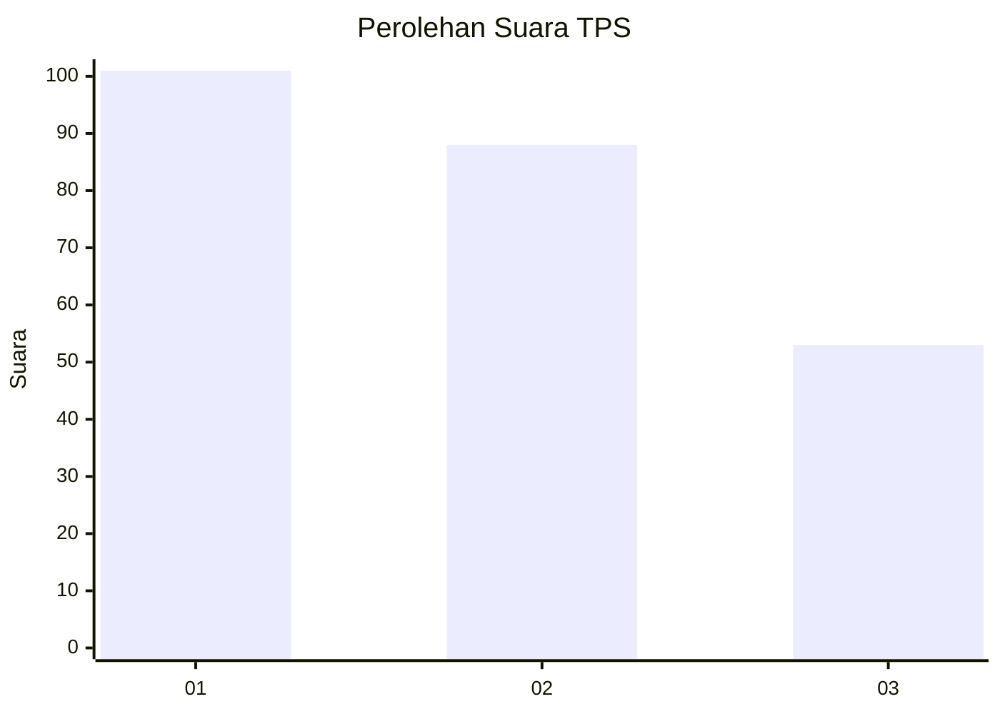
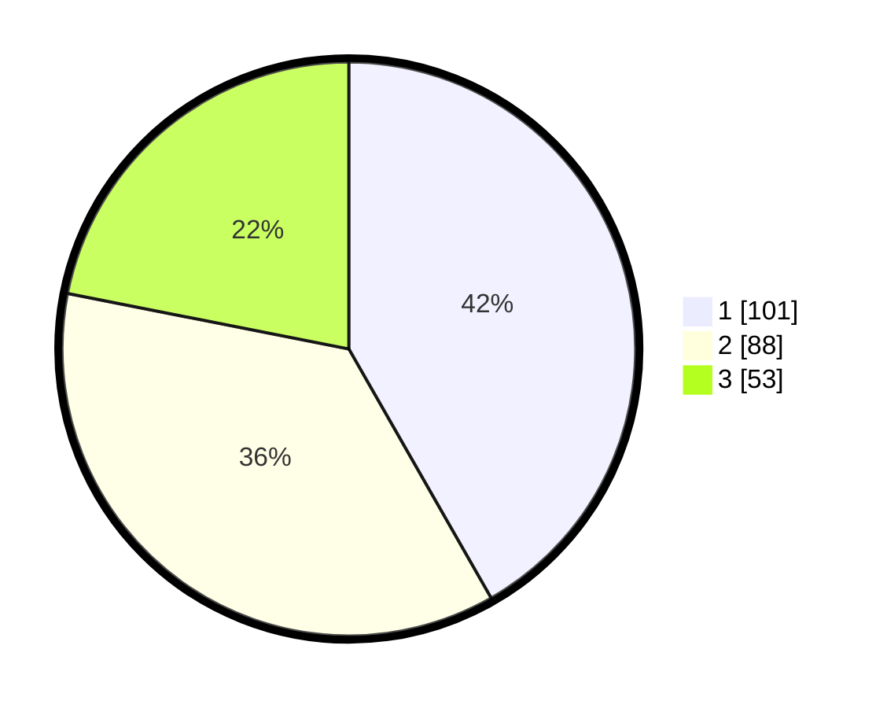

# Hasil

## Grafik

## Tabel

| No. | Nama Paslon    | Suara | Suara (raw) | Persentase |
|:--- |:-------------- | -----:| -----------:| ----------:|
| 1   | ANIES MUHAIMIN | 101   | [101][p-1]  | 41,74      |
| 2   | PRABOWO GIBRAN | 88    | [88][p-2]   | 36,36      |
| 3   | GANJAR MAHFUD  | 53    | [53][p-3]   | 21,90      |

[p-1]: https://github.com/gigit-pemilu/pemilu-2024-33-jawa-tengah/blob/main/pilpres/hitung-suara/sub/33-jawa-tengah/sub/11-sukoharjo/sub/07-polokarto/sub/2010-bulu/sub/003-tps/sub/paslon-1.txt
[p-2]: https://github.com/gigit-pemilu/pemilu-2024-33-jawa-tengah/blob/main/pilpres/hitung-suara/sub/33-jawa-tengah/sub/11-sukoharjo/sub/07-polokarto/sub/2010-bulu/sub/003-tps/sub/paslon-2.txt
[p-3]: https://github.com/gigit-pemilu/pemilu-2024-33-jawa-tengah/blob/main/pilpres/hitung-suara/sub/33-jawa-tengah/sub/11-sukoharjo/sub/07-polokarto/sub/2010-bulu/sub/003-tps/sub/paslon-3.txt

## Foto C Plano

https://sirekap-obj-formc.kpu.go.id/7e28/pemilu/ppwp/33/11/07/20/10/3311072010003-20240217-163246--292214fb-9b51-4836-9631-fc1987a569ce.jpg

https://sirekap-obj-formc.kpu.go.id/7e28/pemilu/ppwp/33/11/07/20/10/3311072010003-20240217-163322--45a580c0-3c5d-483f-84ed-0ea77f096980.jpg

https://sirekap-obj-formc.kpu.go.id/7e28/pemilu/ppwp/33/11/07/20/10/3311072010003-20240217-163407--d17ccbf8-00c7-42ab-aadb-e89c5ab628bc.jpg

## Metadata

| Key        | Value               |
| ---------- | ------------------- |
| Time Stamp | 2024-02-17 16:36:25 |

