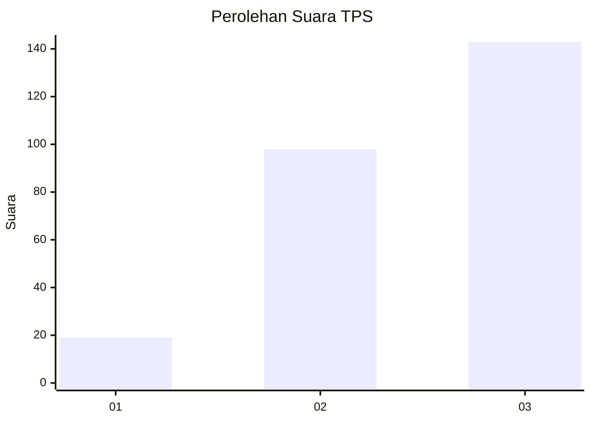
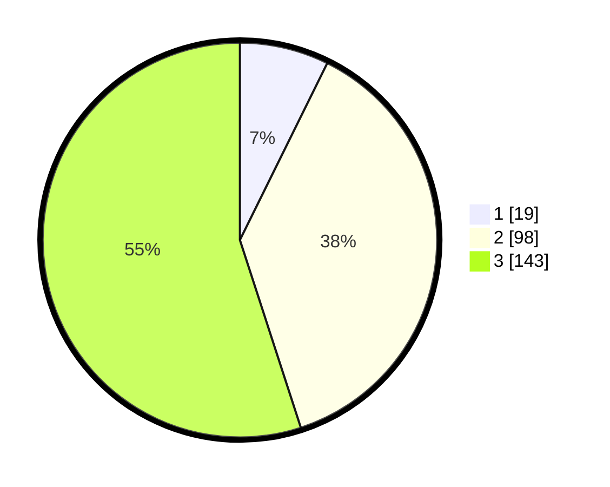

# Hasil

## Grafik

## Tabel

| No. | Nama Paslon    | Suara | Suara (raw) | Persentase |
|:--- |:-------------- | -----:| -----------:| ----------:|
| 1   | ANIES MUHAIMIN | 19    | [19][p-1]   | 7,31       |
| 2   | PRABOWO GIBRAN | 98    | [98][p-2]   | 37,69      |
| 3   | GANJAR MAHFUD  | 143   | [143][p-3]  | 55,00      |

[p-1]: https://github.com/gigit-pemilu/pemilu-2024/blob/main/pilpres/hitung-suara/sub/33-jawa-tengah/sub/11-sukoharjo/sub/07-polokarto/sub/2012-polokarto/sub/017-tps/sub/paslon-1.txt
[p-2]: https://github.com/gigit-pemilu/pemilu-2024/blob/main/pilpres/hitung-suara/sub/33-jawa-tengah/sub/11-sukoharjo/sub/07-polokarto/sub/2012-polokarto/sub/017-tps/sub/paslon-2.txt
[p-3]: https://github.com/gigit-pemilu/pemilu-2024/blob/main/pilpres/hitung-suara/sub/33-jawa-tengah/sub/11-sukoharjo/sub/07-polokarto/sub/2012-polokarto/sub/017-tps/sub/paslon-3.txt

## Foto C Plano

https://sirekap-obj-formc.kpu.go.id/8844/pemilu/ppwp/33/11/07/20/12/3311072012017-20240215-015735--525b985c-ae5a-42b1-a533-4f4325256d0a.jpg

https://sirekap-obj-formc.kpu.go.id/8844/pemilu/ppwp/33/11/07/20/12/3311072012017-20240215-022344--1178bbd7-1086-41bb-82a0-3f24ebc686ee.jpg

https://sirekap-obj-formc.kpu.go.id/8844/pemilu/ppwp/33/11/07/20/12/3311072012017-20240215-020101--99ec2339-6e33-454d-a5ff-6cef78ddf193.jpg

## Metadata

| Key        | Value               |
| ---------- | ------------------- |
| Time Stamp | 2024-02-15 22:00:27 |

