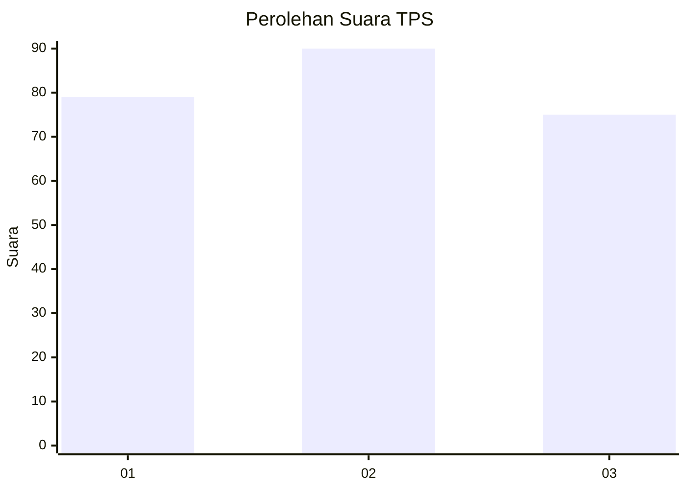
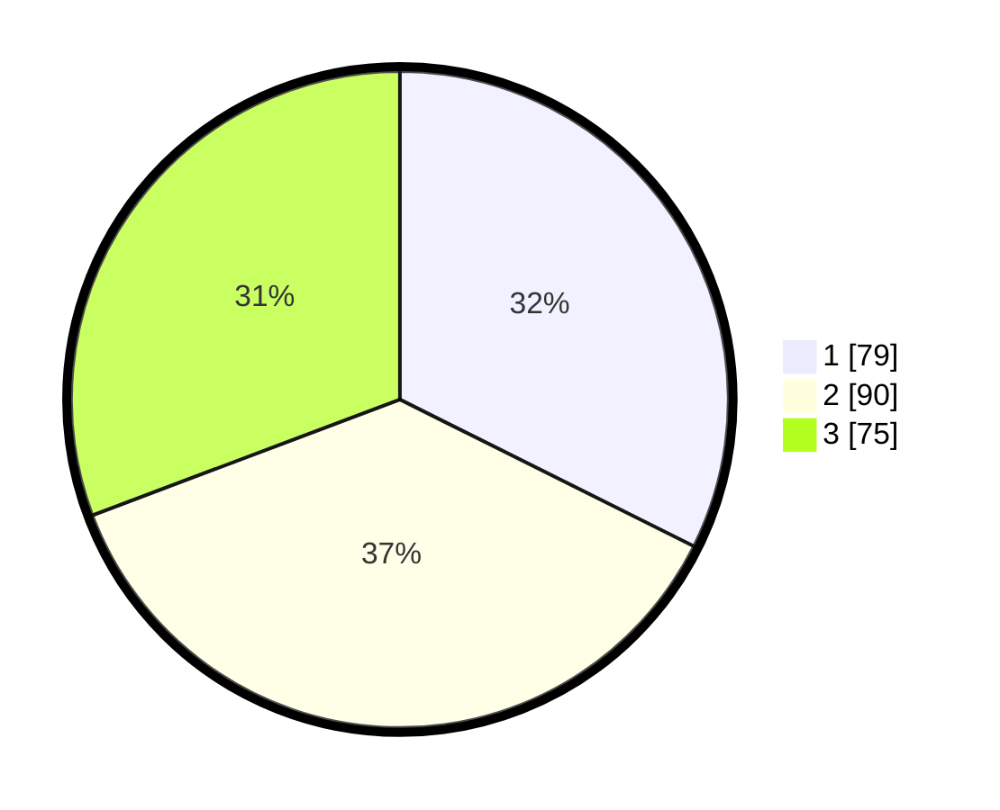

# Hasil

## Grafik

## Tabel

| No. | Nama Paslon    | Suara | Suara (raw) | Persentase |
|:--- |:-------------- | -----:| -----------:| ----------:|
| 1   | ANIES MUHAIMIN | 79    | [79][p-1]   | 32,38      |
| 2   | PRABOWO GIBRAN | 90    | [90][p-2]   | 36,89      |
| 3   | GANJAR MAHFUD  | 75    | [75][p-3]   | 30,74      |

[p-1]: https://github.com/gigit-pemilu/pemilu-2024-33-jawa-tengah/blob/main/pilpres/hitung-suara/sub/33-jawa-tengah/sub/11-sukoharjo/sub/07-polokarto/sub/2013-mranggen/sub/013-tps/sub/paslon-1.txt
[p-2]: https://github.com/gigit-pemilu/pemilu-2024-33-jawa-tengah/blob/main/pilpres/hitung-suara/sub/33-jawa-tengah/sub/11-sukoharjo/sub/07-polokarto/sub/2013-mranggen/sub/013-tps/sub/paslon-2.txt
[p-3]: https://github.com/gigit-pemilu/pemilu-2024-33-jawa-tengah/blob/main/pilpres/hitung-suara/sub/33-jawa-tengah/sub/11-sukoharjo/sub/07-polokarto/sub/2013-mranggen/sub/013-tps/sub/paslon-3.txt

## Foto C Plano

https://sirekap-obj-formc.kpu.go.id/be2c/pemilu/ppwp/33/11/07/20/13/3311072013013-20240218-193044--e656b7d4-a603-4410-bee8-5f8213edbdce.jpg

https://sirekap-obj-formc.kpu.go.id/be2c/pemilu/ppwp/33/11/07/20/13/3311072013013-20240214-202313--c7feb048-9704-43c3-bf21-ee8fe63a6221.jpg

https://sirekap-obj-formc.kpu.go.id/be2c/pemilu/ppwp/33/11/07/20/13/3311072013013-20240214-202320--ba754140-cf5a-46be-969a-70bc7cec0778.jpg

## Metadata

| Key        | Value               |
| ---------- | ------------------- |
| Time Stamp | 2024-02-19 06:16:00 |

