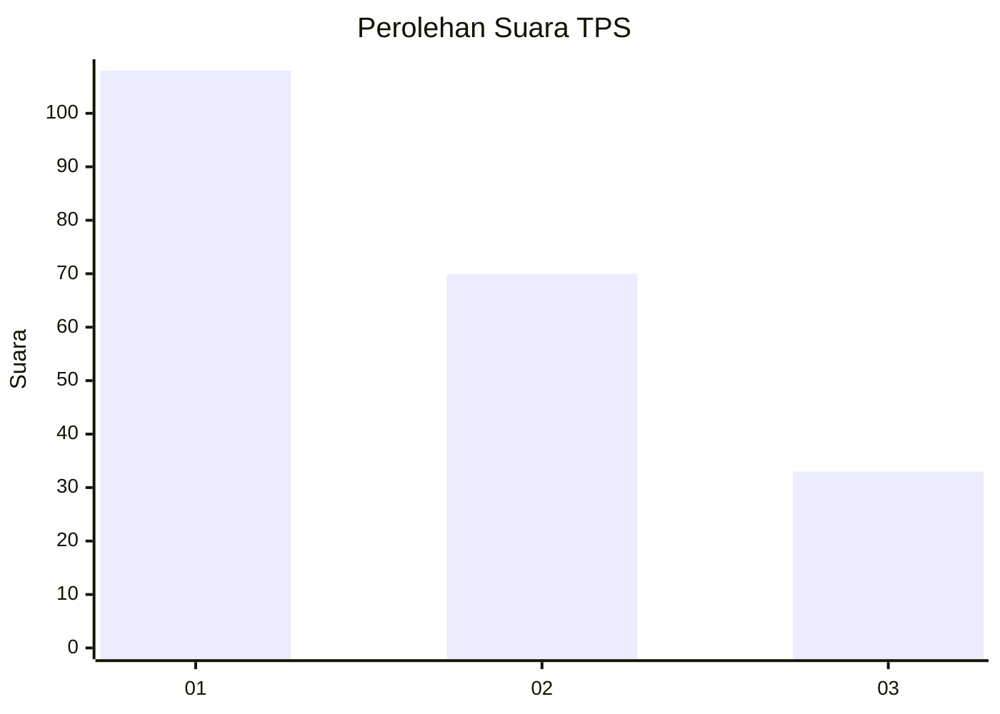
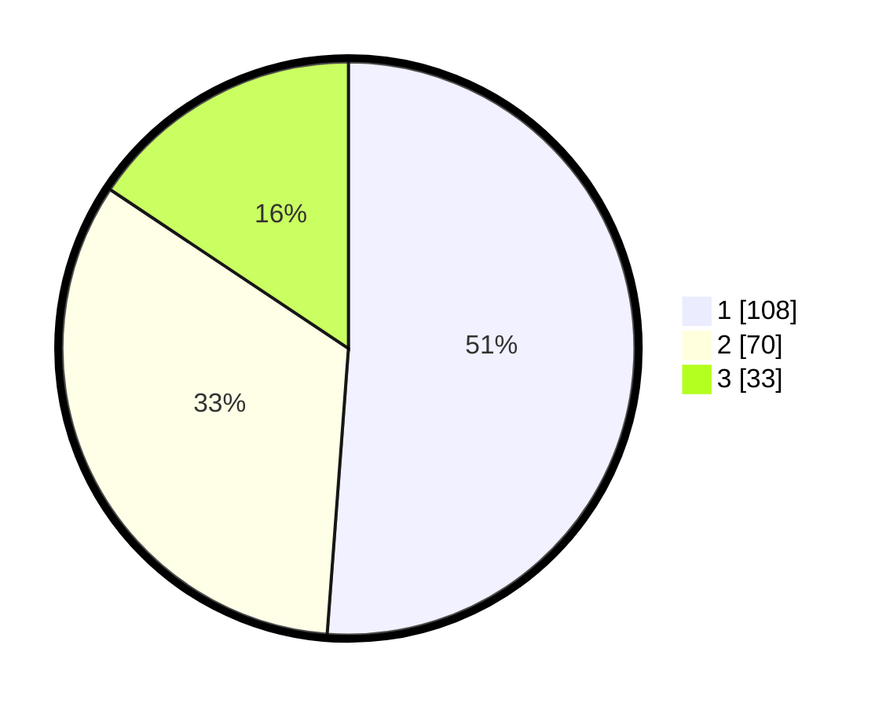

# Hasil

## Grafik

## Tabel

| No. | Nama Paslon    | Suara | Suara (raw) | Persentase |
|:--- |:-------------- | -----:| -----------:| ----------:|
| 1   | ANIES MUHAIMIN | 108   | [108][p-1]  | 51,18      |
| 2   | PRABOWO GIBRAN | 70    | [70][p-2]   | 33,18      |
| 3   | GANJAR MAHFUD  | 33    | [33][p-3]   | 15,64      |

[p-1]: https://github.com/gigit-pemilu/pemilu-2024-33-jawa-tengah/blob/main/pilpres/hitung-suara/sub/33-jawa-tengah/sub/11-sukoharjo/sub/07-polokarto/sub/2013-mranggen/sub/029-tps/sub/paslon-1.txt
[p-2]: https://github.com/gigit-pemilu/pemilu-2024-33-jawa-tengah/blob/main/pilpres/hitung-suara/sub/33-jawa-tengah/sub/11-sukoharjo/sub/07-polokarto/sub/2013-mranggen/sub/029-tps/sub/paslon-2.txt
[p-3]: https://github.com/gigit-pemilu/pemilu-2024-33-jawa-tengah/blob/main/pilpres/hitung-suara/sub/33-jawa-tengah/sub/11-sukoharjo/sub/07-polokarto/sub/2013-mranggen/sub/029-tps/sub/paslon-3.txt

## Foto C Plano

https://sirekap-obj-formc.kpu.go.id/95ce/pemilu/ppwp/33/11/07/20/13/3311072013029-20240218-214746--93d02036-dc9d-4def-8008-66c7b002d488.jpg

https://sirekap-obj-formc.kpu.go.id/95ce/pemilu/ppwp/33/11/07/20/13/3311072013029-20240217-151716--37290f3e-f215-4d8b-ad0f-210252c2e666.jpg

https://sirekap-obj-formc.kpu.go.id/95ce/pemilu/ppwp/33/11/07/20/13/3311072013029-20240217-151742--b45f98c2-5ad9-4d50-9cb5-ba814ba2dba4.jpg

## Metadata

| Key        | Value               |
| ---------- | ------------------- |
| Time Stamp | 2024-02-19 06:16:00 |

