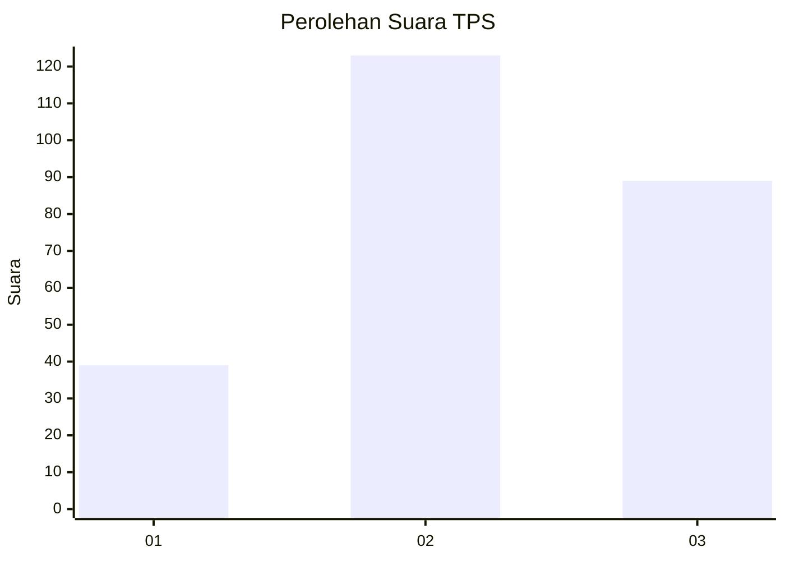
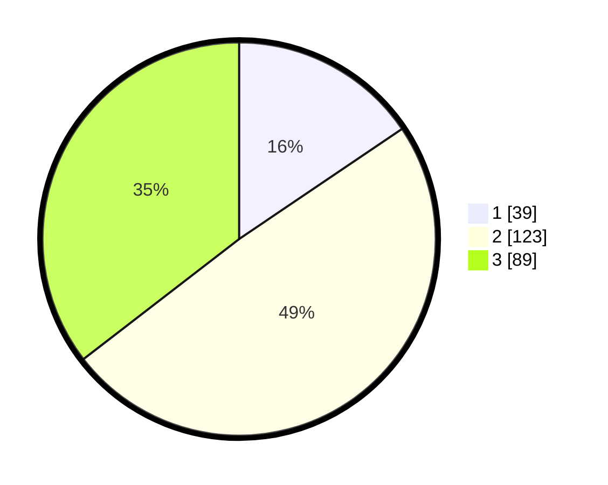

# Hasil

## Grafik

## Tabel

| No. | Nama Paslon    | Suara | Suara (raw) | Persentase |
|:--- |:-------------- | -----:| -----------:| ----------:|
| 1   | ANIES MUHAIMIN | 39    | [39][p-1]   | 15,54      |
| 2   | PRABOWO GIBRAN | 123   | [123][p-2]  | 49,00      |
| 3   | GANJAR MAHFUD  | 89    | [89][p-3]   | 35,46      |

[p-1]: https://github.com/gigit-pemilu/pemilu-2024/blob/main/pilpres/hitung-suara/sub/33-jawa-tengah/sub/11-sukoharjo/sub/08-mojolaban/sub/2001-laban/sub/005-tps/sub/paslon-1.txt
[p-2]: https://github.com/gigit-pemilu/pemilu-2024/blob/main/pilpres/hitung-suara/sub/33-jawa-tengah/sub/11-sukoharjo/sub/08-mojolaban/sub/2001-laban/sub/005-tps/sub/paslon-2.txt
[p-3]: https://github.com/gigit-pemilu/pemilu-2024/blob/main/pilpres/hitung-suara/sub/33-jawa-tengah/sub/11-sukoharjo/sub/08-mojolaban/sub/2001-laban/sub/005-tps/sub/paslon-3.txt

## Foto C Plano

https://sirekap-obj-formc.kpu.go.id/ba3c/pemilu/ppwp/33/11/08/20/01/3311082001005-20240214-192234--829baa7b-d88a-4029-a84b-ee604b4b13fb.jpg

https://sirekap-obj-formc.kpu.go.id/ba3c/pemilu/ppwp/33/11/08/20/01/3311082001005-20240214-192242--5e721337-0c5a-43b3-9b5b-979940026f40.jpg

https://sirekap-obj-formc.kpu.go.id/ba3c/pemilu/ppwp/33/11/08/20/01/3311082001005-20240214-192254--0551a97a-0851-4b9c-a469-1905686f5f5d.jpg

## Metadata

| Key        | Value               |
| ---------- | ------------------- |
| Time Stamp | 2024-02-17 18:30:00 |

