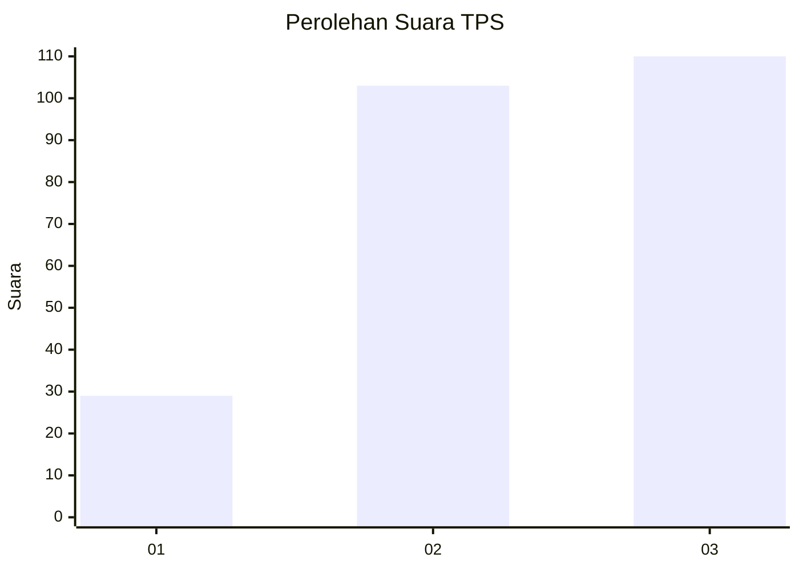
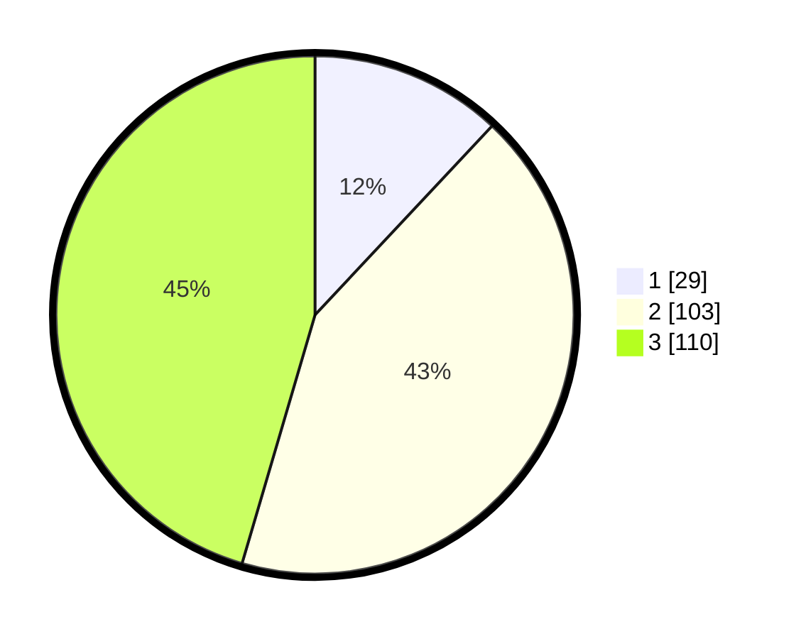

# Hasil

## Grafik

## Tabel

| No. | Nama Paslon    | Suara | Suara (raw) | Persentase |
|:--- |:-------------- | -----:| -----------:| ----------:|
| 1   | ANIES MUHAIMIN | 29    | [29][p-1]   | 11,98      |
| 2   | PRABOWO GIBRAN | 103   | [103][p-2]  | 42,56      |
| 3   | GANJAR MAHFUD  | 110   | [110][p-3]  | 45,45      |

[p-1]: https://github.com/gigit-pemilu/pemilu-2024/blob/main/pilpres/hitung-suara/sub/33-jawa-tengah/sub/11-sukoharjo/sub/08-mojolaban/sub/2003-wirun/sub/004-tps/sub/paslon-1.txt
[p-2]: https://github.com/gigit-pemilu/pemilu-2024/blob/main/pilpres/hitung-suara/sub/33-jawa-tengah/sub/11-sukoharjo/sub/08-mojolaban/sub/2003-wirun/sub/004-tps/sub/paslon-2.txt
[p-3]: https://github.com/gigit-pemilu/pemilu-2024/blob/main/pilpres/hitung-suara/sub/33-jawa-tengah/sub/11-sukoharjo/sub/08-mojolaban/sub/2003-wirun/sub/004-tps/sub/paslon-3.txt

## Foto C Plano

https://sirekap-obj-formc.kpu.go.id/92e7/pemilu/ppwp/33/11/08/20/03/3311082003004-20240214-223728--4fe46e95-e0f8-47e9-97a5-d3a95d5c932d.jpg

https://sirekap-obj-formc.kpu.go.id/92e7/pemilu/ppwp/33/11/08/20/03/3311082003004-20240214-224031--a9c49505-2a79-4a49-a4d1-11ef4e84ef4b.jpg

https://sirekap-obj-formc.kpu.go.id/92e7/pemilu/ppwp/33/11/08/20/03/3311082003004-20240220-204457--b734d5e8-1bc4-4107-8261-df8306578e58.jpg

## Metadata

| Key        | Value               |
| ---------- | ------------------- |
| Time Stamp | 2024-02-20 21:00:00 |

