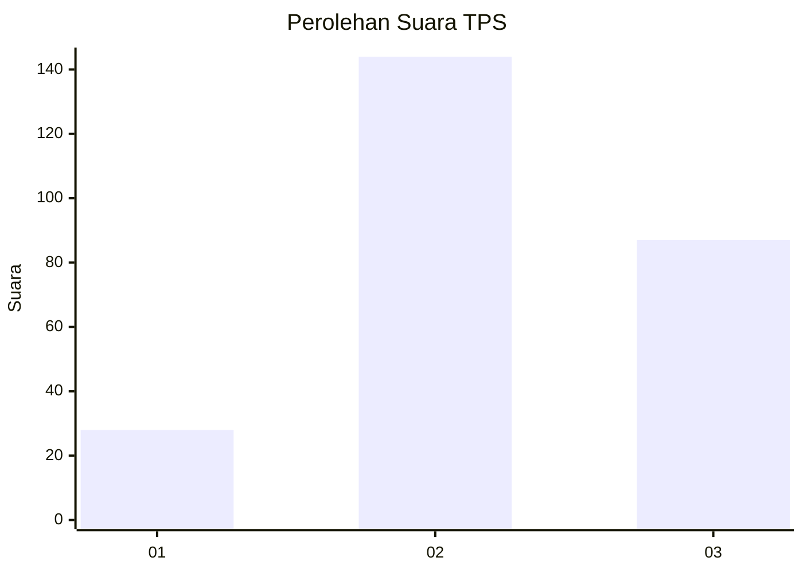
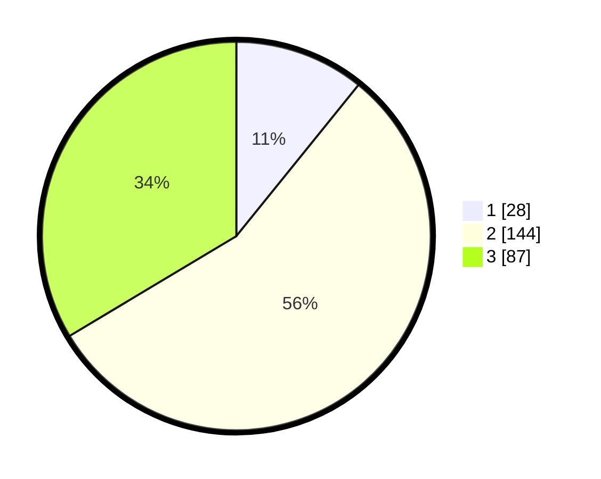

# Hasil

## Grafik

## Tabel

| No. | Nama Paslon    | Suara | Suara (raw) | Persentase |
|:--- |:-------------- | -----:| -----------:| ----------:|
| 1   | ANIES MUHAIMIN | 28    | [28][p-1]   | 10,81      |
| 2   | PRABOWO GIBRAN | 144   | [144][p-2]  | 55,60      |
| 3   | GANJAR MAHFUD  | 87    | [87][p-3]   | 33,59      |

[p-1]: https://github.com/gigit-pemilu/pemilu-2024-33-jawa-tengah/blob/main/pilpres/hitung-suara/sub/33-jawa-tengah/sub/11-sukoharjo/sub/08-mojolaban/sub/2003-wirun/sub/018-tps/sub/paslon-1.txt
[p-2]: https://github.com/gigit-pemilu/pemilu-2024-33-jawa-tengah/blob/main/pilpres/hitung-suara/sub/33-jawa-tengah/sub/11-sukoharjo/sub/08-mojolaban/sub/2003-wirun/sub/018-tps/sub/paslon-2.txt
[p-3]: https://github.com/gigit-pemilu/pemilu-2024-33-jawa-tengah/blob/main/pilpres/hitung-suara/sub/33-jawa-tengah/sub/11-sukoharjo/sub/08-mojolaban/sub/2003-wirun/sub/018-tps/sub/paslon-3.txt

## Foto C Plano

https://sirekap-obj-formc.kpu.go.id/0914/pemilu/ppwp/33/11/08/20/03/3311082003018-20240215-115816--e1665332-2d8a-4f38-9287-2ee304aa8f1c.jpg

https://sirekap-obj-formc.kpu.go.id/0914/pemilu/ppwp/33/11/08/20/03/3311082003018-20240217-151342--190e59af-f8a1-48a3-8f3c-743f4c0d9370.jpg

https://sirekap-obj-formc.kpu.go.id/0914/pemilu/ppwp/33/11/08/20/03/3311082003018-20240216-214943--b1342c40-9773-4c44-992b-c12796c3cdb6.jpg

## Metadata

| Key        | Value               |
| ---------- | ------------------- |
| Time Stamp | 2024-02-19 16:00:00 |

