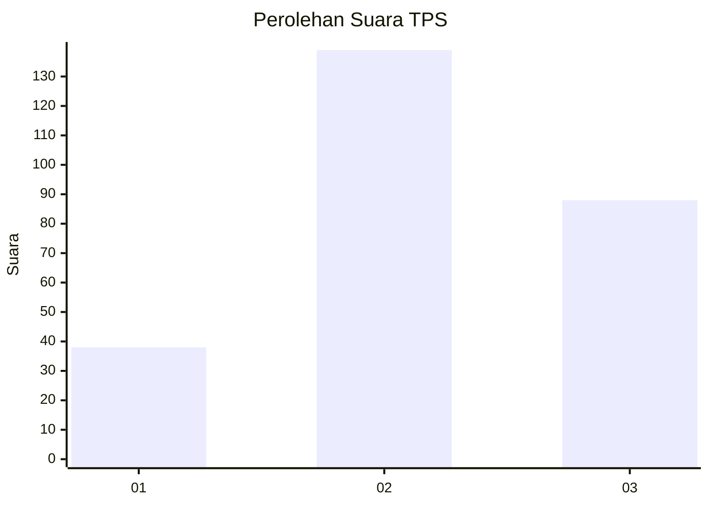
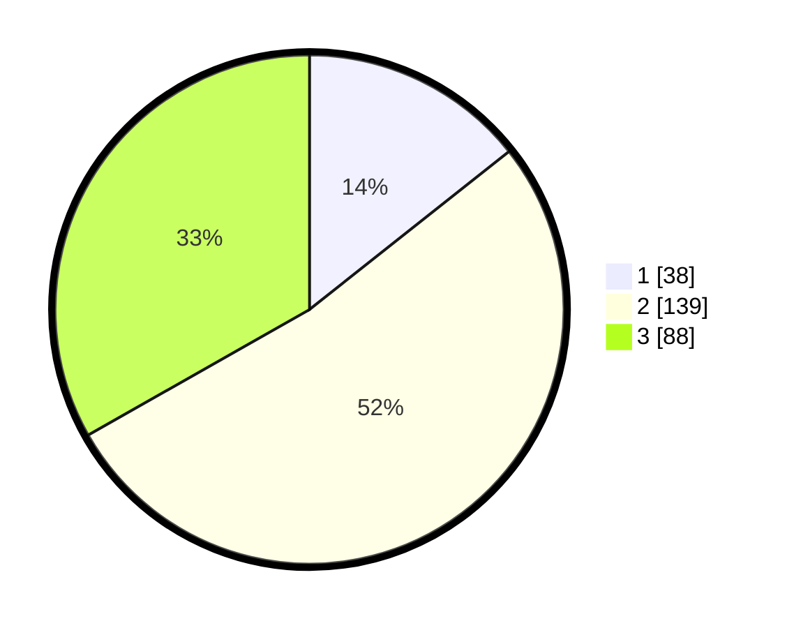

# Hasil

## Grafik

## Tabel

| No. | Nama Paslon    | Suara | Suara (raw) | Persentase |
|:--- |:-------------- | -----:| -----------:| ----------:|
| 1   | ANIES MUHAIMIN | 38    | [38][p-1]   | 14,34      |
| 2   | PRABOWO GIBRAN | 139   | [139][p-2]  | 52,45      |
| 3   | GANJAR MAHFUD  | 88    | [88][p-3]   | 33,21      |

[p-1]: https://github.com/gigit-pemilu/pemilu-2024-33-jawa-tengah/blob/main/pilpres/hitung-suara/sub/33-jawa-tengah/sub/11-sukoharjo/sub/08-mojolaban/sub/2004-bekonang/sub/011-tps/sub/paslon-1.txt
[p-2]: https://github.com/gigit-pemilu/pemilu-2024-33-jawa-tengah/blob/main/pilpres/hitung-suara/sub/33-jawa-tengah/sub/11-sukoharjo/sub/08-mojolaban/sub/2004-bekonang/sub/011-tps/sub/paslon-2.txt
[p-3]: https://github.com/gigit-pemilu/pemilu-2024-33-jawa-tengah/blob/main/pilpres/hitung-suara/sub/33-jawa-tengah/sub/11-sukoharjo/sub/08-mojolaban/sub/2004-bekonang/sub/011-tps/sub/paslon-3.txt

## Foto C Plano

https://sirekap-obj-formc.kpu.go.id/1c83/pemilu/ppwp/33/11/08/20/04/3311082004011-20240217-100313--ffade068-51e1-48dd-8bed-cabb39282a33.jpg

https://sirekap-obj-formc.kpu.go.id/1c83/pemilu/ppwp/33/11/08/20/04/3311082004011-20240219-080638--bf6babe2-8697-4889-9e2b-c891a198a908.jpg

https://sirekap-obj-formc.kpu.go.id/1c83/pemilu/ppwp/33/11/08/20/04/3311082004011-20240217-100204--d9bcd048-e555-4047-93bb-988ce008b976.jpg

## Metadata

| Key        | Value               |
| ---------- | ------------------- |
| Time Stamp | 2024-02-19 12:00:00 |

