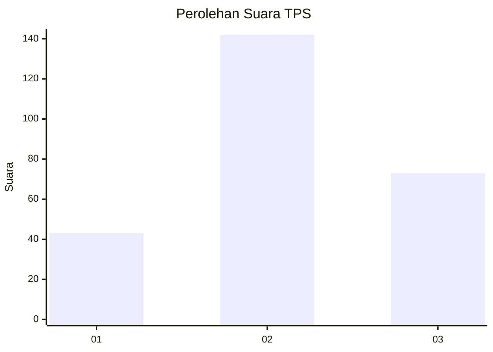
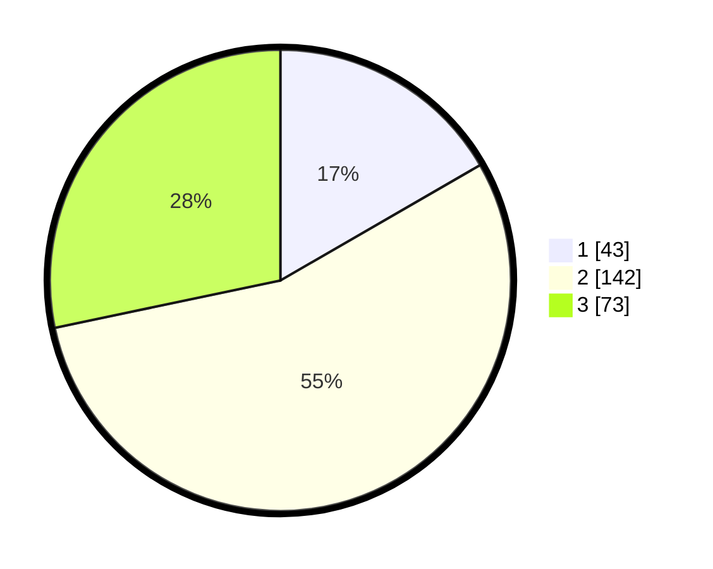

# Hasil

## Grafik

## Tabel

| No. | Nama Paslon    | Suara | Suara (raw) | Persentase |
|:--- |:-------------- | -----:| -----------:| ----------:|
| 1   | ANIES MUHAIMIN | 43    | [43][p-1]   | 16,67      |
| 2   | PRABOWO GIBRAN | 142   | [142][p-2]  | 55,04      |
| 3   | GANJAR MAHFUD  | 73    | [73][p-3]   | 28,29      |

[p-1]: https://github.com/gigit-pemilu/pemilu-2024/blob/main/pilpres/hitung-suara/sub/33-jawa-tengah/sub/11-sukoharjo/sub/08-mojolaban/sub/2004-bekonang/sub/013-tps/sub/paslon-1.txt
[p-2]: https://github.com/gigit-pemilu/pemilu-2024/blob/main/pilpres/hitung-suara/sub/33-jawa-tengah/sub/11-sukoharjo/sub/08-mojolaban/sub/2004-bekonang/sub/013-tps/sub/paslon-2.txt
[p-3]: https://github.com/gigit-pemilu/pemilu-2024/blob/main/pilpres/hitung-suara/sub/33-jawa-tengah/sub/11-sukoharjo/sub/08-mojolaban/sub/2004-bekonang/sub/013-tps/sub/paslon-3.txt

## Foto C Plano

https://sirekap-obj-formc.kpu.go.id/6d7a/pemilu/ppwp/33/11/08/20/04/3311082004013-20240217-183754--7c8b7003-651c-4083-bb9b-b0d17669f591.jpg

https://sirekap-obj-formc.kpu.go.id/6d7a/pemilu/ppwp/33/11/08/20/04/3311082004013-20240217-183947--e6923cd7-0b8a-4fa3-bb6a-52573ca52ee2.jpg

https://sirekap-obj-formc.kpu.go.id/6d7a/pemilu/ppwp/33/11/08/20/04/3311082004013-20240217-195355--6c5b0240-e0b1-427b-819c-bb9e13004a3c.jpg

## Metadata

| Key        | Value               |
| ---------- | ------------------- |
| Time Stamp | 2024-02-24 22:31:28 |

