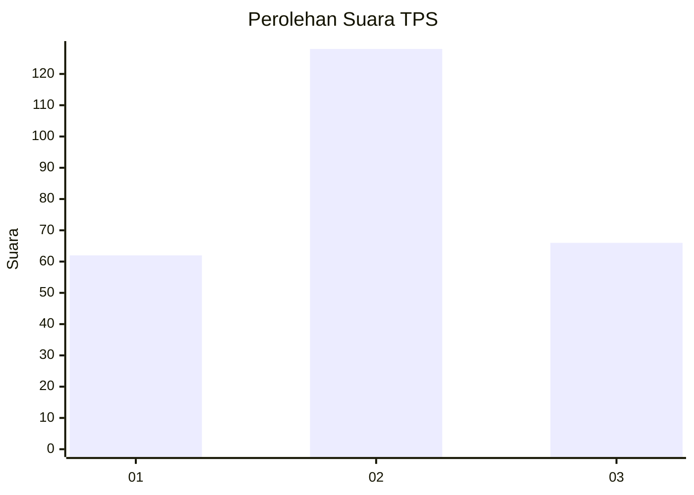
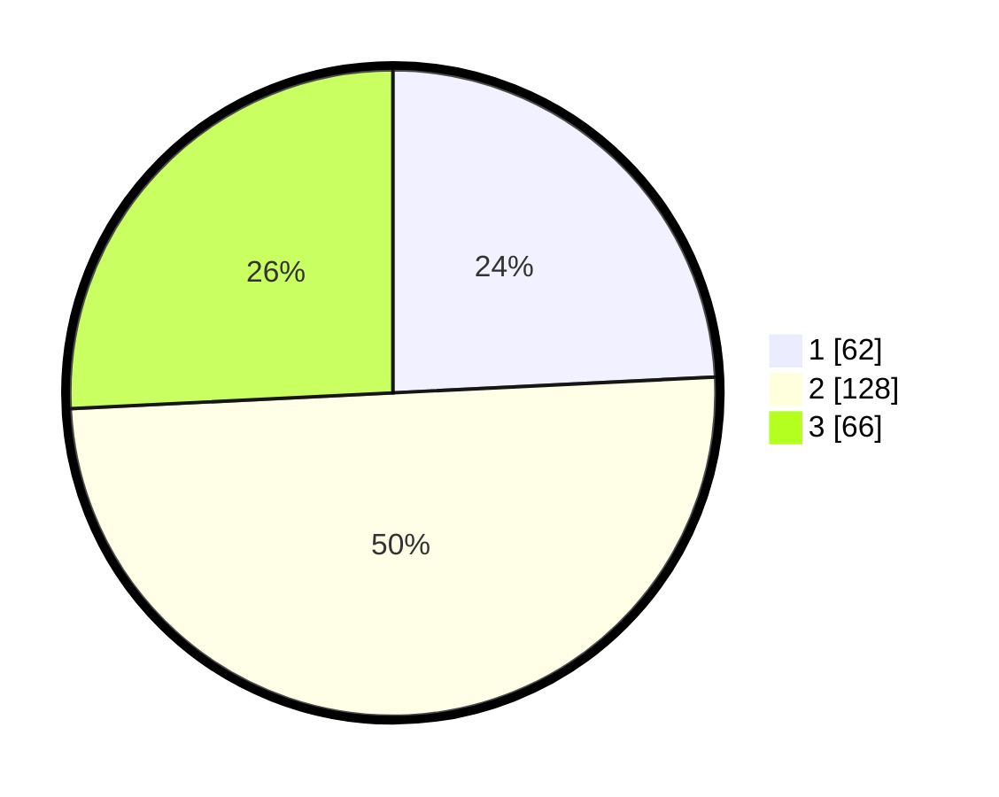

# Hasil

## Grafik

## Tabel

| No. | Nama Paslon    | Suara | Suara (raw) | Persentase |
|:--- |:-------------- | -----:| -----------:| ----------:|
| 1   | ANIES MUHAIMIN | 62    | [62][p-1]   | 24,22      |
| 2   | PRABOWO GIBRAN | 128   | [128][p-2]  | 50,00      |
| 3   | GANJAR MAHFUD  | 66    | [66][p-3]   | 25,78      |

[p-1]: https://github.com/gigit-pemilu/pemilu-2024/blob/main/pilpres/hitung-suara/sub/33-jawa-tengah/sub/11-sukoharjo/sub/08-mojolaban/sub/2005-cangkol/sub/001-tps/sub/paslon-1.txt
[p-2]: https://github.com/gigit-pemilu/pemilu-2024/blob/main/pilpres/hitung-suara/sub/33-jawa-tengah/sub/11-sukoharjo/sub/08-mojolaban/sub/2005-cangkol/sub/001-tps/sub/paslon-2.txt
[p-3]: https://github.com/gigit-pemilu/pemilu-2024/blob/main/pilpres/hitung-suara/sub/33-jawa-tengah/sub/11-sukoharjo/sub/08-mojolaban/sub/2005-cangkol/sub/001-tps/sub/paslon-3.txt

## Foto C Plano

https://sirekap-obj-formc.kpu.go.id/15e6/pemilu/ppwp/33/11/08/20/05/3311082005001-20240221-173554--7e18c31f-e503-488b-95a1-ee462a9af986.jpg

https://sirekap-obj-formc.kpu.go.id/15e6/pemilu/ppwp/33/11/08/20/05/3311082005001-20240221-173645--e4df8980-d981-4232-9845-b71843a9e938.jpg

https://sirekap-obj-formc.kpu.go.id/15e6/pemilu/ppwp/33/11/08/20/05/3311082005001-20240215-013505--b1269420-dbe1-4c4e-9de8-d57c07c7f206.jpg

## Metadata

| Key        | Value               |
| ---------- | ------------------- |
| Time Stamp | 2024-02-25 21:00:00 |

