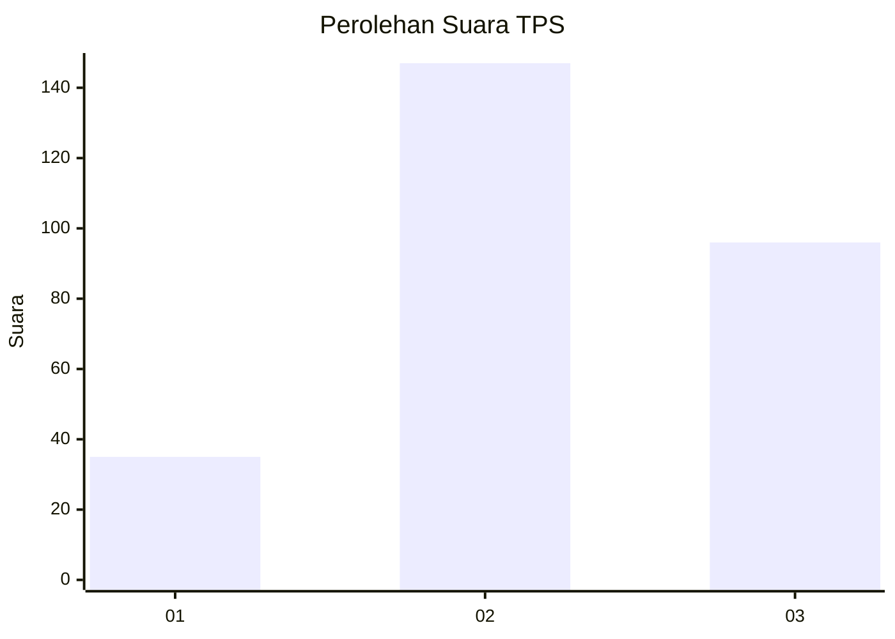
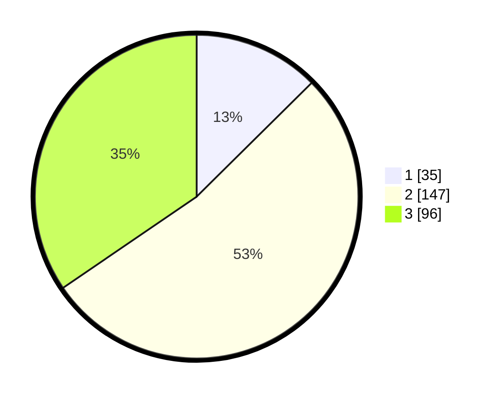

# Hasil

## Grafik

## Tabel

| No. | Nama Paslon    | Suara | Suara (raw) | Persentase |
|:--- |:-------------- | -----:| -----------:| ----------:|
| 1   | ANIES MUHAIMIN | 35    | [35][p-1]   | 12,59      |
| 2   | PRABOWO GIBRAN | 147   | [147][p-2]  | 52,88      |
| 3   | GANJAR MAHFUD  | 96    | [96][p-3]   | 34,53      |

[p-1]: https://github.com/gigit-pemilu/pemilu-2024/blob/main/pilpres/hitung-suara/sub/33-jawa-tengah/sub/11-sukoharjo/sub/08-mojolaban/sub/2005-cangkol/sub/010-tps/sub/paslon-1.txt
[p-2]: https://github.com/gigit-pemilu/pemilu-2024/blob/main/pilpres/hitung-suara/sub/33-jawa-tengah/sub/11-sukoharjo/sub/08-mojolaban/sub/2005-cangkol/sub/010-tps/sub/paslon-2.txt
[p-3]: https://github.com/gigit-pemilu/pemilu-2024/blob/main/pilpres/hitung-suara/sub/33-jawa-tengah/sub/11-sukoharjo/sub/08-mojolaban/sub/2005-cangkol/sub/010-tps/sub/paslon-3.txt

## Foto C Plano

https://sirekap-obj-formc.kpu.go.id/bf36/pemilu/ppwp/33/11/08/20/05/3311082005010-20240215-021256--969564de-47d4-48e2-9ae8-fff09d3726ec.jpg

https://sirekap-obj-formc.kpu.go.id/bf36/pemilu/ppwp/33/11/08/20/05/3311082005010-20240216-074239--5abaf7ba-0a1d-44d4-a636-b9da449e60e4.jpg

https://sirekap-obj-formc.kpu.go.id/bf36/pemilu/ppwp/33/11/08/20/05/3311082005010-20240215-022105--f7c74de0-187c-4d38-a0a4-3aff22164f69.jpg

## Metadata

| Key        | Value               |
| ---------- | ------------------- |
| Time Stamp | 2024-02-16 16:25:10 |

