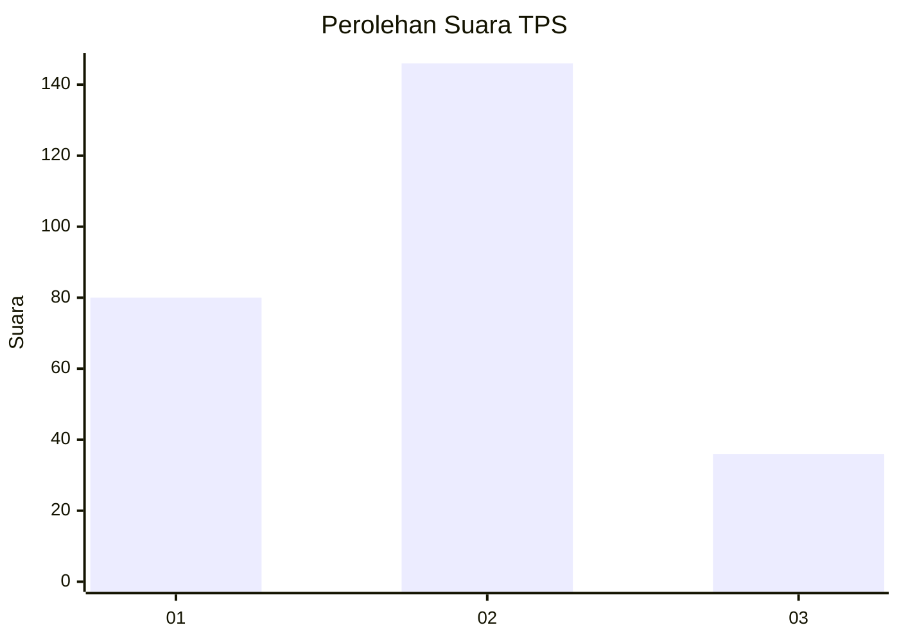
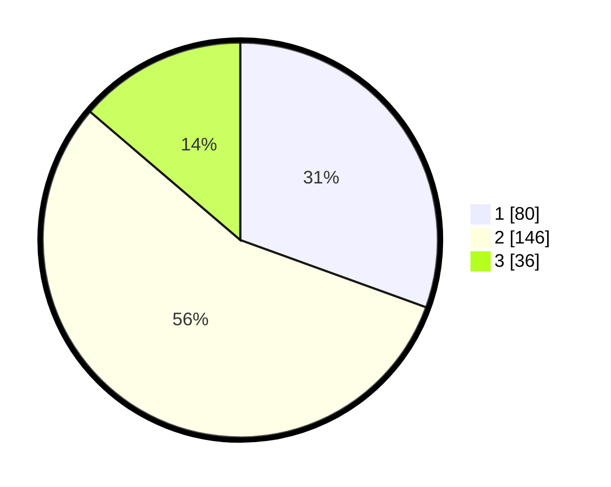

# Hasil

## Grafik

## Tabel

| No. | Nama Paslon    | Suara | Suara (raw) | Persentase |
|:--- |:-------------- | -----:| -----------:| ----------:|
| 1   | ANIES MUHAIMIN | 80    | [80][p-1]   | 30,53      |
| 2   | PRABOWO GIBRAN | 146   | [146][p-2]  | 55,73      |
| 3   | GANJAR MAHFUD  | 36    | [36][p-3]   | 13,74      |

[p-1]: https://github.com/gigit-pemilu/pemilu-2024-33-jawa-tengah/blob/main/pilpres/hitung-suara/sub/33-jawa-tengah/sub/11-sukoharjo/sub/08-mojolaban/sub/2005-cangkol/sub/016-tps/sub/paslon-1.txt
[p-2]: https://github.com/gigit-pemilu/pemilu-2024-33-jawa-tengah/blob/main/pilpres/hitung-suara/sub/33-jawa-tengah/sub/11-sukoharjo/sub/08-mojolaban/sub/2005-cangkol/sub/016-tps/sub/paslon-2.txt
[p-3]: https://github.com/gigit-pemilu/pemilu-2024-33-jawa-tengah/blob/main/pilpres/hitung-suara/sub/33-jawa-tengah/sub/11-sukoharjo/sub/08-mojolaban/sub/2005-cangkol/sub/016-tps/sub/paslon-3.txt

## Foto C Plano

https://sirekap-obj-formc.kpu.go.id/d2c9/pemilu/ppwp/33/11/08/20/05/3311082005016-20240215-202342--321cacdd-78b2-450e-aec4-1975e9f1e68a.jpg

https://sirekap-obj-formc.kpu.go.id/d2c9/pemilu/ppwp/33/11/08/20/05/3311082005016-20240215-202616--c5e7a746-e3e3-474d-80a7-582faa63c8f4.jpg

https://sirekap-obj-formc.kpu.go.id/d2c9/pemilu/ppwp/33/11/08/20/05/3311082005016-20240215-202541--63f5fcef-3638-4f47-8780-bf000b298e54.jpg

## Metadata

| Key        | Value               |
| ---------- | ------------------- |
| Time Stamp | 2024-02-15 21:01:18 |

