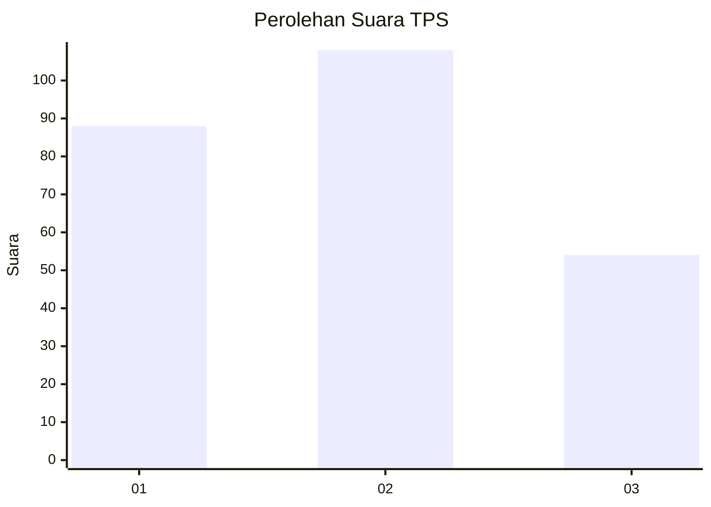
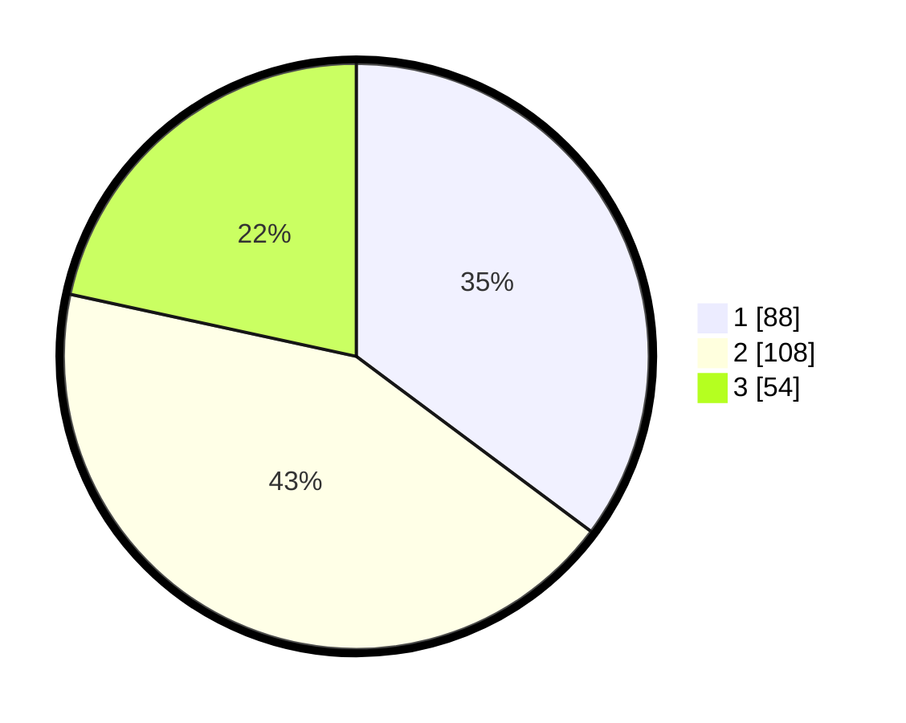

# Hasil

## Grafik

## Tabel

| No. | Nama Paslon    | Suara | Suara (raw) | Persentase |
|:--- |:-------------- | -----:| -----------:| ----------:|
| 1   | ANIES MUHAIMIN | 88    | [88][p-1]   | 35,20      |
| 2   | PRABOWO GIBRAN | 108   | [108][p-2]  | 43,20      |
| 3   | GANJAR MAHFUD  | 54    | [54][p-3]   | 21,60      |

[p-1]: https://github.com/gigit-pemilu/pemilu-2024-33-jawa-tengah/blob/main/pilpres/hitung-suara/sub/33-jawa-tengah/sub/11-sukoharjo/sub/08-mojolaban/sub/2008-sapen/sub/014-tps/sub/paslon-1.txt
[p-2]: https://github.com/gigit-pemilu/pemilu-2024-33-jawa-tengah/blob/main/pilpres/hitung-suara/sub/33-jawa-tengah/sub/11-sukoharjo/sub/08-mojolaban/sub/2008-sapen/sub/014-tps/sub/paslon-2.txt
[p-3]: https://github.com/gigit-pemilu/pemilu-2024-33-jawa-tengah/blob/main/pilpres/hitung-suara/sub/33-jawa-tengah/sub/11-sukoharjo/sub/08-mojolaban/sub/2008-sapen/sub/014-tps/sub/paslon-3.txt

## Foto C Plano

https://sirekap-obj-formc.kpu.go.id/bda7/pemilu/ppwp/33/11/08/20/08/3311082008014-20240214-194820--5db9915b-30f6-4812-a144-2f2f937c5f6c.jpg

https://sirekap-obj-formc.kpu.go.id/bda7/pemilu/ppwp/33/11/08/20/08/3311082008014-20240214-194822--6b5464ee-1522-4d2d-a266-562a14407a19.jpg

https://sirekap-obj-formc.kpu.go.id/bda7/pemilu/ppwp/33/11/08/20/08/3311082008014-20240215-014151--1585a595-39b2-4c35-803c-87ffdaae7500.jpg

## Metadata

| Key        | Value               |
| ---------- | ------------------- |
| Time Stamp | 2024-02-15 06:00:23 |

