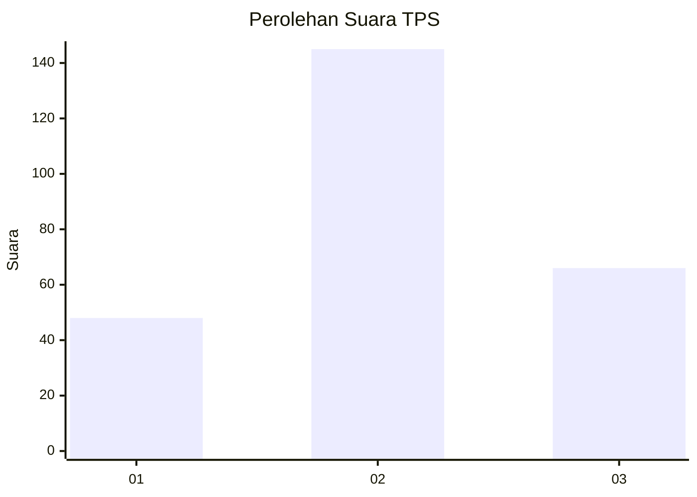
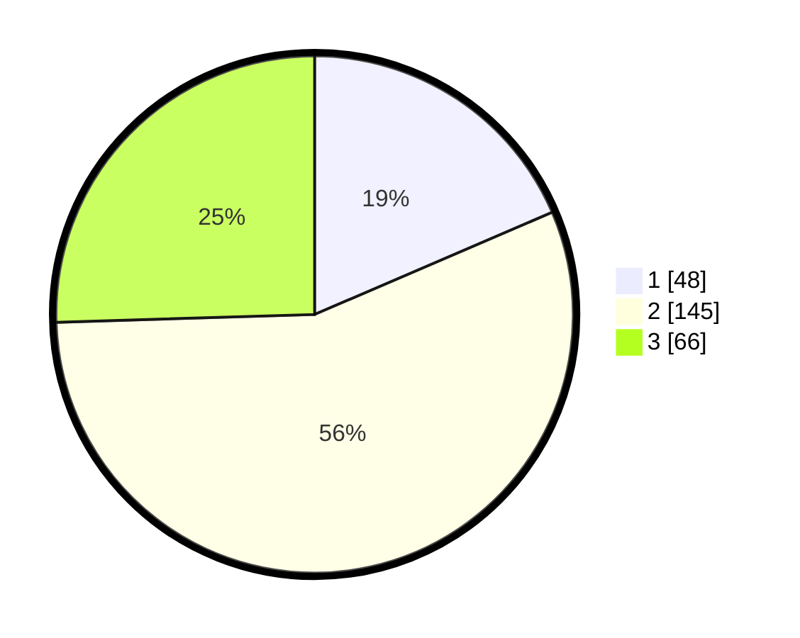

# Hasil

## Grafik

## Tabel

| No. | Nama Paslon    | Suara | Suara (raw) | Persentase |
|:--- |:-------------- | -----:| -----------:| ----------:|
| 1   | ANIES MUHAIMIN | 48    | [48][p-1]   | 18,53      |
| 2   | PRABOWO GIBRAN | 145   | [145][p-2]  | 55,98      |
| 3   | GANJAR MAHFUD  | 66    | [66][p-3]   | 25,48      |

[p-1]: https://github.com/gigit-pemilu/pemilu-2024-33-jawa-tengah/blob/main/pilpres/hitung-suara/sub/33-jawa-tengah/sub/11-sukoharjo/sub/08-mojolaban/sub/2010-demakan/sub/004-tps/sub/paslon-1.txt
[p-2]: https://github.com/gigit-pemilu/pemilu-2024-33-jawa-tengah/blob/main/pilpres/hitung-suara/sub/33-jawa-tengah/sub/11-sukoharjo/sub/08-mojolaban/sub/2010-demakan/sub/004-tps/sub/paslon-2.txt
[p-3]: https://github.com/gigit-pemilu/pemilu-2024-33-jawa-tengah/blob/main/pilpres/hitung-suara/sub/33-jawa-tengah/sub/11-sukoharjo/sub/08-mojolaban/sub/2010-demakan/sub/004-tps/sub/paslon-3.txt

## Foto C Plano

https://sirekap-obj-formc.kpu.go.id/274b/pemilu/ppwp/33/11/08/20/10/3311082010004-20240217-121028--be58ae1e-a562-4f03-a5ab-5445fbe85217.jpg

https://sirekap-obj-formc.kpu.go.id/274b/pemilu/ppwp/33/11/08/20/10/3311082010004-20240217-121259--458da8a6-0841-492a-9d9c-3b609e8f62f3.jpg

https://sirekap-obj-formc.kpu.go.id/274b/pemilu/ppwp/33/11/08/20/10/3311082010004-20240217-121406--67f989bf-5a7b-41a3-9d58-d27d0ba5be03.jpg

## Metadata

| Key        | Value               |
| ---------- | ------------------- |
| Time Stamp | 2024-02-17 13:37:34 |

