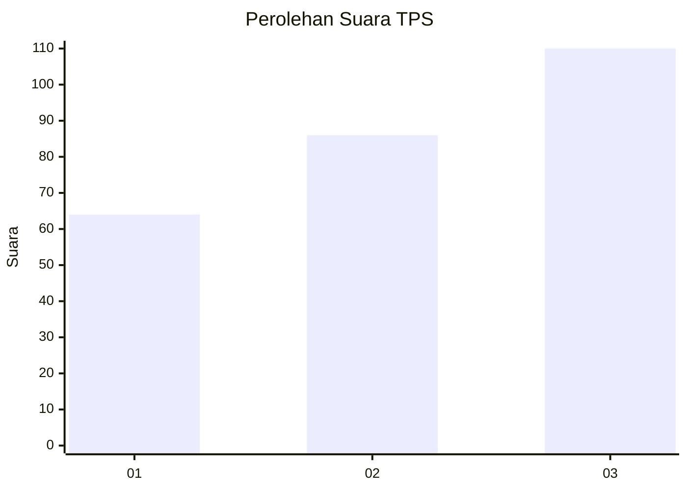
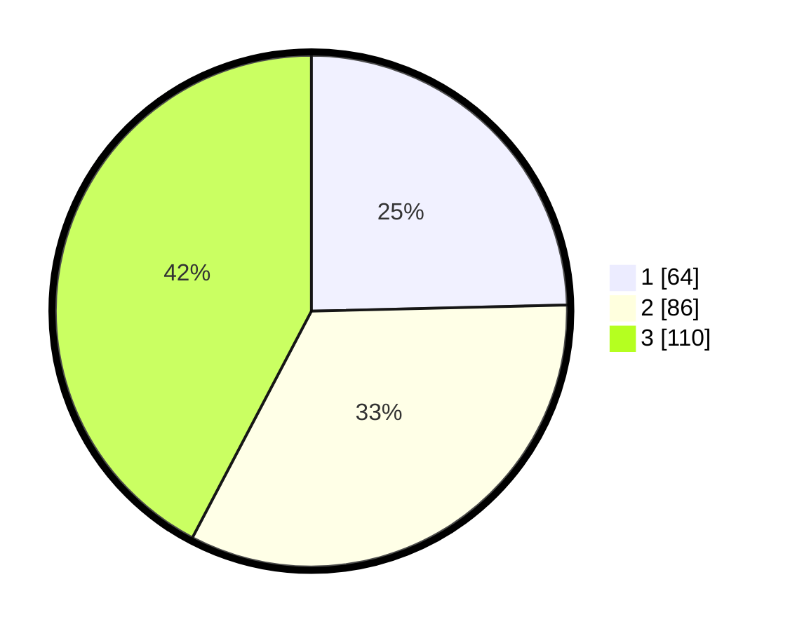

# Hasil

## Grafik

## Tabel

| No. | Nama Paslon    | Suara | Suara (raw) | Persentase |
|:--- |:-------------- | -----:| -----------:| ----------:|
| 1   | ANIES MUHAIMIN | 64    | [64][p-1]   | 24,62      |
| 2   | PRABOWO GIBRAN | 86    | [86][p-2]   | 33,08      |
| 3   | GANJAR MAHFUD  | 110   | [110][p-3]  | 42,31      |

[p-1]: https://github.com/gigit-pemilu/pemilu-2024/blob/main/pilpres/hitung-suara/sub/33-jawa-tengah/sub/11-sukoharjo/sub/08-mojolaban/sub/2010-demakan/sub/011-tps/sub/paslon-1.txt
[p-2]: https://github.com/gigit-pemilu/pemilu-2024/blob/main/pilpres/hitung-suara/sub/33-jawa-tengah/sub/11-sukoharjo/sub/08-mojolaban/sub/2010-demakan/sub/011-tps/sub/paslon-2.txt
[p-3]: https://github.com/gigit-pemilu/pemilu-2024/blob/main/pilpres/hitung-suara/sub/33-jawa-tengah/sub/11-sukoharjo/sub/08-mojolaban/sub/2010-demakan/sub/011-tps/sub/paslon-3.txt

## Foto C Plano

https://sirekap-obj-formc.kpu.go.id/343a/pemilu/ppwp/33/11/08/20/10/3311082010011-20240217-213116--82b3331d-1413-4fff-88c8-046740b19ffd.jpg

https://sirekap-obj-formc.kpu.go.id/343a/pemilu/ppwp/33/11/08/20/10/3311082010011-20240215-043037--243646de-8ab6-4932-9537-6964c3aeca5a.jpg

https://sirekap-obj-formc.kpu.go.id/343a/pemilu/ppwp/33/11/08/20/10/3311082010011-20240215-043147--45bad3e0-4667-4162-bdc2-df6fd76c9837.jpg

## Metadata

| Key        | Value               |
| ---------- | ------------------- |
| Time Stamp | 2024-02-19 06:16:00 |

