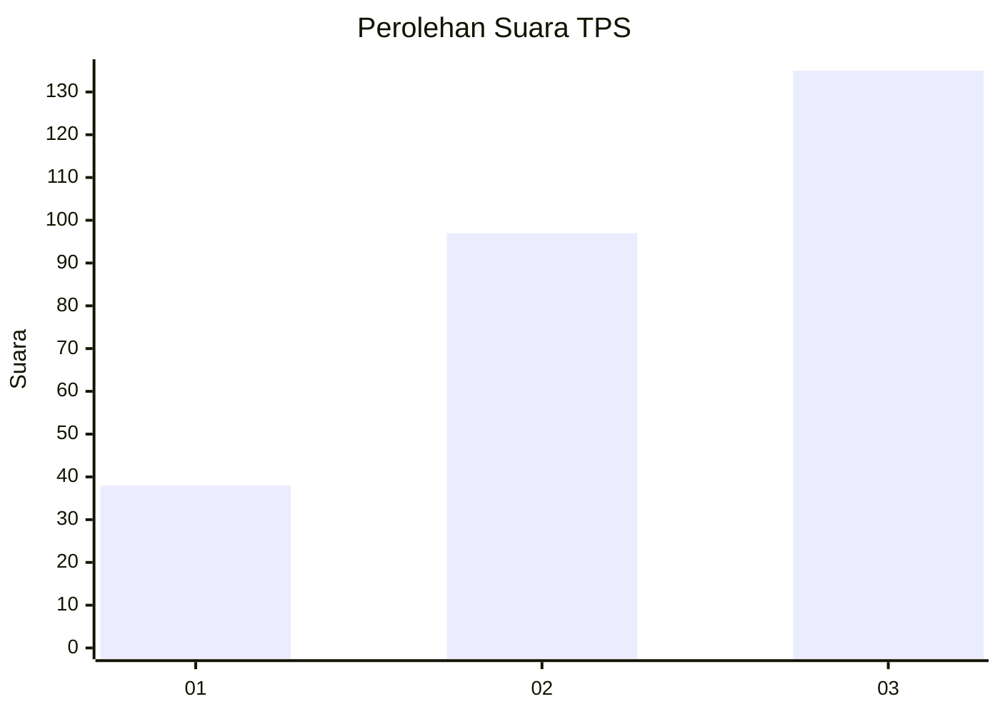
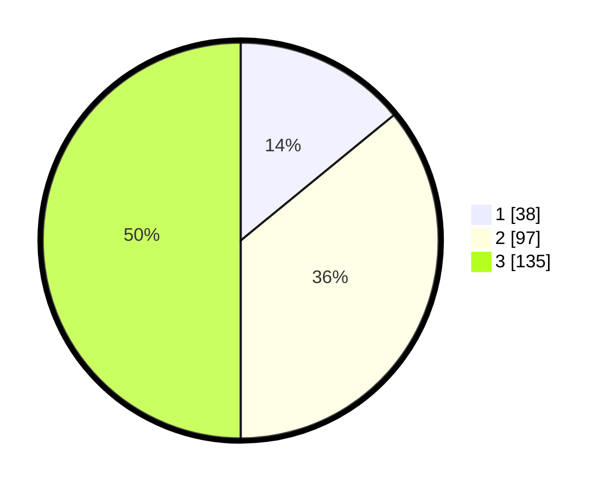

# Hasil

## Grafik

## Tabel

| No. | Nama Paslon    | Suara | Suara (raw) | Persentase |
|:--- |:-------------- | -----:| -----------:| ----------:|
| 1   | ANIES MUHAIMIN | 38    | [38][p-1]   | 14,07      |
| 2   | PRABOWO GIBRAN | 97    | [97][p-2]   | 35,93      |
| 3   | GANJAR MAHFUD  | 135   | [135][p-3]  | 50,00      |

[p-1]: https://github.com/gigit-pemilu/pemilu-2024/blob/main/pilpres/hitung-suara/sub/33-jawa-tengah/sub/11-sukoharjo/sub/08-mojolaban/sub/2011-dukuh/sub/003-tps/sub/paslon-1.txt
[p-2]: https://github.com/gigit-pemilu/pemilu-2024/blob/main/pilpres/hitung-suara/sub/33-jawa-tengah/sub/11-sukoharjo/sub/08-mojolaban/sub/2011-dukuh/sub/003-tps/sub/paslon-2.txt
[p-3]: https://github.com/gigit-pemilu/pemilu-2024/blob/main/pilpres/hitung-suara/sub/33-jawa-tengah/sub/11-sukoharjo/sub/08-mojolaban/sub/2011-dukuh/sub/003-tps/sub/paslon-3.txt

## Foto C Plano

https://sirekap-obj-formc.kpu.go.id/3ba2/pemilu/ppwp/33/11/08/20/11/3311082011003-20240216-151920--d9f3aa5f-18e3-45a4-80ac-f507c3e0413c.jpg

https://sirekap-obj-formc.kpu.go.id/3ba2/pemilu/ppwp/33/11/08/20/11/3311082011003-20240216-151925--c9c401d2-6fea-4495-8d53-d18602400085.jpg

https://sirekap-obj-formc.kpu.go.id/3ba2/pemilu/ppwp/33/11/08/20/11/3311082011003-20240216-151929--4b0affb6-a535-4330-b57a-7eace3bc9912.jpg

## Metadata

| Key        | Value               |
| ---------- | ------------------- |
| Time Stamp | 2024-02-16 16:25:10 |

