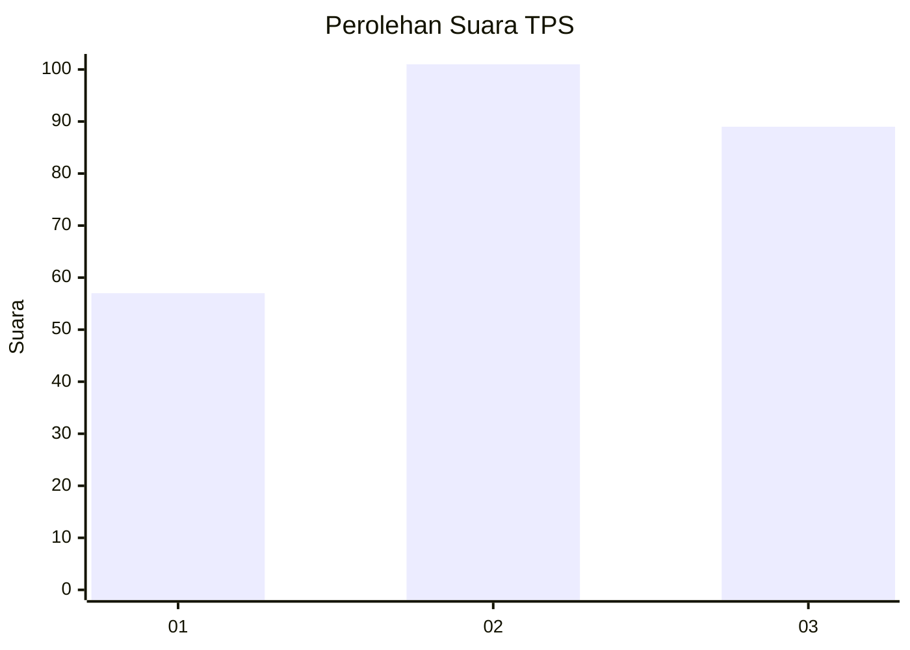
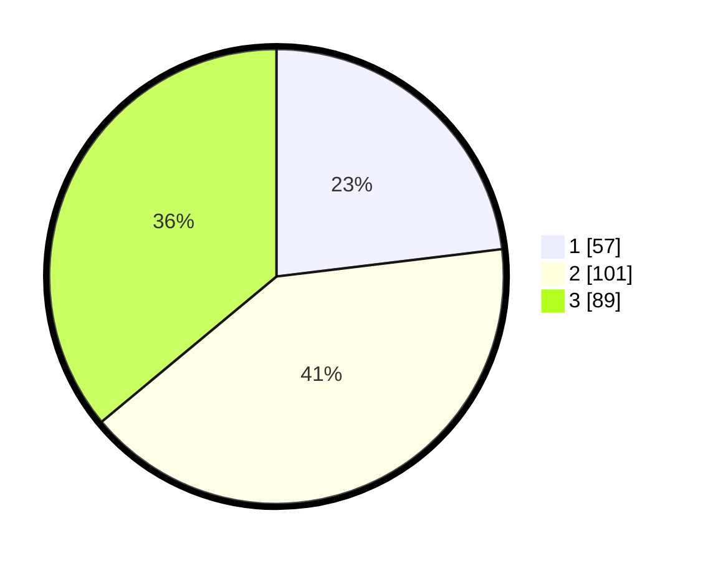

# Hasil

## Grafik

## Tabel

| No. | Nama Paslon    | Suara | Suara (raw) | Persentase |
|:--- |:-------------- | -----:| -----------:| ----------:|
| 1   | ANIES MUHAIMIN | 57    | [57][p-1]   | 23,08      |
| 2   | PRABOWO GIBRAN | 101   | [101][p-2]  | 40,89      |
| 3   | GANJAR MAHFUD  | 89    | [89][p-3]   | 36,03      |

[p-1]: https://github.com/gigit-pemilu/pemilu-2024/blob/main/pilpres/hitung-suara/sub/33-jawa-tengah/sub/11-sukoharjo/sub/08-mojolaban/sub/2012-plumbon/sub/007-tps/sub/paslon-1.txt
[p-2]: https://github.com/gigit-pemilu/pemilu-2024/blob/main/pilpres/hitung-suara/sub/33-jawa-tengah/sub/11-sukoharjo/sub/08-mojolaban/sub/2012-plumbon/sub/007-tps/sub/paslon-2.txt
[p-3]: https://github.com/gigit-pemilu/pemilu-2024/blob/main/pilpres/hitung-suara/sub/33-jawa-tengah/sub/11-sukoharjo/sub/08-mojolaban/sub/2012-plumbon/sub/007-tps/sub/paslon-3.txt

## Foto C Plano

https://sirekap-obj-formc.kpu.go.id/c0fb/pemilu/ppwp/33/11/08/20/12/3311082012007-20240214-221419--062cf329-17cb-4e6f-a534-7a8bc30a266f.jpg

https://sirekap-obj-formc.kpu.go.id/c0fb/pemilu/ppwp/33/11/08/20/12/3311082012007-20240214-221633--8272ff72-d751-4d81-af9b-6e927f9cdd27.jpg

https://sirekap-obj-formc.kpu.go.id/c0fb/pemilu/ppwp/33/11/08/20/12/3311082012007-20240214-221807--2c94c8e5-f604-43f5-83b0-d4e6ee8645fb.jpg

## Metadata

| Key        | Value               |
| ---------- | ------------------- |
| Time Stamp | 2024-02-15 21:01:18 |

