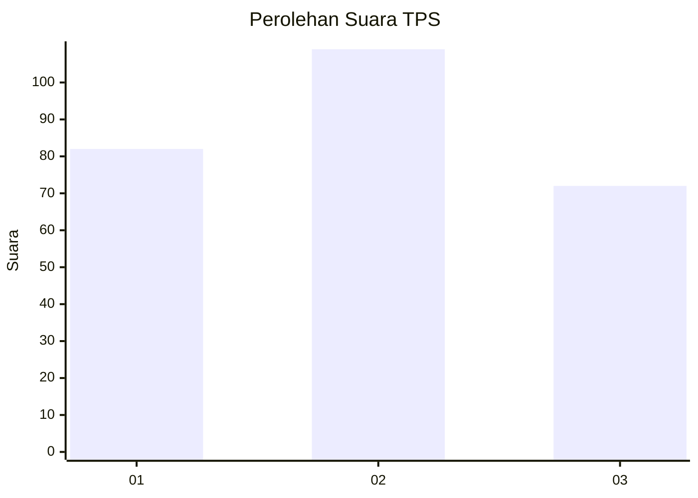
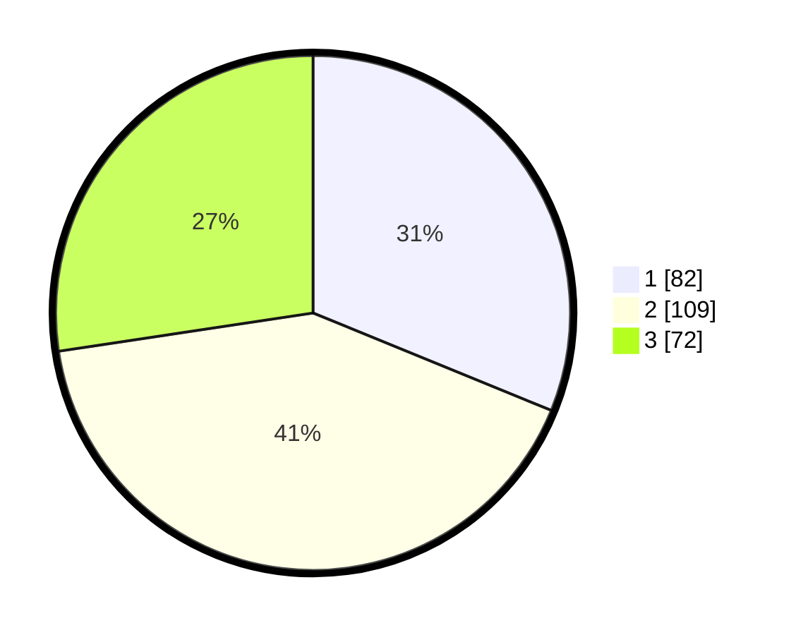

# Hasil

## Grafik

## Tabel

| No. | Nama Paslon    | Suara | Suara (raw) | Persentase |
|:--- |:-------------- | -----:| -----------:| ----------:|
| 1   | ANIES MUHAIMIN | 82    | [82][p-1]   | 31,18      |
| 2   | PRABOWO GIBRAN | 109   | [109][p-2]  | 41,44      |
| 3   | GANJAR MAHFUD  | 72    | [72][p-3]   | 27,38      |

[p-1]: https://github.com/gigit-pemilu/pemilu-2024/blob/main/pilpres/hitung-suara/sub/33-jawa-tengah/sub/11-sukoharjo/sub/08-mojolaban/sub/2012-plumbon/sub/010-tps/sub/paslon-1.txt
[p-2]: https://github.com/gigit-pemilu/pemilu-2024/blob/main/pilpres/hitung-suara/sub/33-jawa-tengah/sub/11-sukoharjo/sub/08-mojolaban/sub/2012-plumbon/sub/010-tps/sub/paslon-2.txt
[p-3]: https://github.com/gigit-pemilu/pemilu-2024/blob/main/pilpres/hitung-suara/sub/33-jawa-tengah/sub/11-sukoharjo/sub/08-mojolaban/sub/2012-plumbon/sub/010-tps/sub/paslon-3.txt

## Foto C Plano

https://sirekap-obj-formc.kpu.go.id/6ec2/pemilu/ppwp/33/11/08/20/12/3311082012010-20240216-190814--760d4937-a0f6-491e-a12e-e30ccc4ea19a.jpg

https://sirekap-obj-formc.kpu.go.id/6ec2/pemilu/ppwp/33/11/08/20/12/3311082012010-20240214-233004--ff4a06e5-4a1e-49fd-bf21-986d4ecdb446.jpg

https://sirekap-obj-formc.kpu.go.id/6ec2/pemilu/ppwp/33/11/08/20/12/3311082012010-20240214-233046--75629d3a-9e38-4c26-a48d-ff42f28df347.jpg

## Metadata

| Key        | Value               |
| ---------- | ------------------- |
| Time Stamp | 2024-02-16 21:01:00 |

