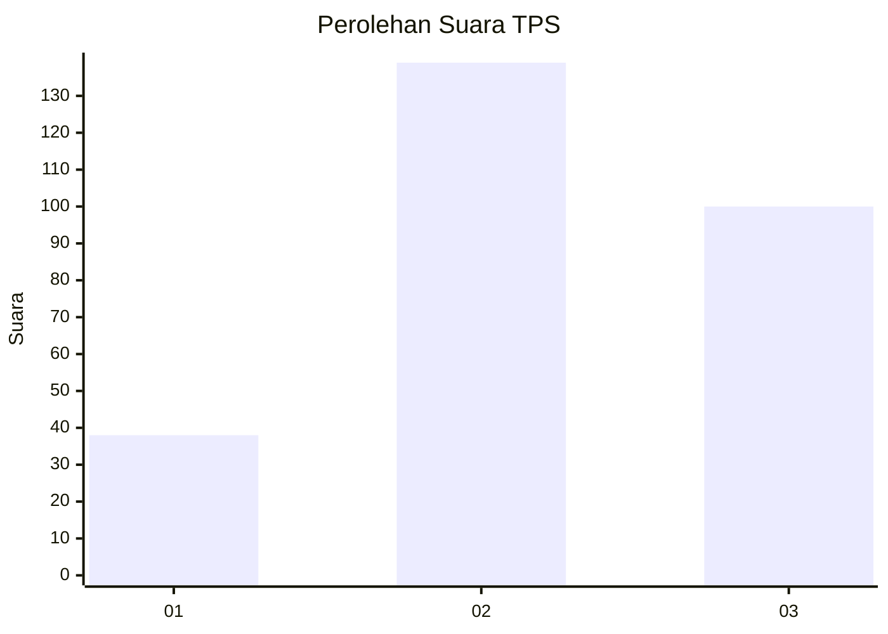
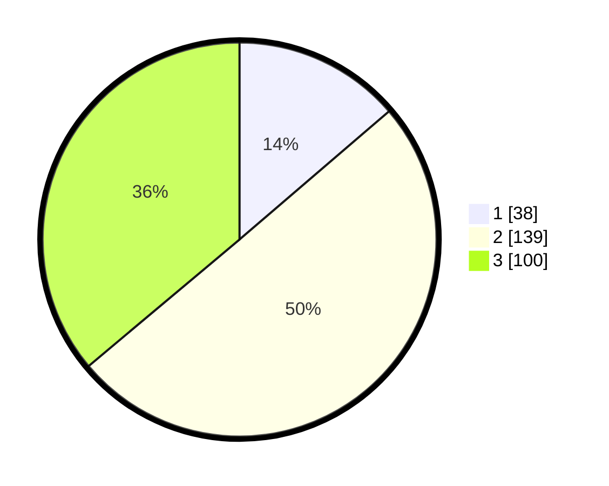

# Hasil

## Grafik

## Tabel

| No. | Nama Paslon    | Suara | Suara (raw) | Persentase |
|:--- |:-------------- | -----:| -----------:| ----------:|
| 1   | ANIES MUHAIMIN | 38    | [38][p-1]   | 13,72      |
| 2   | PRABOWO GIBRAN | 139   | [139][p-2]  | 50,18      |
| 3   | GANJAR MAHFUD  | 100   | [100][p-3]  | 36,10      |

[p-1]: https://github.com/gigit-pemilu/pemilu-2024/blob/main/pilpres/hitung-suara/sub/33-jawa-tengah/sub/11-sukoharjo/sub/08-mojolaban/sub/2012-plumbon/sub/011-tps/sub/paslon-1.txt
[p-2]: https://github.com/gigit-pemilu/pemilu-2024/blob/main/pilpres/hitung-suara/sub/33-jawa-tengah/sub/11-sukoharjo/sub/08-mojolaban/sub/2012-plumbon/sub/011-tps/sub/paslon-2.txt
[p-3]: https://github.com/gigit-pemilu/pemilu-2024/blob/main/pilpres/hitung-suara/sub/33-jawa-tengah/sub/11-sukoharjo/sub/08-mojolaban/sub/2012-plumbon/sub/011-tps/sub/paslon-3.txt

## Foto C Plano

https://sirekap-obj-formc.kpu.go.id/0144/pemilu/ppwp/33/11/08/20/12/3311082012011-20240214-190030--baa6768e-ef04-4d26-9b9f-bd0e9237233a.jpg

https://sirekap-obj-formc.kpu.go.id/0144/pemilu/ppwp/33/11/08/20/12/3311082012011-20240219-213448--a81f531f-11a7-40f4-89e3-ecaa094a35ed.jpg

https://sirekap-obj-formc.kpu.go.id/0144/pemilu/ppwp/33/11/08/20/12/3311082012011-20240214-190634--3fb36e16-4e27-42a0-b70f-4d611c0750f4.jpg

## Metadata

| Key        | Value               |
| ---------- | ------------------- |
| Time Stamp | 2024-02-24 22:31:28 |

