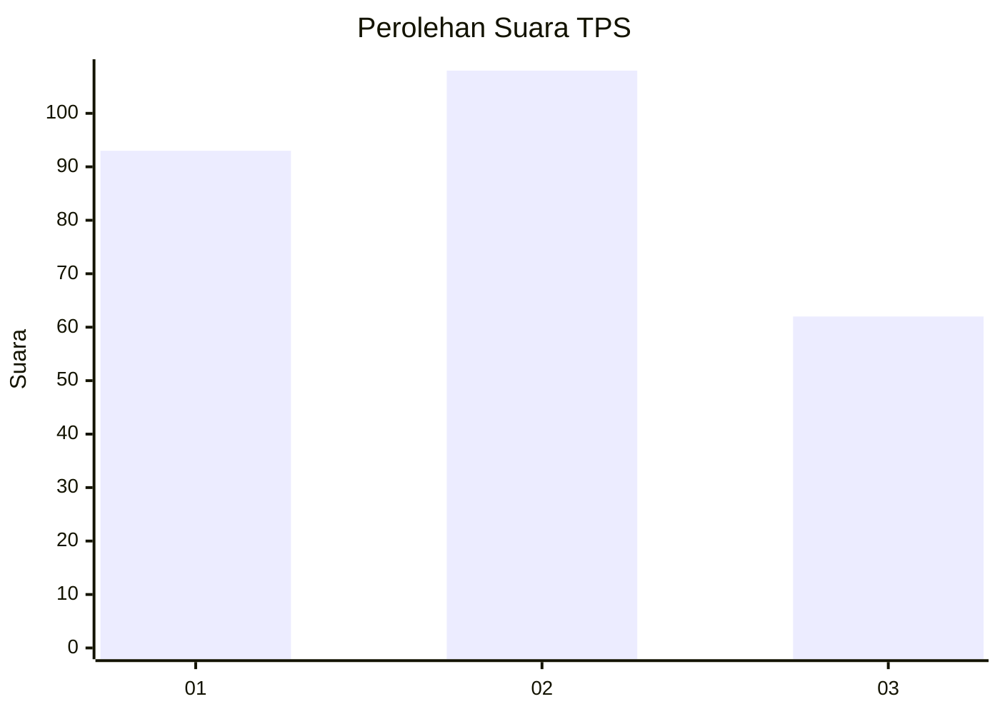
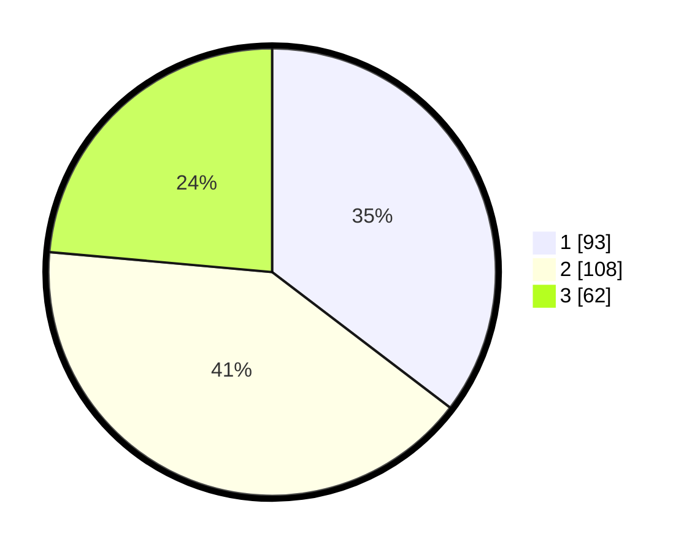

# Hasil

## Grafik

## Tabel

| No. | Nama Paslon    | Suara | Suara (raw) | Persentase |
|:--- |:-------------- | -----:| -----------:| ----------:|
| 1   | ANIES MUHAIMIN | 93    | [93][p-1]   | 35,36      |
| 2   | PRABOWO GIBRAN | 108   | [108][p-2]  | 41,06      |
| 3   | GANJAR MAHFUD  | 62    | [62][p-3]   | 23,57      |

[p-1]: https://github.com/gigit-pemilu/pemilu-2024/blob/main/pilpres/hitung-suara/sub/33-jawa-tengah/sub/11-sukoharjo/sub/08-mojolaban/sub/2013-gadingan/sub/004-tps/sub/paslon-1.txt
[p-2]: https://github.com/gigit-pemilu/pemilu-2024/blob/main/pilpres/hitung-suara/sub/33-jawa-tengah/sub/11-sukoharjo/sub/08-mojolaban/sub/2013-gadingan/sub/004-tps/sub/paslon-2.txt
[p-3]: https://github.com/gigit-pemilu/pemilu-2024/blob/main/pilpres/hitung-suara/sub/33-jawa-tengah/sub/11-sukoharjo/sub/08-mojolaban/sub/2013-gadingan/sub/004-tps/sub/paslon-3.txt

## Foto C Plano

https://sirekap-obj-formc.kpu.go.id/2549/pemilu/ppwp/33/11/08/20/13/3311082013004-20240215-171825--9d387348-97d2-48cb-a829-a338c968e2c3.jpg

https://sirekap-obj-formc.kpu.go.id/2549/pemilu/ppwp/33/11/08/20/13/3311082013004-20240216-185628--100622ff-77af-4ccd-9a2e-f329f7babc60.jpg

https://sirekap-obj-formc.kpu.go.id/2549/pemilu/ppwp/33/11/08/20/13/3311082013004-20240215-202214--262f769e-bb8d-4853-bd8b-f987136f65f8.jpg

## Metadata

| Key        | Value               |
| ---------- | ------------------- |
| Time Stamp | 2024-02-16 21:01:00 |

