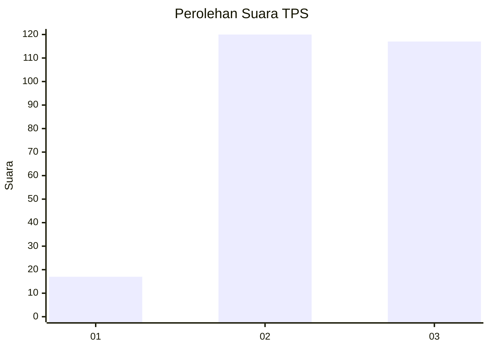
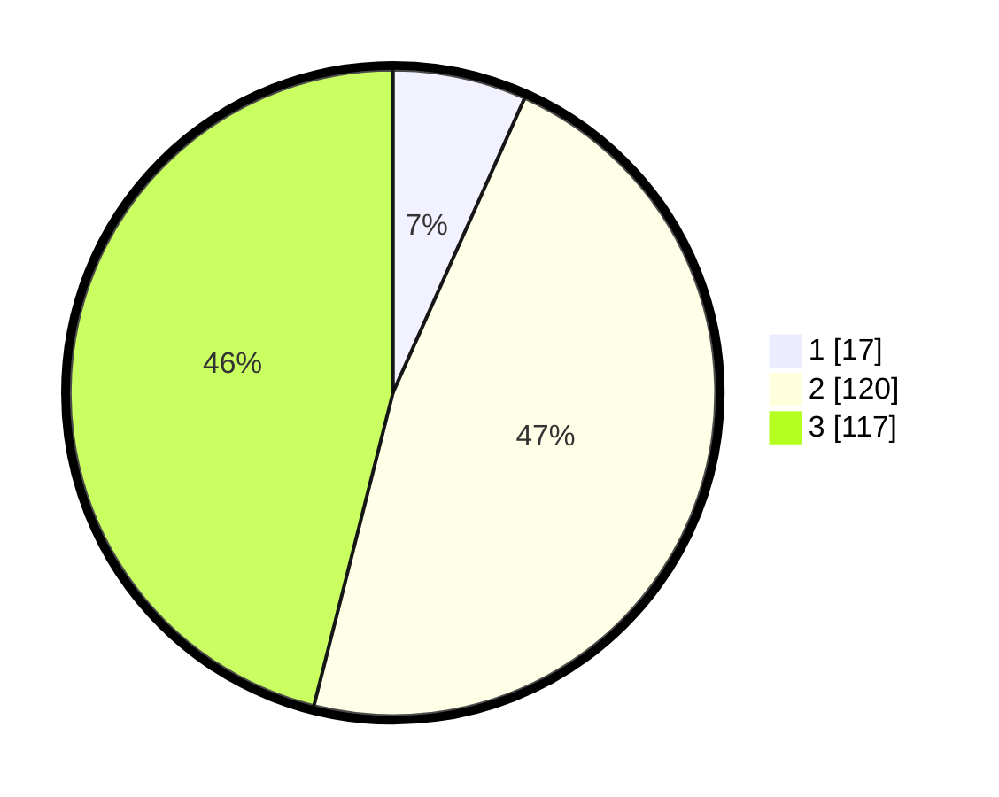

# Hasil

## Grafik

## Tabel

| No. | Nama Paslon    | Suara | Suara (raw) | Persentase |
|:--- |:-------------- | -----:| -----------:| ----------:|
| 1   | ANIES MUHAIMIN | 17    | [17][p-1]   | 6,69       |
| 2   | PRABOWO GIBRAN | 120   | [120][p-2]  | 47,24      |
| 3   | GANJAR MAHFUD  | 117   | [117][p-3]  | 46,06      |

[p-1]: https://github.com/gigit-pemilu/pemilu-2024/blob/main/pilpres/hitung-suara/sub/33-jawa-tengah/sub/11-sukoharjo/sub/08-mojolaban/sub/2013-gadingan/sub/017-tps/sub/paslon-1.txt
[p-2]: https://github.com/gigit-pemilu/pemilu-2024/blob/main/pilpres/hitung-suara/sub/33-jawa-tengah/sub/11-sukoharjo/sub/08-mojolaban/sub/2013-gadingan/sub/017-tps/sub/paslon-2.txt
[p-3]: https://github.com/gigit-pemilu/pemilu-2024/blob/main/pilpres/hitung-suara/sub/33-jawa-tengah/sub/11-sukoharjo/sub/08-mojolaban/sub/2013-gadingan/sub/017-tps/sub/paslon-3.txt

## Foto C Plano

https://sirekap-obj-formc.kpu.go.id/33a2/pemilu/ppwp/33/11/08/20/13/3311082013017-20240219-174349--713874d9-7e2c-4ade-8691-73da0dd8e41d.jpg

https://sirekap-obj-formc.kpu.go.id/33a2/pemilu/ppwp/33/11/08/20/13/3311082013017-20240215-032515--a3dd762a-018f-47fa-b5fc-0d1598c34c2e.jpg

https://sirekap-obj-formc.kpu.go.id/33a2/pemilu/ppwp/33/11/08/20/13/3311082013017-20240215-032611--7539d114-f6fc-4ffe-b4ba-73775663dbb7.jpg

## Metadata

| Key        | Value               |
| ---------- | ------------------- |
| Time Stamp | 2024-02-19 18:00:00 |

