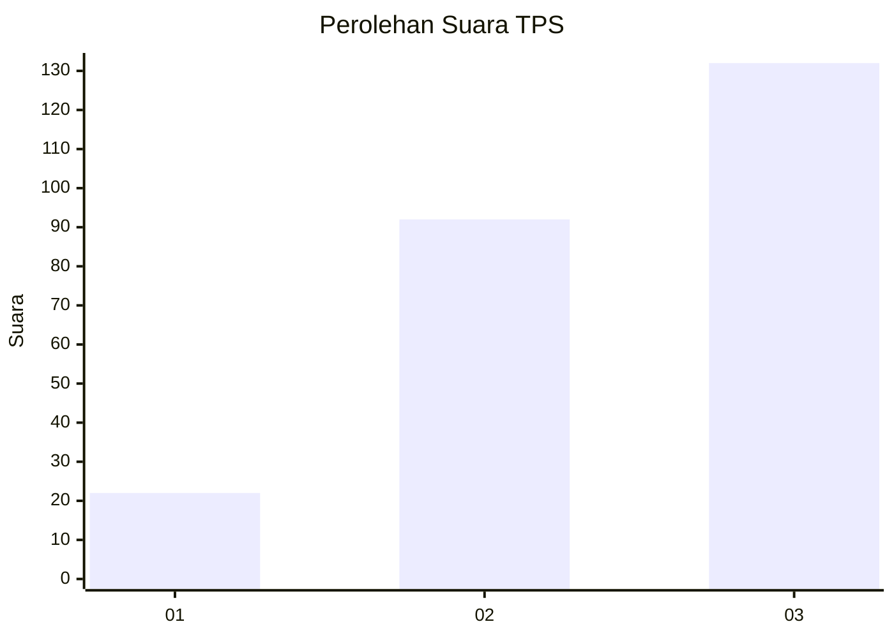
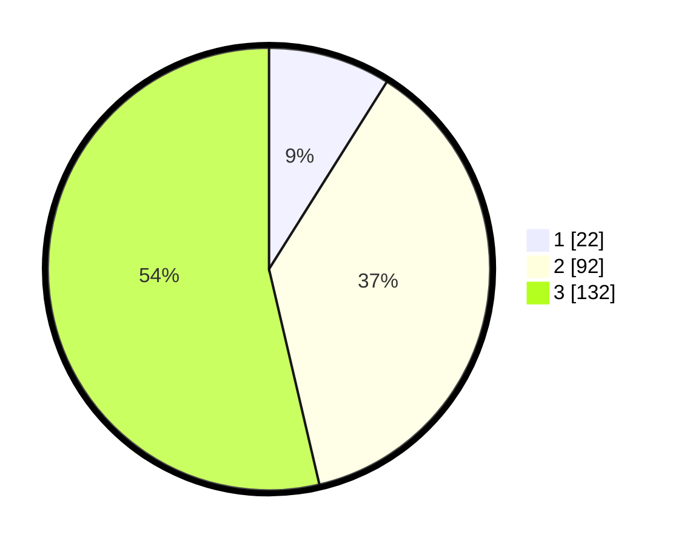

# Hasil

## Grafik

## Tabel

| No. | Nama Paslon    | Suara | Suara (raw) | Persentase |
|:--- |:-------------- | -----:| -----------:| ----------:|
| 1   | ANIES MUHAIMIN | 22    | [22][p-1]   | 8,94       |
| 2   | PRABOWO GIBRAN | 92    | [92][p-2]   | 37,40      |
| 3   | GANJAR MAHFUD  | 132   | [132][p-3]  | 53,66      |

[p-1]: https://github.com/gigit-pemilu/pemilu-2024-33-jawa-tengah/blob/main/pilpres/hitung-suara/sub/33-jawa-tengah/sub/11-sukoharjo/sub/09-grogol/sub/2002-telukan/sub/019-tps/sub/paslon-1.txt
[p-2]: https://github.com/gigit-pemilu/pemilu-2024-33-jawa-tengah/blob/main/pilpres/hitung-suara/sub/33-jawa-tengah/sub/11-sukoharjo/sub/09-grogol/sub/2002-telukan/sub/019-tps/sub/paslon-2.txt
[p-3]: https://github.com/gigit-pemilu/pemilu-2024-33-jawa-tengah/blob/main/pilpres/hitung-suara/sub/33-jawa-tengah/sub/11-sukoharjo/sub/09-grogol/sub/2002-telukan/sub/019-tps/sub/paslon-3.txt

## Foto C Plano

https://sirekap-obj-formc.kpu.go.id/6c43/pemilu/ppwp/33/11/09/20/02/3311092002019-20240217-214816--4f8d3960-e849-4fc2-9b83-0cbf8337f21c.jpg

https://sirekap-obj-formc.kpu.go.id/6c43/pemilu/ppwp/33/11/09/20/02/3311092002019-20240217-214931--7058385f-94ec-4a7d-b583-af0009847685.jpg

https://sirekap-obj-formc.kpu.go.id/6c43/pemilu/ppwp/33/11/09/20/02/3311092002019-20240217-215058--dfbac21a-f749-4d6c-968e-d95dc6140aa0.jpg

## Metadata

| Key        | Value               |
| ---------- | ------------------- |
| Time Stamp | 2024-02-19 06:16:00 |

