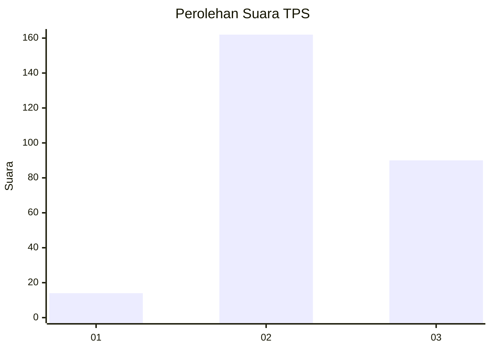
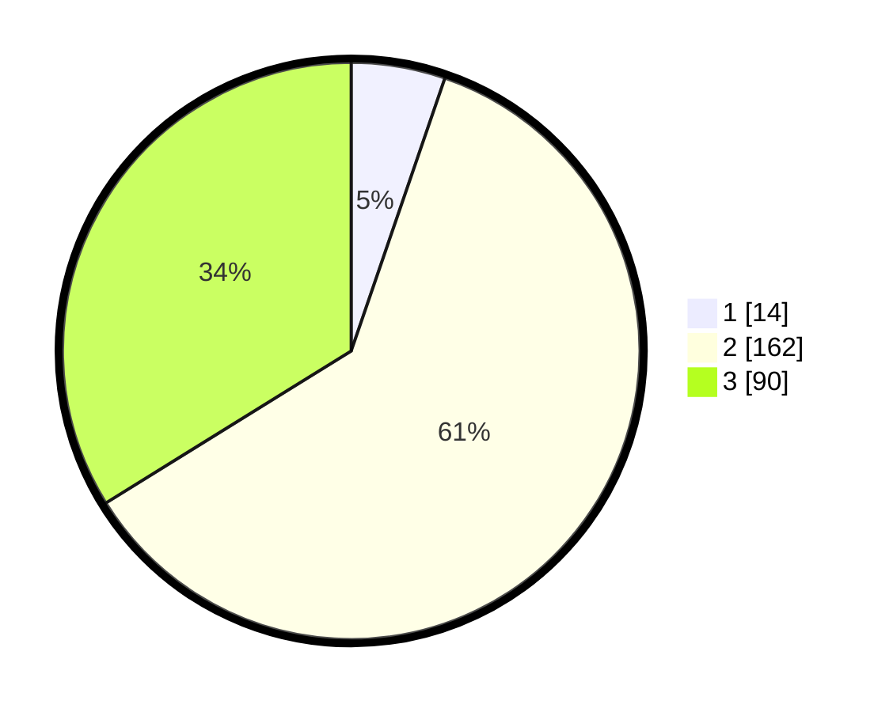

# Hasil

## Grafik

## Tabel

| No. | Nama Paslon    | Suara | Suara (raw) | Persentase |
|:--- |:-------------- | -----:| -----------:| ----------:|
| 1   | ANIES MUHAIMIN | 14    | [14][p-1]   | 5,26       |
| 2   | PRABOWO GIBRAN | 162   | [162][p-2]  | 60,90      |
| 3   | GANJAR MAHFUD  | 90    | [90][p-3]   | 33,83      |

[p-1]: https://github.com/gigit-pemilu/pemilu-2024/blob/main/pilpres/hitung-suara/sub/33-jawa-tengah/sub/11-sukoharjo/sub/09-grogol/sub/2011-sanggrahan/sub/010-tps/sub/paslon-1.txt
[p-2]: https://github.com/gigit-pemilu/pemilu-2024/blob/main/pilpres/hitung-suara/sub/33-jawa-tengah/sub/11-sukoharjo/sub/09-grogol/sub/2011-sanggrahan/sub/010-tps/sub/paslon-2.txt
[p-3]: https://github.com/gigit-pemilu/pemilu-2024/blob/main/pilpres/hitung-suara/sub/33-jawa-tengah/sub/11-sukoharjo/sub/09-grogol/sub/2011-sanggrahan/sub/010-tps/sub/paslon-3.txt

## Foto C Plano

https://sirekap-obj-formc.kpu.go.id/a6b0/pemilu/ppwp/33/11/09/20/11/3311092011010-20240217-145847--672edda4-d09a-4700-ad29-473c30946bdb.jpg

https://sirekap-obj-formc.kpu.go.id/a6b0/pemilu/ppwp/33/11/09/20/11/3311092011010-20240217-145403--0357f063-2f8b-4809-923f-5e76d576284d.jpg

https://sirekap-obj-formc.kpu.go.id/a6b0/pemilu/ppwp/33/11/09/20/11/3311092011010-20240217-145458--8c9001d2-9a60-41c8-b753-70a5457431e4.jpg

## Metadata

| Key        | Value               |
| ---------- | ------------------- |
| Time Stamp | 2024-02-17 16:00:02 |

