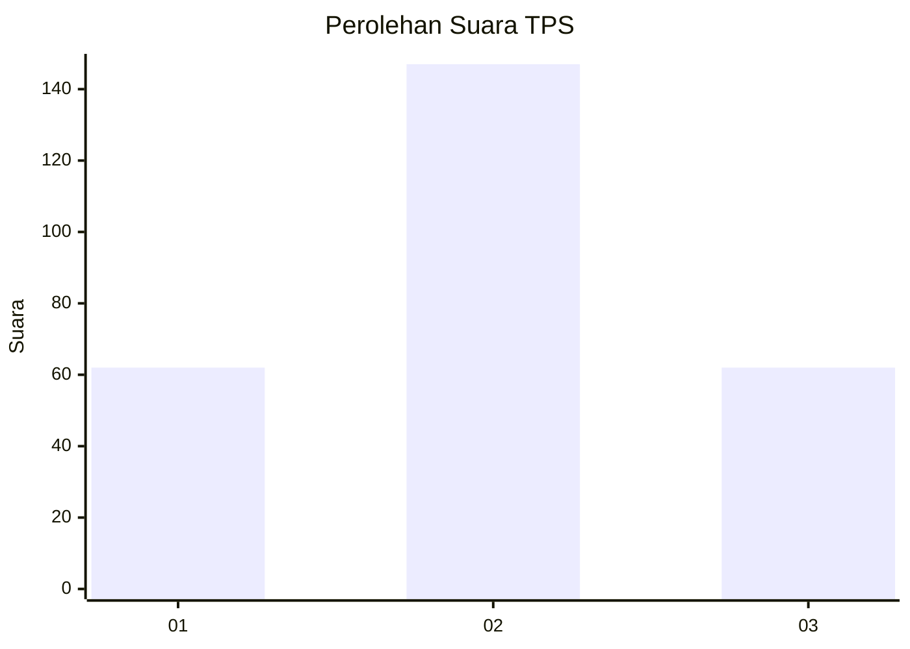
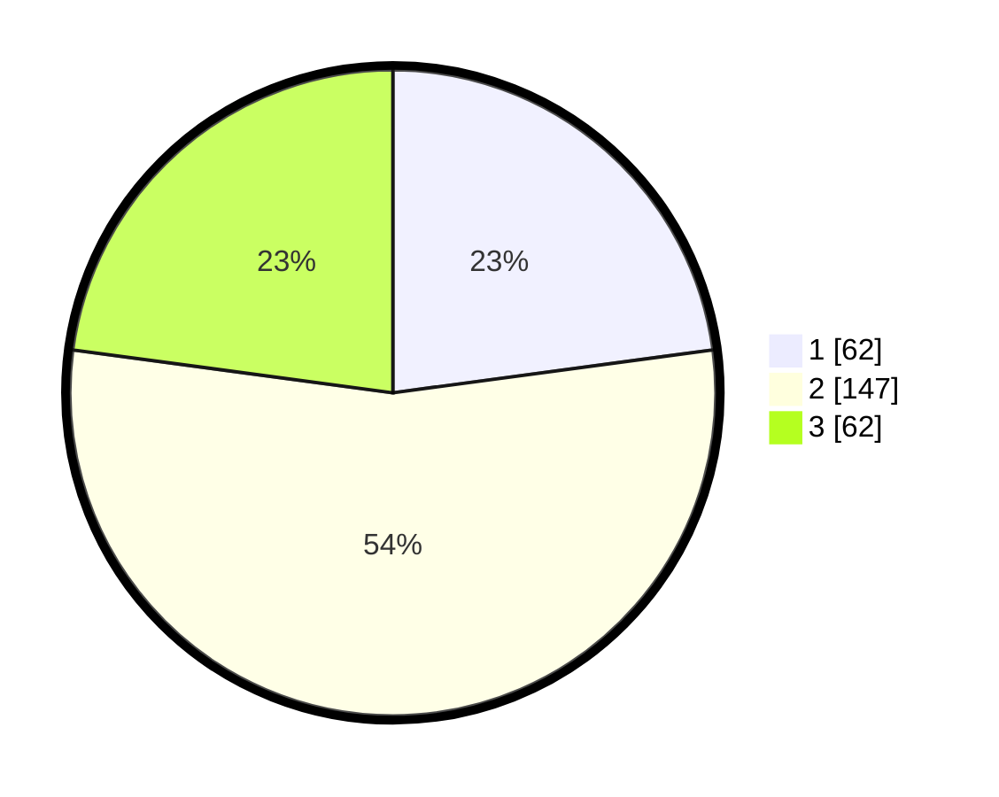

# Hasil

## Grafik

## Tabel

| No. | Nama Paslon    | Suara | Suara (raw) | Persentase |
|:--- |:-------------- | -----:| -----------:| ----------:|
| 1   | ANIES MUHAIMIN | 62    | [62][p-1]   | 22,88      |
| 2   | PRABOWO GIBRAN | 147   | [147][p-2]  | 54,24      |
| 3   | GANJAR MAHFUD  | 62    | [62][p-3]   | 22,88      |

[p-1]: https://github.com/gigit-pemilu/pemilu-2024-33-jawa-tengah/blob/main/pilpres/hitung-suara/sub/33-jawa-tengah/sub/11-sukoharjo/sub/09-grogol/sub/2011-sanggrahan/sub/012-tps/sub/paslon-1.txt
[p-2]: https://github.com/gigit-pemilu/pemilu-2024-33-jawa-tengah/blob/main/pilpres/hitung-suara/sub/33-jawa-tengah/sub/11-sukoharjo/sub/09-grogol/sub/2011-sanggrahan/sub/012-tps/sub/paslon-2.txt
[p-3]: https://github.com/gigit-pemilu/pemilu-2024-33-jawa-tengah/blob/main/pilpres/hitung-suara/sub/33-jawa-tengah/sub/11-sukoharjo/sub/09-grogol/sub/2011-sanggrahan/sub/012-tps/sub/paslon-3.txt

## Foto C Plano

https://sirekap-obj-formc.kpu.go.id/f15f/pemilu/ppwp/33/11/09/20/11/3311092011012-20240217-181632--d389c427-edbf-40d7-b4c6-37ec201bd9e7.jpg

https://sirekap-obj-formc.kpu.go.id/f15f/pemilu/ppwp/33/11/09/20/11/3311092011012-20240217-182046--5173ba37-1f14-4f47-9acb-15b9e59ad125.jpg

https://sirekap-obj-formc.kpu.go.id/f15f/pemilu/ppwp/33/11/09/20/11/3311092011012-20240217-182355--b1e4c9cd-24b0-43ce-a2ef-ae51837be3c2.jpg

## Metadata

| Key        | Value               |
| ---------- | ------------------- |
| Time Stamp | 2024-02-19 06:16:00 |

