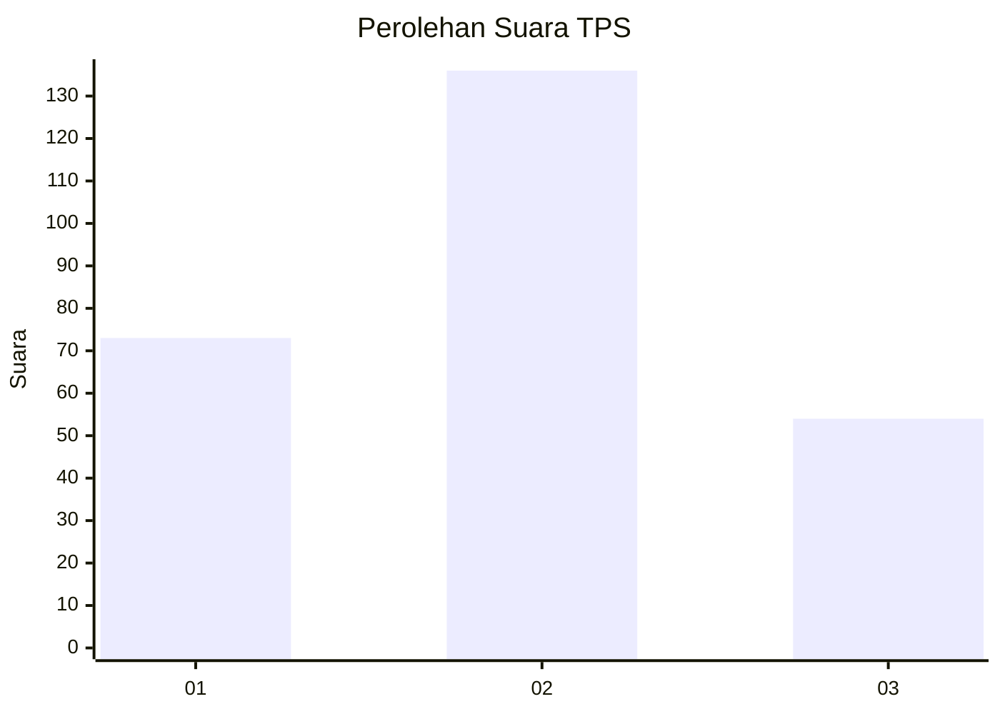
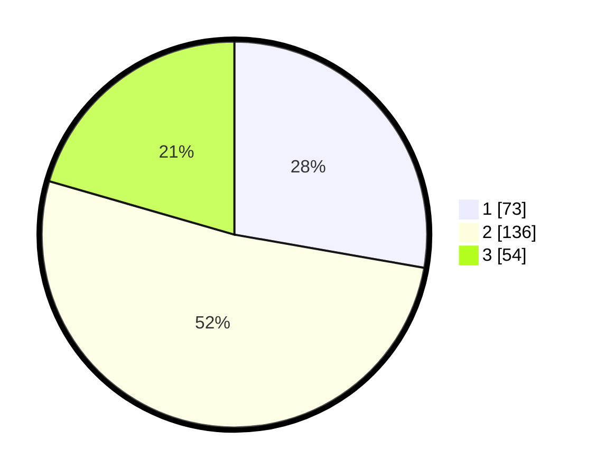

# Hasil

## Grafik

## Tabel

| No. | Nama Paslon    | Suara | Suara (raw) | Persentase |
|:--- |:-------------- | -----:| -----------:| ----------:|
| 1   | ANIES MUHAIMIN | 73    | [73][p-1]   | 27,76      |
| 2   | PRABOWO GIBRAN | 136   | [136][p-2]  | 51,71      |
| 3   | GANJAR MAHFUD  | 54    | [54][p-3]   | 20,53      |

[p-1]: https://github.com/gigit-pemilu/pemilu-2024-33-jawa-tengah/blob/main/pilpres/hitung-suara/sub/33-jawa-tengah/sub/11-sukoharjo/sub/09-grogol/sub/2011-sanggrahan/sub/013-tps/sub/paslon-1.txt
[p-2]: https://github.com/gigit-pemilu/pemilu-2024-33-jawa-tengah/blob/main/pilpres/hitung-suara/sub/33-jawa-tengah/sub/11-sukoharjo/sub/09-grogol/sub/2011-sanggrahan/sub/013-tps/sub/paslon-2.txt
[p-3]: https://github.com/gigit-pemilu/pemilu-2024-33-jawa-tengah/blob/main/pilpres/hitung-suara/sub/33-jawa-tengah/sub/11-sukoharjo/sub/09-grogol/sub/2011-sanggrahan/sub/013-tps/sub/paslon-3.txt

## Foto C Plano

https://sirekap-obj-formc.kpu.go.id/f495/pemilu/ppwp/33/11/09/20/11/3311092011013-20240217-124013--665ca96b-eb82-4d4b-812a-1539cfc4a73b.jpg

https://sirekap-obj-formc.kpu.go.id/f495/pemilu/ppwp/33/11/09/20/11/3311092011013-20240216-211555--3a3510cc-35ef-4bc5-b44d-85b9ca2fc34a.jpg

https://sirekap-obj-formc.kpu.go.id/f495/pemilu/ppwp/33/11/09/20/11/3311092011013-20240216-211917--a603b1cc-c5f5-4d4c-92f2-934565604cc0.jpg

## Metadata

| Key        | Value               |
| ---------- | ------------------- |
| Time Stamp | 2024-02-17 13:37:34 |

