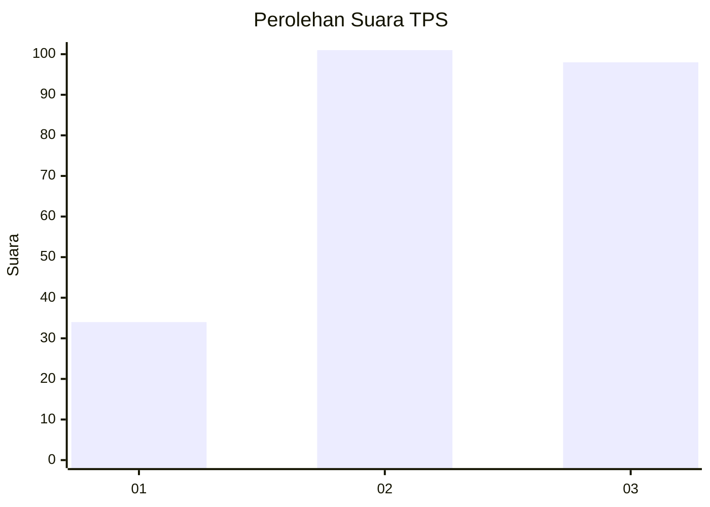
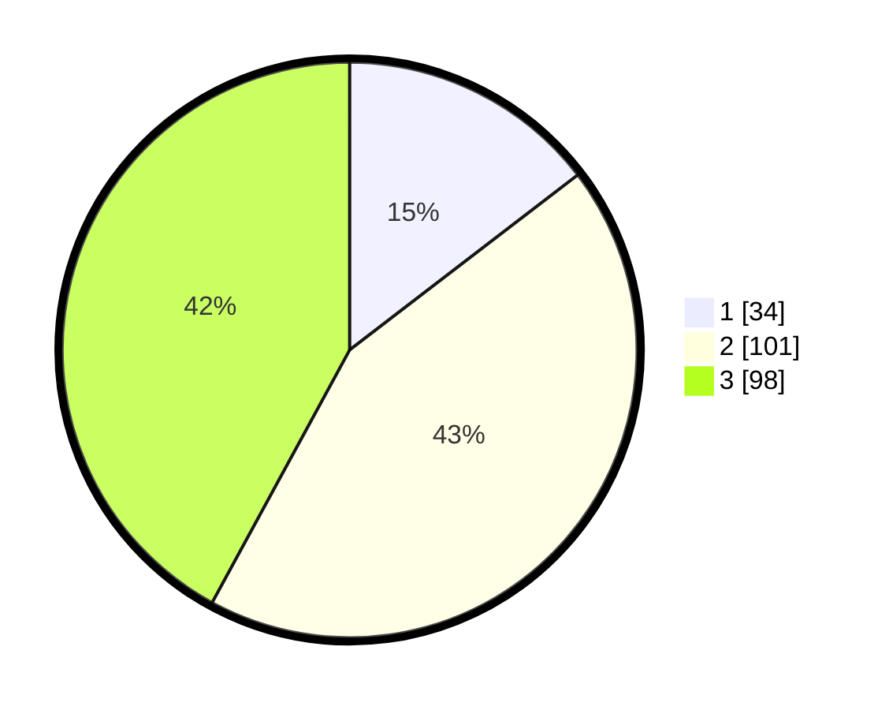

# Hasil

## Grafik

## Tabel

| No. | Nama Paslon    | Suara | Suara (raw) | Persentase |
|:--- |:-------------- | -----:| -----------:| ----------:|
| 1   | ANIES MUHAIMIN | 34    | [34][p-1]   | 14,59      |
| 2   | PRABOWO GIBRAN | 101   | [101][p-2]  | 43,35      |
| 3   | GANJAR MAHFUD  | 98    | [98][p-3]   | 42,06      |

[p-1]: https://github.com/gigit-pemilu/pemilu-2024/blob/main/pilpres/hitung-suara/sub/33-jawa-tengah/sub/11-sukoharjo/sub/09-grogol/sub/2011-sanggrahan/sub/026-tps/sub/paslon-1.txt
[p-2]: https://github.com/gigit-pemilu/pemilu-2024/blob/main/pilpres/hitung-suara/sub/33-jawa-tengah/sub/11-sukoharjo/sub/09-grogol/sub/2011-sanggrahan/sub/026-tps/sub/paslon-2.txt
[p-3]: https://github.com/gigit-pemilu/pemilu-2024/blob/main/pilpres/hitung-suara/sub/33-jawa-tengah/sub/11-sukoharjo/sub/09-grogol/sub/2011-sanggrahan/sub/026-tps/sub/paslon-3.txt

## Foto C Plano

https://sirekap-obj-formc.kpu.go.id/9a61/pemilu/ppwp/33/11/09/20/11/3311092011026-20240217-115638--24a76a9c-bda0-4097-8b42-320627a5fdc5.jpg

https://sirekap-obj-formc.kpu.go.id/9a61/pemilu/ppwp/33/11/09/20/11/3311092011026-20240217-115317--417737f1-21bb-4fe7-a590-2938d3e941c4.jpg

https://sirekap-obj-formc.kpu.go.id/9a61/pemilu/ppwp/33/11/09/20/11/3311092011026-20240217-115747--189eb08d-6eb8-45a6-9cef-a92e43d47278.jpg

## Metadata

| Key        | Value               |
| ---------- | ------------------- |
| Time Stamp | 2024-02-19 06:16:00 |

## DATA PEMILIH TETAP

Jumlah pemilih dalam DPT: **872**.
 * L: **272**.
 * P: **444**.

## DATA PENGGUNA HAK PILIH

Jumlah pengguna hak pilih dalam DPT: **223**.
 * L: **892**.
 * P: **415**.

Jumlah pengguna hak pilih dalam DPTb: **9**.
 * L: **4**.
 * P: **85**.

Jumlah pengguna hak pilih dalam DPK: **2**.
 * L: **801**.
 * P: **8**.

Jumlah pengguna hak pilih: **237**.
 * L: **422**.
 * P: **425**.

## JUMLAH SUARA SAH DAN TIDAK SAH

JUMLAH SELURUH SUARA SAH: **233**.

JUMLAH SUARA TIDAK SAH: **4**.

JUMLAH SELURUH SUARA SAH DAN SUARA TIDAK SAH: **237**.

