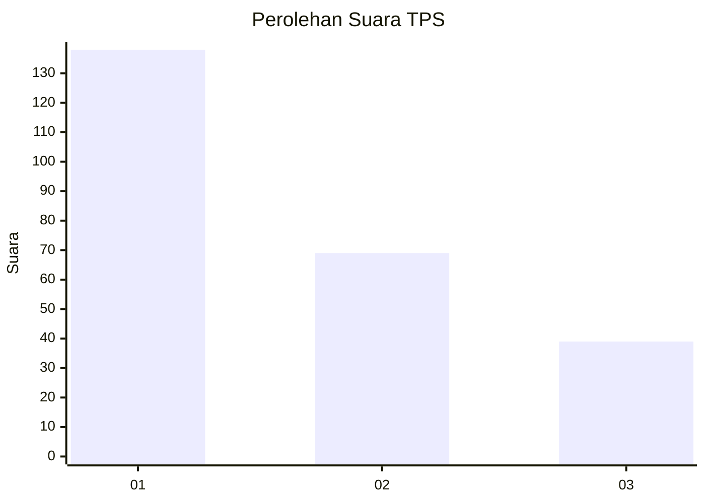
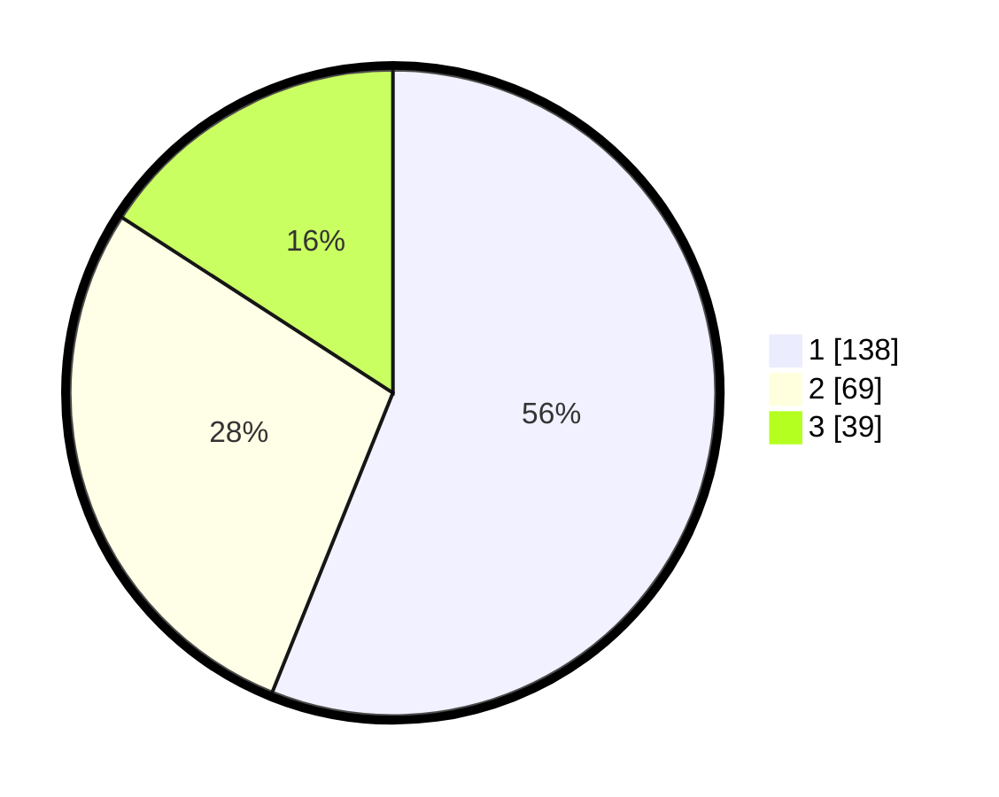

# Hasil

## Grafik

## Tabel

| No. | Nama Paslon    | Suara | Suara (raw) | Persentase |
|:--- |:-------------- | -----:| -----------:| ----------:|
| 1   | ANIES MUHAIMIN | 138   | [138][p-1]  | 56,10      |
| 2   | PRABOWO GIBRAN | 69    | [69][p-2]   | 28,05      |
| 3   | GANJAR MAHFUD  | 39    | [39][p-3]   | 15,85      |

[p-1]: https://github.com/gigit-pemilu/pemilu-2024-33-jawa-tengah/blob/main/pilpres/hitung-suara/sub/33-jawa-tengah/sub/11-sukoharjo/sub/09-grogol/sub/2012-manang/sub/018-tps/sub/paslon-1.txt
[p-2]: https://github.com/gigit-pemilu/pemilu-2024-33-jawa-tengah/blob/main/pilpres/hitung-suara/sub/33-jawa-tengah/sub/11-sukoharjo/sub/09-grogol/sub/2012-manang/sub/018-tps/sub/paslon-2.txt
[p-3]: https://github.com/gigit-pemilu/pemilu-2024-33-jawa-tengah/blob/main/pilpres/hitung-suara/sub/33-jawa-tengah/sub/11-sukoharjo/sub/09-grogol/sub/2012-manang/sub/018-tps/sub/paslon-3.txt

## Foto C Plano

https://sirekap-obj-formc.kpu.go.id/ad64/pemilu/ppwp/33/11/09/20/12/3311092012018-20240217-213515--b9ba1342-8f37-45b2-9dcc-1fcc2df36079.jpg

https://sirekap-obj-formc.kpu.go.id/ad64/pemilu/ppwp/33/11/09/20/12/3311092012018-20240217-214451--e15a4bd2-a0c8-44f0-9959-5918efca2ef3.jpg

https://sirekap-obj-formc.kpu.go.id/ad64/pemilu/ppwp/33/11/09/20/12/3311092012018-20240216-170829--26e1d84a-e9fe-4622-b5f6-69ca04d31104.jpg

## Metadata

| Key        | Value               |
| ---------- | ------------------- |
| Time Stamp | 2024-02-19 06:16:00 |

