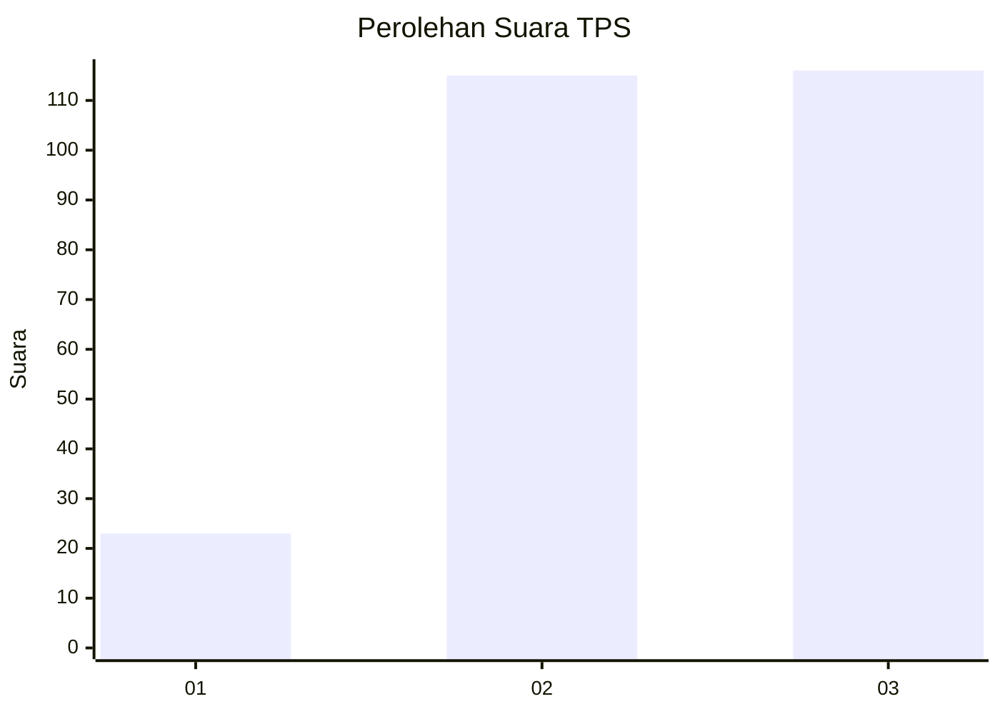
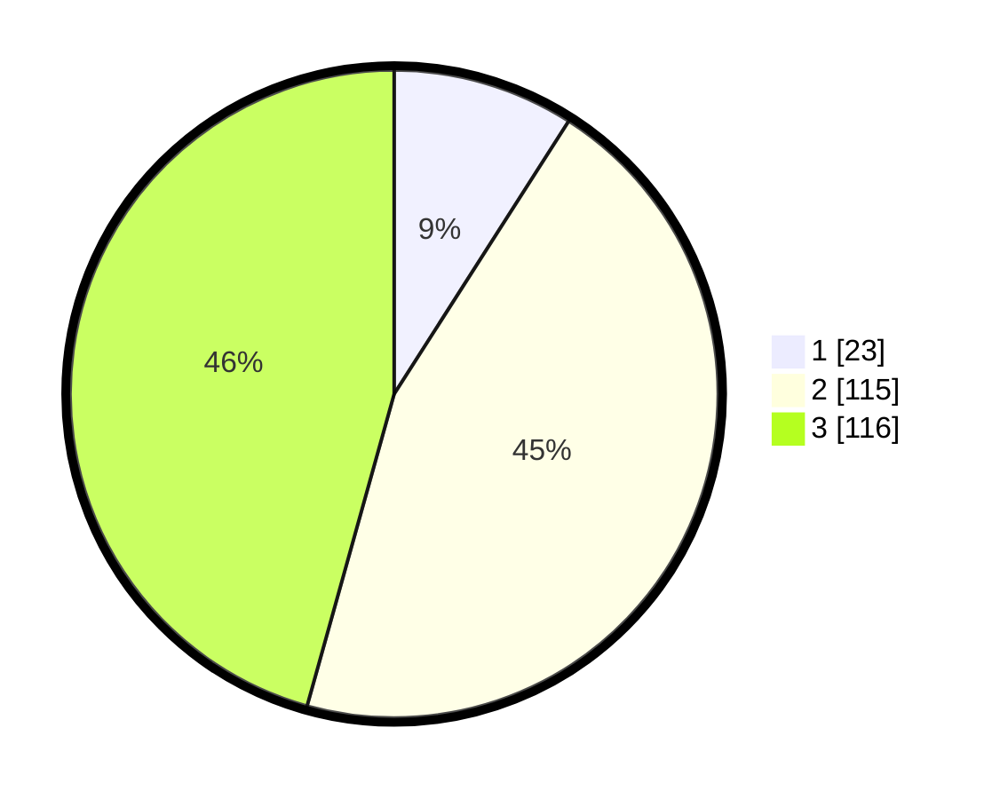

# Hasil

## Grafik

## Tabel

| No. | Nama Paslon    | Suara | Suara (raw) | Persentase |
|:--- |:-------------- | -----:| -----------:| ----------:|
| 1   | ANIES MUHAIMIN | 23    | [23][p-1]   | 9,06       |
| 2   | PRABOWO GIBRAN | 115   | [115][p-2]  | 45,28      |
| 3   | GANJAR MAHFUD  | 116   | [116][p-3]  | 45,67      |

[p-1]: https://github.com/gigit-pemilu/pemilu-2024/blob/main/pilpres/hitung-suara/sub/33-jawa-tengah/sub/11-sukoharjo/sub/09-grogol/sub/2014-cemani/sub/002-tps/sub/paslon-1.txt
[p-2]: https://github.com/gigit-pemilu/pemilu-2024/blob/main/pilpres/hitung-suara/sub/33-jawa-tengah/sub/11-sukoharjo/sub/09-grogol/sub/2014-cemani/sub/002-tps/sub/paslon-2.txt
[p-3]: https://github.com/gigit-pemilu/pemilu-2024/blob/main/pilpres/hitung-suara/sub/33-jawa-tengah/sub/11-sukoharjo/sub/09-grogol/sub/2014-cemani/sub/002-tps/sub/paslon-3.txt

## Foto C Plano

https://sirekap-obj-formc.kpu.go.id/0b1d/pemilu/ppwp/33/11/09/20/14/3311092014002-20240215-032207--0227984c-b79c-4f85-aa3e-d57b920b5fbf.jpg

https://sirekap-obj-formc.kpu.go.id/0b1d/pemilu/ppwp/33/11/09/20/14/3311092014002-20240215-031555--5ed94572-12a6-473b-a27f-42dd0ade2368.jpg

https://sirekap-obj-formc.kpu.go.id/0b1d/pemilu/ppwp/33/11/09/20/14/3311092014002-20240215-031707--3fadd5d4-2ae9-4cc0-90f2-09a1126cdf0a.jpg

## Metadata

| Key        | Value               |
| ---------- | ------------------- |
| Time Stamp | 2024-02-15 21:30:27 |

