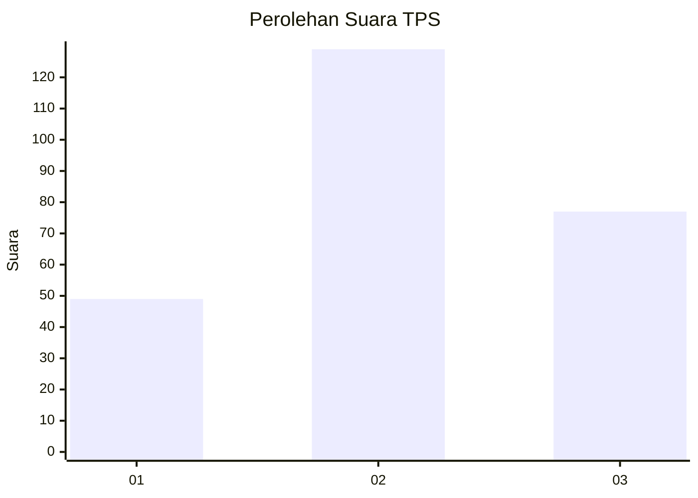
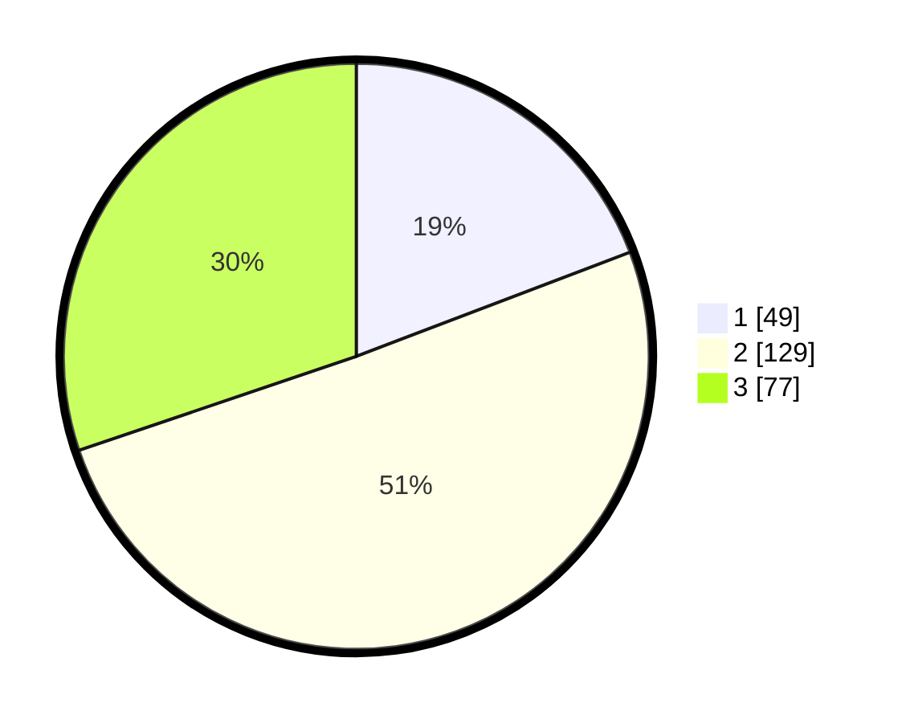

# Hasil

## Grafik

## Tabel

| No. | Nama Paslon    | Suara | Suara (raw) | Persentase |
|:--- |:-------------- | -----:| -----------:| ----------:|
| 1   | ANIES MUHAIMIN | 49    | [49][p-1]   | 19,22      |
| 2   | PRABOWO GIBRAN | 129   | [129][p-2]  | 50,59      |
| 3   | GANJAR MAHFUD  | 77    | [77][p-3]   | 30,20      |

[p-1]: https://github.com/gigit-pemilu/pemilu-2024/blob/main/pilpres/hitung-suara/sub/33-jawa-tengah/sub/11-sukoharjo/sub/09-grogol/sub/2014-cemani/sub/009-tps/sub/paslon-1.txt
[p-2]: https://github.com/gigit-pemilu/pemilu-2024/blob/main/pilpres/hitung-suara/sub/33-jawa-tengah/sub/11-sukoharjo/sub/09-grogol/sub/2014-cemani/sub/009-tps/sub/paslon-2.txt
[p-3]: https://github.com/gigit-pemilu/pemilu-2024/blob/main/pilpres/hitung-suara/sub/33-jawa-tengah/sub/11-sukoharjo/sub/09-grogol/sub/2014-cemani/sub/009-tps/sub/paslon-3.txt

## Foto C Plano

https://sirekap-obj-formc.kpu.go.id/5e16/pemilu/ppwp/33/11/09/20/14/3311092014009-20240217-114212--afc848ab-83e9-4135-bc46-7a2280660a28.jpg

https://sirekap-obj-formc.kpu.go.id/5e16/pemilu/ppwp/33/11/09/20/14/3311092014009-20240217-164837--baae5867-0ad8-4818-9bc1-e9160508f8d9.jpg

https://sirekap-obj-formc.kpu.go.id/5e16/pemilu/ppwp/33/11/09/20/14/3311092014009-20240217-165011--9693816b-a43b-4336-9781-a19c57b3df00.jpg

## Metadata

| Key        | Value               |
| ---------- | ------------------- |
| Time Stamp | 2024-02-17 17:30:00 |

