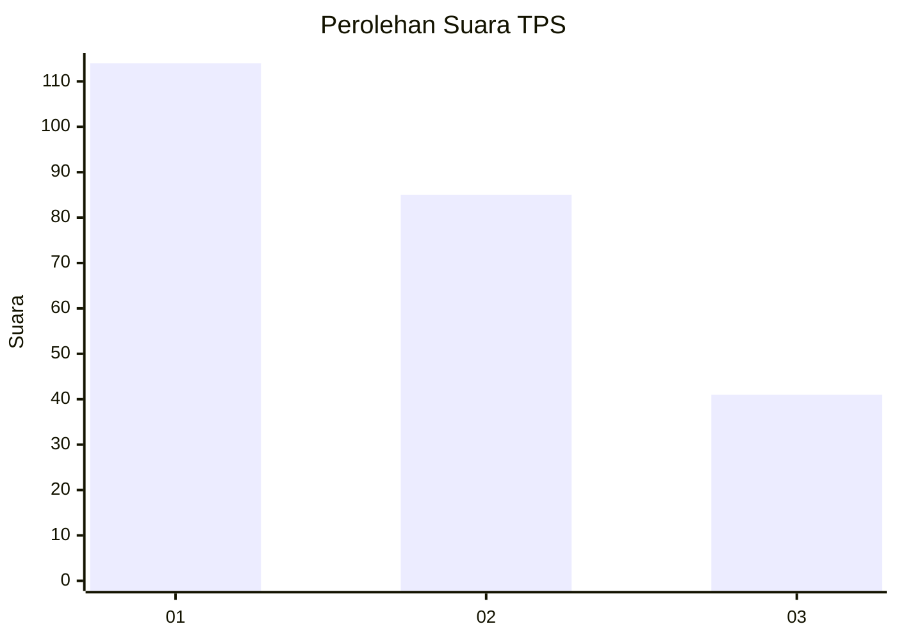
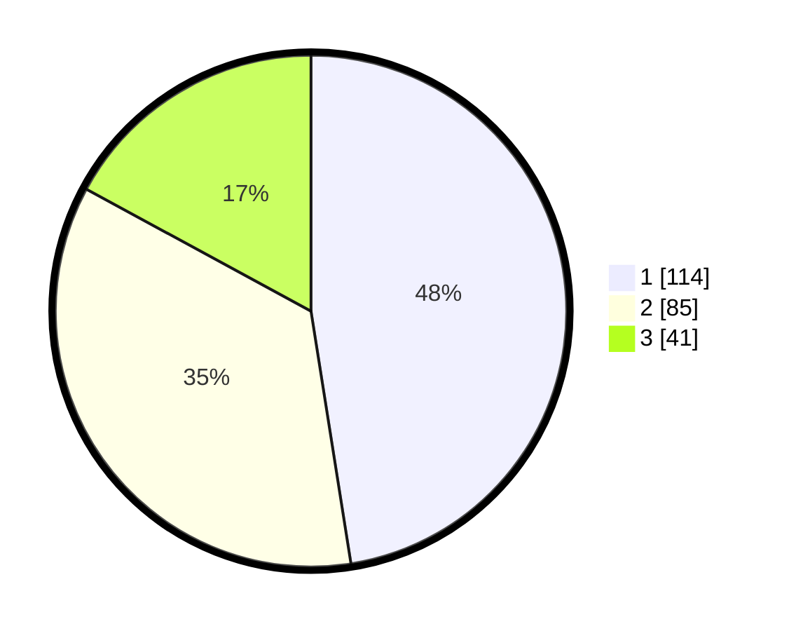

# Hasil

## Grafik

## Tabel

| No. | Nama Paslon    | Suara | Suara (raw) | Persentase |
|:--- |:-------------- | -----:| -----------:| ----------:|
| 1   | ANIES MUHAIMIN | 114   | [114][p-1]  | 47,50      |
| 2   | PRABOWO GIBRAN | 85    | [85][p-2]   | 35,42      |
| 3   | GANJAR MAHFUD  | 41    | [41][p-3]   | 17,08      |

[p-1]: https://github.com/gigit-pemilu/pemilu-2024-33-jawa-tengah/blob/main/pilpres/hitung-suara/sub/33-jawa-tengah/sub/11-sukoharjo/sub/09-grogol/sub/2014-cemani/sub/047-tps/sub/paslon-1.txt
[p-2]: https://github.com/gigit-pemilu/pemilu-2024-33-jawa-tengah/blob/main/pilpres/hitung-suara/sub/33-jawa-tengah/sub/11-sukoharjo/sub/09-grogol/sub/2014-cemani/sub/047-tps/sub/paslon-2.txt
[p-3]: https://github.com/gigit-pemilu/pemilu-2024-33-jawa-tengah/blob/main/pilpres/hitung-suara/sub/33-jawa-tengah/sub/11-sukoharjo/sub/09-grogol/sub/2014-cemani/sub/047-tps/sub/paslon-3.txt

## Foto C Plano

https://sirekap-obj-formc.kpu.go.id/8b2f/pemilu/ppwp/33/11/09/20/14/3311092014047-20240214-210844--65033fbe-a2f6-43a7-b017-5f2fffbc2e78.jpg

https://sirekap-obj-formc.kpu.go.id/8b2f/pemilu/ppwp/33/11/09/20/14/3311092014047-20240214-211050--6cbdb6ad-8619-434d-b707-04fa26551cd1.jpg

https://sirekap-obj-formc.kpu.go.id/8b2f/pemilu/ppwp/33/11/09/20/14/3311092014047-20240215-145147--b42c1b9a-b981-4d92-a6eb-26a7983aeb46.jpg

## Metadata

| Key        | Value               |
| ---------- | ------------------- |
| Time Stamp | 2024-02-15 15:00:29 |

