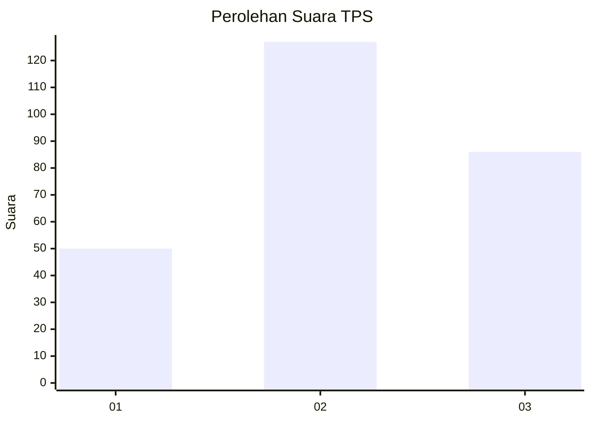
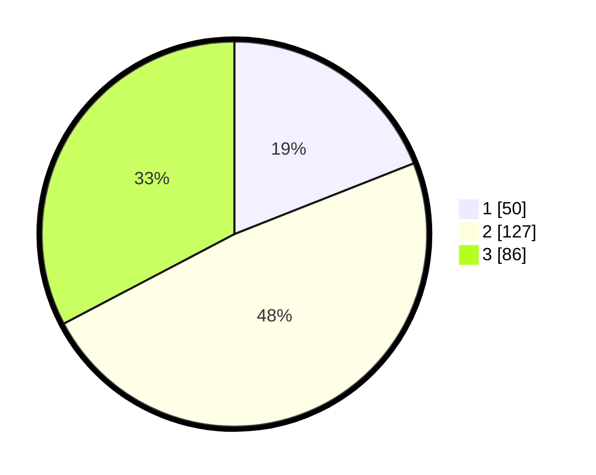

# Hasil

## Grafik

## Tabel

| No. | Nama Paslon    | Suara | Suara (raw) | Persentase |
|:--- |:-------------- | -----:| -----------:| ----------:|
| 1   | ANIES MUHAIMIN | 50    | [50][p-1]   | 19,01      |
| 2   | PRABOWO GIBRAN | 127   | [127][p-2]  | 48,29      |
| 3   | GANJAR MAHFUD  | 86    | [86][p-3]   | 32,70      |

[p-1]: https://github.com/gigit-pemilu/pemilu-2024-33-jawa-tengah/blob/main/pilpres/hitung-suara/sub/33-jawa-tengah/sub/11-sukoharjo/sub/09-grogol/sub/2014-cemani/sub/048-tps/sub/paslon-1.txt
[p-2]: https://github.com/gigit-pemilu/pemilu-2024-33-jawa-tengah/blob/main/pilpres/hitung-suara/sub/33-jawa-tengah/sub/11-sukoharjo/sub/09-grogol/sub/2014-cemani/sub/048-tps/sub/paslon-2.txt
[p-3]: https://github.com/gigit-pemilu/pemilu-2024-33-jawa-tengah/blob/main/pilpres/hitung-suara/sub/33-jawa-tengah/sub/11-sukoharjo/sub/09-grogol/sub/2014-cemani/sub/048-tps/sub/paslon-3.txt

## Foto C Plano

https://sirekap-obj-formc.kpu.go.id/efd3/pemilu/ppwp/33/11/09/20/14/3311092014048-20240216-233726--2bace621-eec8-46fa-bb7c-3a0079c0d493.jpg

https://sirekap-obj-formc.kpu.go.id/efd3/pemilu/ppwp/33/11/09/20/14/3311092014048-20240216-233523--0d0900a3-96a3-4c48-9cbb-ec8cee3f151b.jpg

https://sirekap-obj-formc.kpu.go.id/efd3/pemilu/ppwp/33/11/09/20/14/3311092014048-20240216-234137--fa659e12-99b2-4a7d-944d-436923d9cd51.jpg

## Metadata

| Key        | Value               |
| ---------- | ------------------- |
| Time Stamp | 2024-02-17 06:30:03 |

