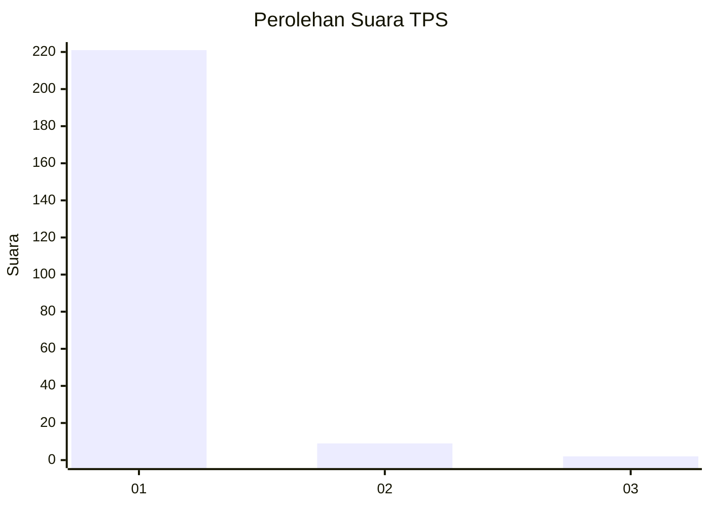
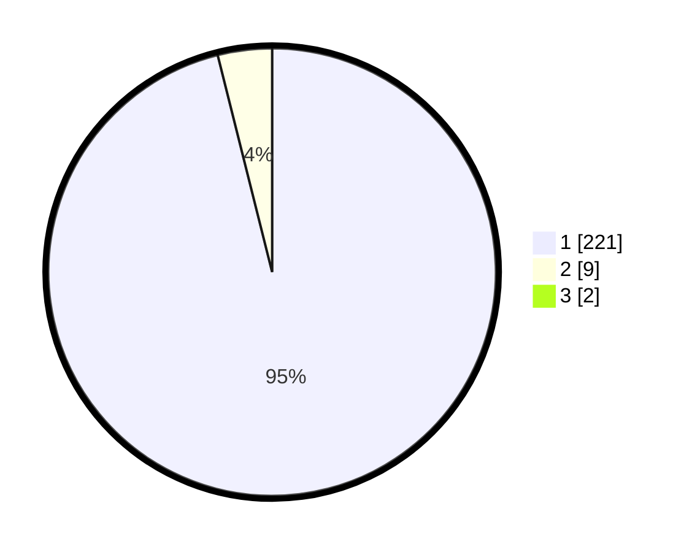

# Hasil

## Grafik

## Tabel

| No. | Nama Paslon    | Suara | Suara (raw) | Persentase |
|:--- |:-------------- | -----:| -----------:| ----------:|
| 1   | ANIES MUHAIMIN | 221   | [221][p-1]  | 95,26      |
| 2   | PRABOWO GIBRAN | 9     | [9][p-2]    | 3,88       |
| 3   | GANJAR MAHFUD  | 2     | [2][p-3]    | 0,86       |

[p-1]: https://github.com/gigit-pemilu/pemilu-2024/blob/main/pilpres/hitung-suara/sub/33-jawa-tengah/sub/11-sukoharjo/sub/09-grogol/sub/2014-cemani/sub/054-tps/sub/paslon-1.txt
[p-2]: https://github.com/gigit-pemilu/pemilu-2024/blob/main/pilpres/hitung-suara/sub/33-jawa-tengah/sub/11-sukoharjo/sub/09-grogol/sub/2014-cemani/sub/054-tps/sub/paslon-2.txt
[p-3]: https://github.com/gigit-pemilu/pemilu-2024/blob/main/pilpres/hitung-suara/sub/33-jawa-tengah/sub/11-sukoharjo/sub/09-grogol/sub/2014-cemani/sub/054-tps/sub/paslon-3.txt

## Foto C Plano

https://sirekap-obj-formc.kpu.go.id/f928/pemilu/ppwp/33/11/09/20/14/3311092014054-20240215-024241--7caafdf4-f92d-42fb-8ff9-1b3ac563e7e1.jpg

https://sirekap-obj-formc.kpu.go.id/f928/pemilu/ppwp/33/11/09/20/14/3311092014054-20240215-024359--b5cbce76-f0f3-42d5-b028-06b4163158f7.jpg

https://sirekap-obj-formc.kpu.go.id/f928/pemilu/ppwp/33/11/09/20/14/3311092014054-20240215-024403--756f0b24-36f1-413f-828c-8006c73af77b.jpg

## Metadata

| Key        | Value               |
| ---------- | ------------------- |
| Time Stamp | 2024-02-17 06:30:03 |

