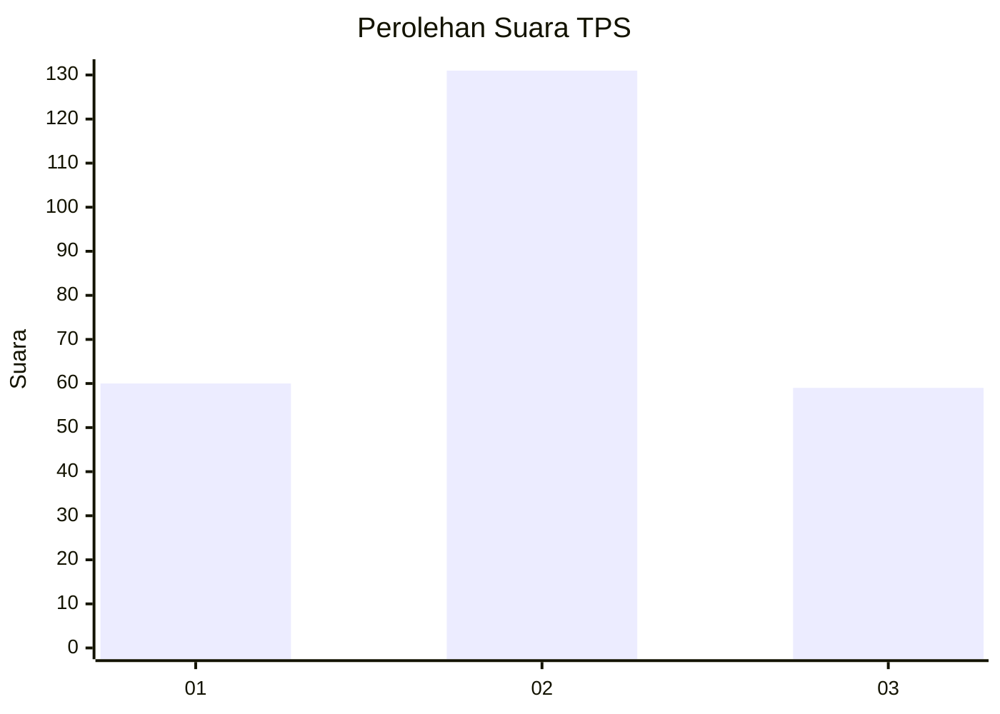
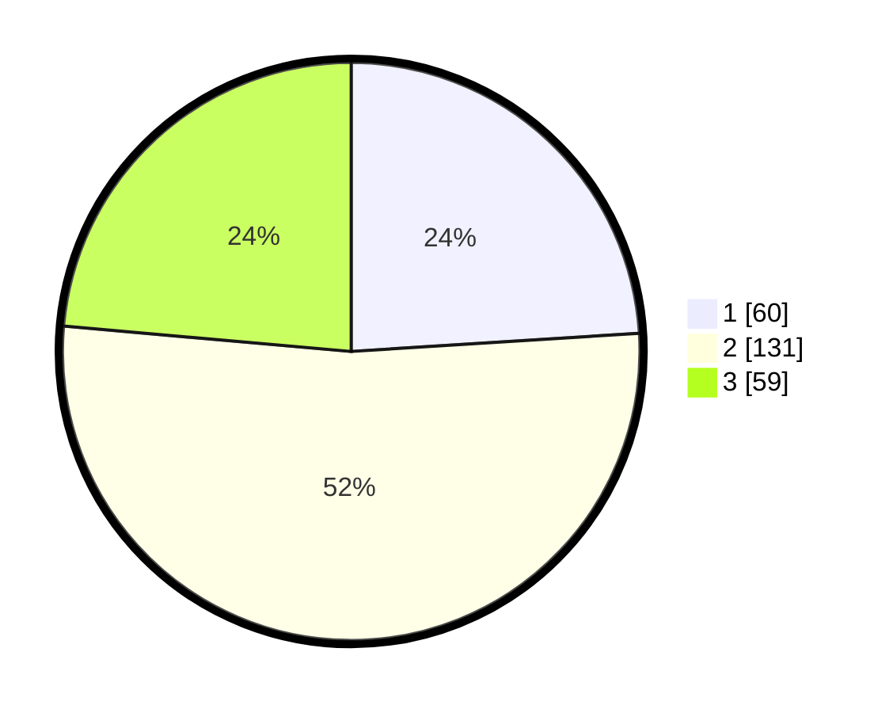

# Hasil

## Grafik

## Tabel

| No. | Nama Paslon    | Suara | Suara (raw) | Persentase |
|:--- |:-------------- | -----:| -----------:| ----------:|
| 1   | ANIES MUHAIMIN | 60    | [60][p-1]   | 24,00      |
| 2   | PRABOWO GIBRAN | 131   | [131][p-2]  | 52,40      |
| 3   | GANJAR MAHFUD  | 59    | [59][p-3]   | 23,60      |

[p-1]: https://github.com/gigit-pemilu/pemilu-2024-33-jawa-tengah/blob/main/pilpres/hitung-suara/sub/33-jawa-tengah/sub/11-sukoharjo/sub/10-baki/sub/2002-mancasan/sub/006-tps/sub/paslon-1.txt
[p-2]: https://github.com/gigit-pemilu/pemilu-2024-33-jawa-tengah/blob/main/pilpres/hitung-suara/sub/33-jawa-tengah/sub/11-sukoharjo/sub/10-baki/sub/2002-mancasan/sub/006-tps/sub/paslon-2.txt
[p-3]: https://github.com/gigit-pemilu/pemilu-2024-33-jawa-tengah/blob/main/pilpres/hitung-suara/sub/33-jawa-tengah/sub/11-sukoharjo/sub/10-baki/sub/2002-mancasan/sub/006-tps/sub/paslon-3.txt

## Foto C Plano

https://sirekap-obj-formc.kpu.go.id/3a4f/pemilu/ppwp/33/11/10/20/02/3311102002006-20240217-201226--8834d029-b021-48ed-abdb-c12ccdcf5f96.jpg

https://sirekap-obj-formc.kpu.go.id/3a4f/pemilu/ppwp/33/11/10/20/02/3311102002006-20240217-212254--e77944c1-2b34-4341-acf1-ecd67846b501.jpg

https://sirekap-obj-formc.kpu.go.id/3a4f/pemilu/ppwp/33/11/10/20/02/3311102002006-20240217-224246--187fcb23-d543-4af0-86a9-954910319334.jpg

## Metadata

| Key        | Value               |
| ---------- | ------------------- |
| Time Stamp | 2024-02-19 11:00:00 |

## DATA PEMILIH TETAP

Jumlah pemilih dalam DPT: **283**.
 * L: **435**.
 * P: **448**.

## DATA PENGGUNA HAK PILIH

Jumlah pengguna hak pilih dalam DPT: **253**.
 * L: **49**.
 * P: **434**.

Jumlah pengguna hak pilih dalam DPTb: **80**.
 * L: **885**.
 * P: **888**.

Jumlah pengguna hak pilih dalam DPK: **882**.
 * L: **2**.
 * P: **880**.

Jumlah pengguna hak pilih: **256**.
 * L: **422**.
 * P: **434**.

## JUMLAH SUARA SAH DAN TIDAK SAH

JUMLAH SELURUH SUARA SAH: **250**.

JUMLAH SUARA TIDAK SAH: **6**.

JUMLAH SELURUH SUARA SAH DAN SUARA TIDAK SAH: **256**.

