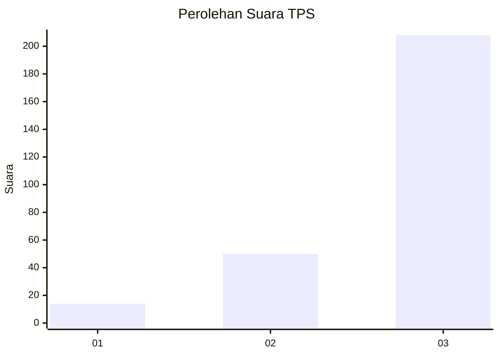
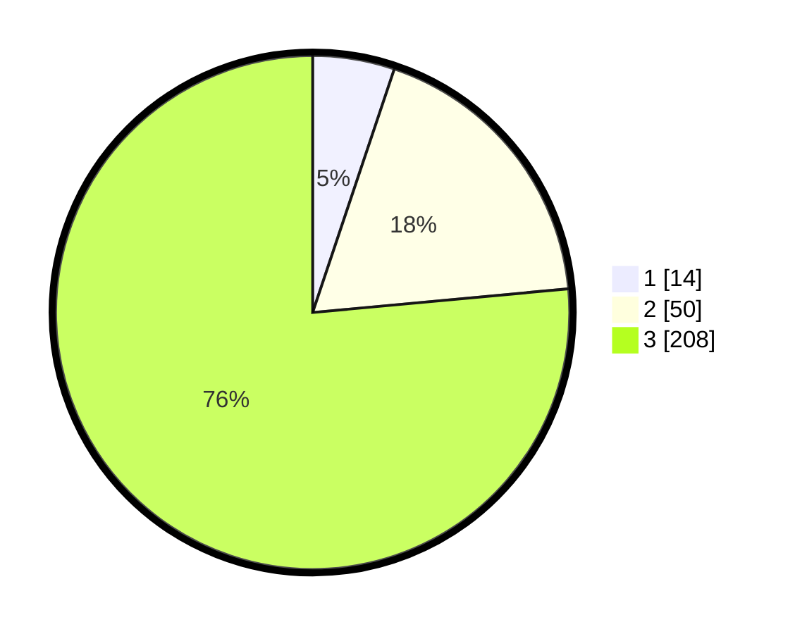

# Hasil

## Grafik

## Tabel

| No. | Nama Paslon    | Suara | Suara (raw) | Persentase |
|:--- |:-------------- | -----:| -----------:| ----------:|
| 1   | ANIES MUHAIMIN | 14    | [14][p-1]   | 5,15       |
| 2   | PRABOWO GIBRAN | 50    | [50][p-2]   | 18,38      |
| 3   | GANJAR MAHFUD  | 208   | [208][p-3]  | 76,47      |

[p-1]: https://github.com/gigit-pemilu/pemilu-2024/blob/main/pilpres/hitung-suara/sub/33-jawa-tengah/sub/11-sukoharjo/sub/11-gatak/sub/2002-kagokan/sub/001-tps/sub/paslon-1.txt
[p-2]: https://github.com/gigit-pemilu/pemilu-2024/blob/main/pilpres/hitung-suara/sub/33-jawa-tengah/sub/11-sukoharjo/sub/11-gatak/sub/2002-kagokan/sub/001-tps/sub/paslon-2.txt
[p-3]: https://github.com/gigit-pemilu/pemilu-2024/blob/main/pilpres/hitung-suara/sub/33-jawa-tengah/sub/11-sukoharjo/sub/11-gatak/sub/2002-kagokan/sub/001-tps/sub/paslon-3.txt

## Foto C Plano

https://sirekap-obj-formc.kpu.go.id/1ea1/pemilu/ppwp/33/11/11/20/02/3311112002001-20240214-185909--347b1825-d006-4941-9b4c-64850f9089ba.jpg

https://sirekap-obj-formc.kpu.go.id/1ea1/pemilu/ppwp/33/11/11/20/02/3311112002001-20240214-190017--1534dca3-13c3-4d53-b34d-9e216fb72a97.jpg

## Metadata

| Key        | Value               |
| ---------- | ------------------- |
| Time Stamp | 2024-02-15 07:00:44 |

