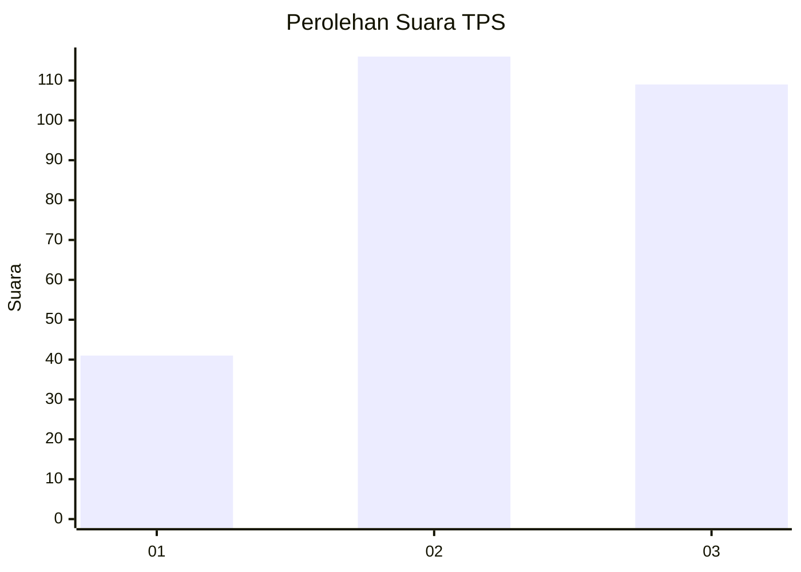
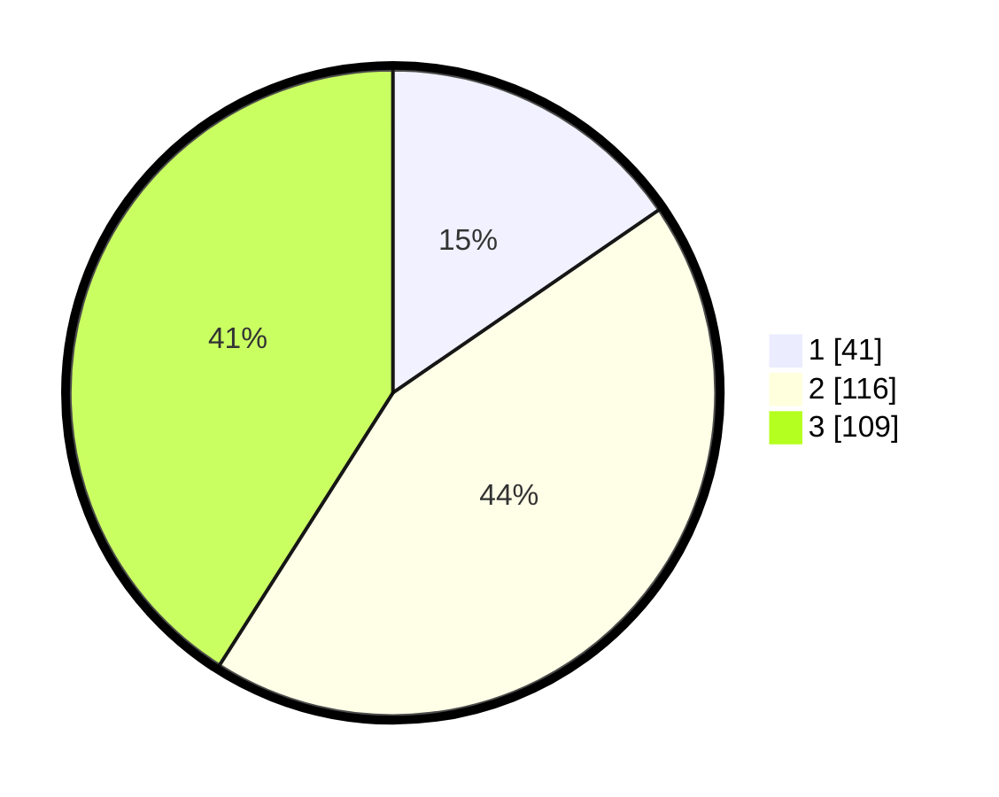

# Hasil

## Grafik

## Tabel

| No. | Nama Paslon    | Suara | Suara (raw) | Persentase |
|:--- |:-------------- | -----:| -----------:| ----------:|
| 1   | ANIES MUHAIMIN | 41    | [41][p-1]   | 15,41      |
| 2   | PRABOWO GIBRAN | 116   | [116][p-2]  | 43,61      |
| 3   | GANJAR MAHFUD  | 109   | [109][p-3]  | 40,98      |

[p-1]: https://github.com/gigit-pemilu/pemilu-2024-33-jawa-tengah/blob/main/pilpres/hitung-suara/sub/33-jawa-tengah/sub/11-sukoharjo/sub/11-gatak/sub/2003-blimbing/sub/006-tps/sub/paslon-1.txt
[p-2]: https://github.com/gigit-pemilu/pemilu-2024-33-jawa-tengah/blob/main/pilpres/hitung-suara/sub/33-jawa-tengah/sub/11-sukoharjo/sub/11-gatak/sub/2003-blimbing/sub/006-tps/sub/paslon-2.txt
[p-3]: https://github.com/gigit-pemilu/pemilu-2024-33-jawa-tengah/blob/main/pilpres/hitung-suara/sub/33-jawa-tengah/sub/11-sukoharjo/sub/11-gatak/sub/2003-blimbing/sub/006-tps/sub/paslon-3.txt

## Foto C Plano

https://sirekap-obj-formc.kpu.go.id/268a/pemilu/ppwp/33/11/11/20/03/3311112003006-20240214-162227--03e95648-2edd-444b-bd3e-26f3e6d40db2.jpg

https://sirekap-obj-formc.kpu.go.id/268a/pemilu/ppwp/33/11/11/20/03/3311112003006-20240217-094032--7e512162-7c7c-4e9c-a863-eb30aa8d5f0f.jpg

https://sirekap-obj-formc.kpu.go.id/268a/pemilu/ppwp/33/11/11/20/03/3311112003006-20240217-001159--857d2d07-d48f-4843-a18a-997d11fddafe.jpg

## Metadata

| Key        | Value               |
| ---------- | ------------------- |
| Time Stamp | 2024-02-19 12:00:00 |

