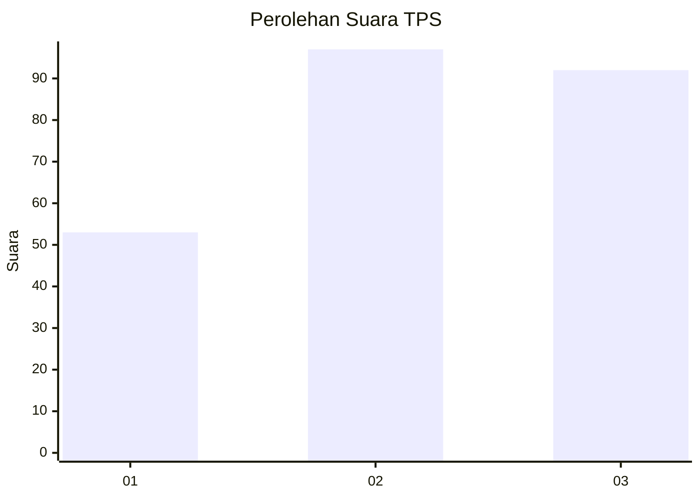
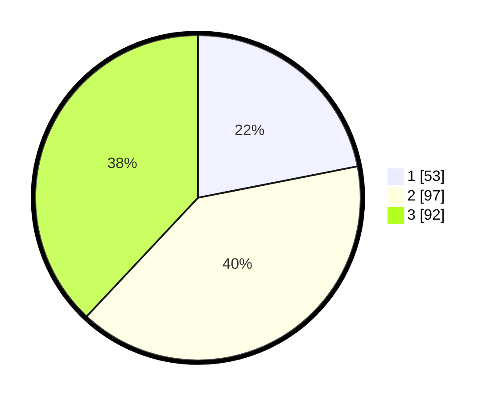

# Hasil

## Grafik

## Tabel

| No. | Nama Paslon    | Suara | Suara (raw) | Persentase |
|:--- |:-------------- | -----:| -----------:| ----------:|
| 1   | ANIES MUHAIMIN | 53    | [53][p-1]   | 21,90      |
| 2   | PRABOWO GIBRAN | 97    | [97][p-2]   | 40,08      |
| 3   | GANJAR MAHFUD  | 92    | [92][p-3]   | 38,02      |

[p-1]: https://github.com/gigit-pemilu/pemilu-2024/blob/main/pilpres/hitung-suara/sub/33-jawa-tengah/sub/11-sukoharjo/sub/11-gatak/sub/2003-blimbing/sub/008-tps/sub/paslon-1.txt
[p-2]: https://github.com/gigit-pemilu/pemilu-2024/blob/main/pilpres/hitung-suara/sub/33-jawa-tengah/sub/11-sukoharjo/sub/11-gatak/sub/2003-blimbing/sub/008-tps/sub/paslon-2.txt
[p-3]: https://github.com/gigit-pemilu/pemilu-2024/blob/main/pilpres/hitung-suara/sub/33-jawa-tengah/sub/11-sukoharjo/sub/11-gatak/sub/2003-blimbing/sub/008-tps/sub/paslon-3.txt

## Foto C Plano

https://sirekap-obj-formc.kpu.go.id/f896/pemilu/ppwp/33/11/11/20/03/3311112003008-20240215-005442--4416e3bf-962e-404b-b675-744a9168d93e.jpg

https://sirekap-obj-formc.kpu.go.id/f896/pemilu/ppwp/33/11/11/20/03/3311112003008-20240215-012548--58453fca-f14b-45c6-8201-7a5a4ea6d854.jpg

https://sirekap-obj-formc.kpu.go.id/f896/pemilu/ppwp/33/11/11/20/03/3311112003008-20240215-012640--fc341de8-ee1a-4f69-93bf-d22694735f44.jpg

## Metadata

| Key        | Value               |
| ---------- | ------------------- |
| Time Stamp | 2024-02-16 09:30:28 |

