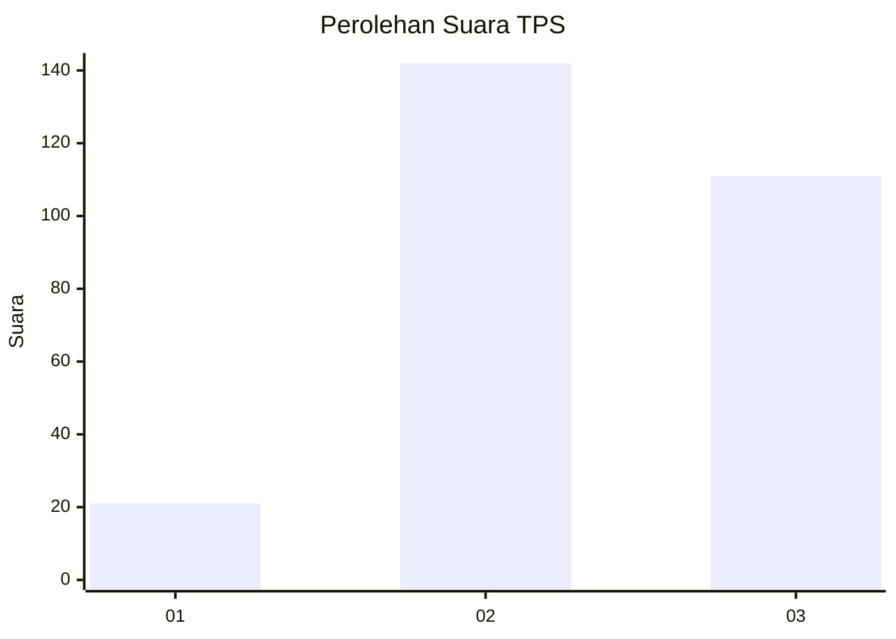
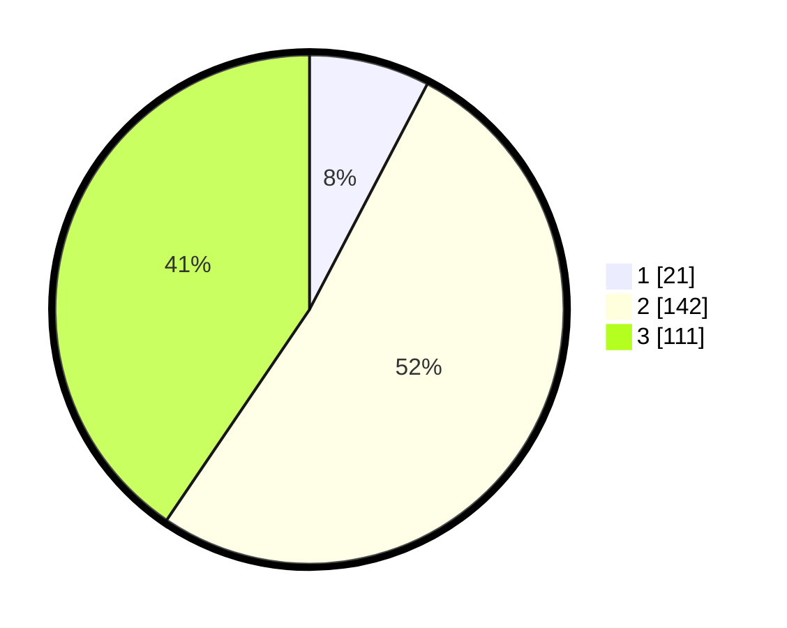

# Hasil

## Grafik

## Tabel

| No. | Nama Paslon    | Suara | Suara (raw) | Persentase |
|:--- |:-------------- | -----:| -----------:| ----------:|
| 1   | ANIES MUHAIMIN | 21    | [21][p-1]   | 7,66       |
| 2   | PRABOWO GIBRAN | 142   | [142][p-2]  | 51,82      |
| 3   | GANJAR MAHFUD  | 111   | [111][p-3]  | 40,51      |

[p-1]: https://github.com/gigit-pemilu/pemilu-2024/blob/main/pilpres/hitung-suara/sub/33-jawa-tengah/sub/11-sukoharjo/sub/11-gatak/sub/2005-geneng/sub/002-tps/sub/paslon-1.txt
[p-2]: https://github.com/gigit-pemilu/pemilu-2024/blob/main/pilpres/hitung-suara/sub/33-jawa-tengah/sub/11-sukoharjo/sub/11-gatak/sub/2005-geneng/sub/002-tps/sub/paslon-2.txt
[p-3]: https://github.com/gigit-pemilu/pemilu-2024/blob/main/pilpres/hitung-suara/sub/33-jawa-tengah/sub/11-sukoharjo/sub/11-gatak/sub/2005-geneng/sub/002-tps/sub/paslon-3.txt

## Foto C Plano

https://sirekap-obj-formc.kpu.go.id/88cb/pemilu/ppwp/33/11/11/20/05/3311112005002-20240214-230219--4a689148-eeb1-44aa-8635-afbc0e4eb107.jpg

https://sirekap-obj-formc.kpu.go.id/88cb/pemilu/ppwp/33/11/11/20/05/3311112005002-20240214-230435--31474a3d-d1bd-4383-b752-8e90ac4520e5.jpg

https://sirekap-obj-formc.kpu.go.id/88cb/pemilu/ppwp/33/11/11/20/05/3311112005002-20240214-230721--2d92d88d-4422-42c2-9391-77e86e05cd4a.jpg

## Metadata

| Key        | Value               |
| ---------- | ------------------- |
| Time Stamp | 2024-02-16 09:30:28 |

