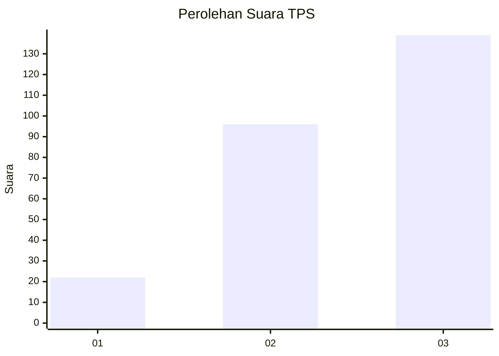
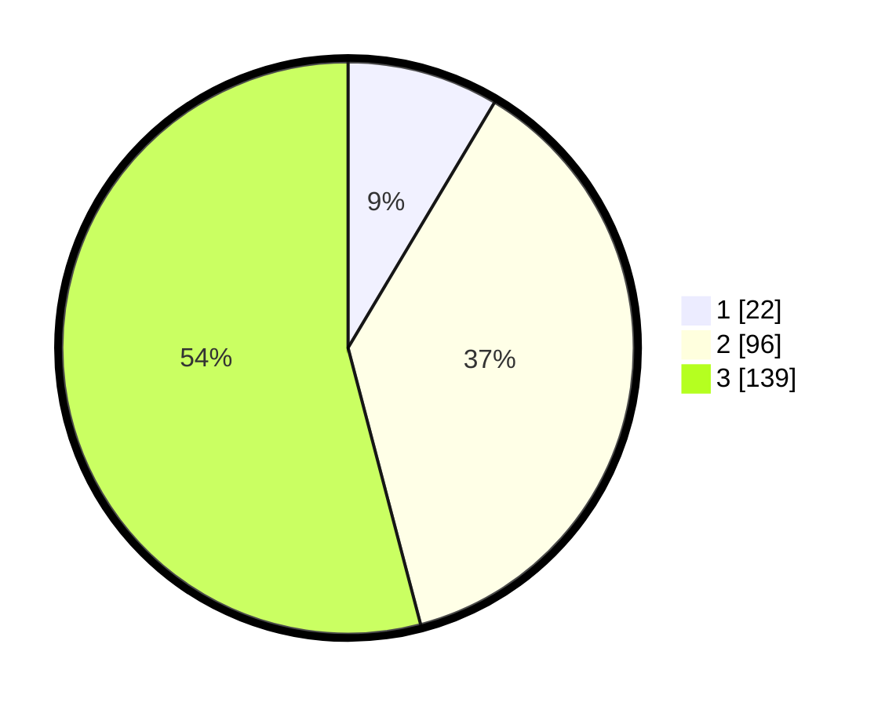

# Hasil

## Grafik

## Tabel

| No. | Nama Paslon    | Suara | Suara (raw) | Persentase |
|:--- |:-------------- | -----:| -----------:| ----------:|
| 1   | ANIES MUHAIMIN | 22    | [22][p-1]   | 8,56       |
| 2   | PRABOWO GIBRAN | 96    | [96][p-2]   | 37,35      |
| 3   | GANJAR MAHFUD  | 139   | [139][p-3]  | 54,09      |

[p-1]: https://github.com/gigit-pemilu/pemilu-2024/blob/main/pilpres/hitung-suara/sub/33-jawa-tengah/sub/11-sukoharjo/sub/11-gatak/sub/2005-geneng/sub/003-tps/sub/paslon-1.txt
[p-2]: https://github.com/gigit-pemilu/pemilu-2024/blob/main/pilpres/hitung-suara/sub/33-jawa-tengah/sub/11-sukoharjo/sub/11-gatak/sub/2005-geneng/sub/003-tps/sub/paslon-2.txt
[p-3]: https://github.com/gigit-pemilu/pemilu-2024/blob/main/pilpres/hitung-suara/sub/33-jawa-tengah/sub/11-sukoharjo/sub/11-gatak/sub/2005-geneng/sub/003-tps/sub/paslon-3.txt

## Foto C Plano

https://sirekap-obj-formc.kpu.go.id/bd94/pemilu/ppwp/33/11/11/20/05/3311112005003-20240214-202947--2eecd96d-9c3b-4bfe-957d-c191839837b7.jpg

https://sirekap-obj-formc.kpu.go.id/bd94/pemilu/ppwp/33/11/11/20/05/3311112005003-20240216-150339--57533a65-aff7-482d-8a1f-8b05463ab290.jpg

https://sirekap-obj-formc.kpu.go.id/bd94/pemilu/ppwp/33/11/11/20/05/3311112005003-20240214-202953--4f7bb66c-d934-4225-80b7-fb5f7dd44bd5.jpg

## Metadata

| Key        | Value               |
| ---------- | ------------------- |
| Time Stamp | 2024-02-16 16:25:10 |

