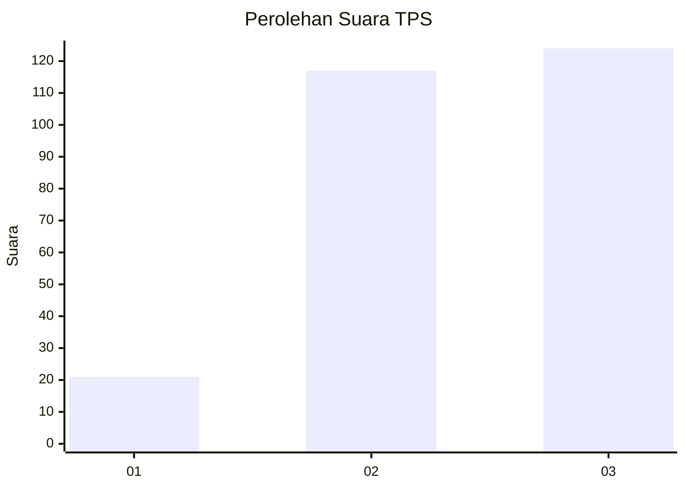
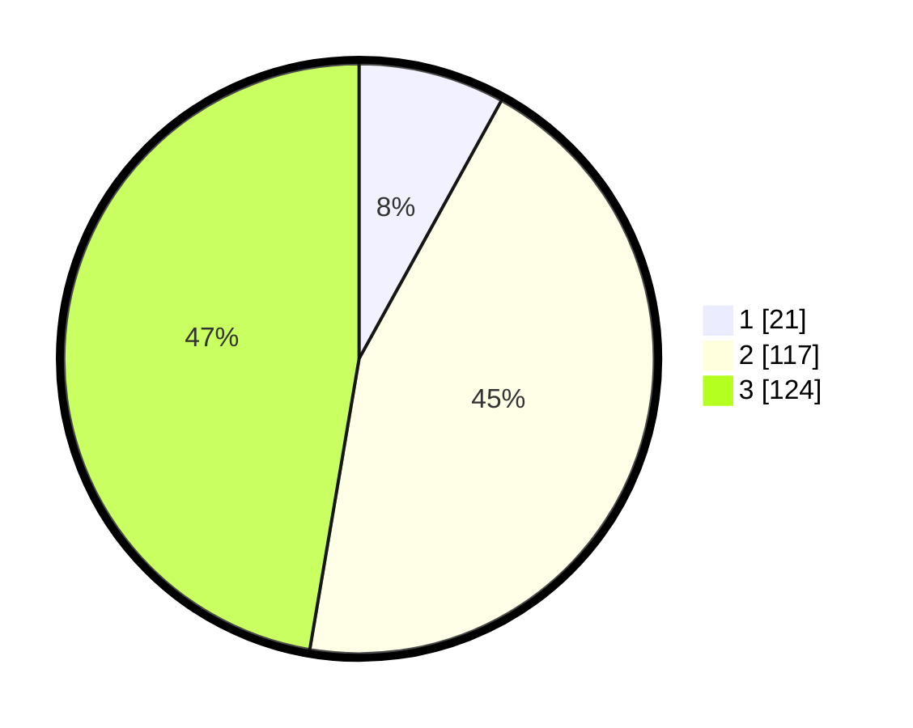

# Hasil

## Grafik

## Tabel

| No. | Nama Paslon    | Suara | Suara (raw) | Persentase |
|:--- |:-------------- | -----:| -----------:| ----------:|
| 1   | ANIES MUHAIMIN | 21    | [21][p-1]   | 8,02       |
| 2   | PRABOWO GIBRAN | 117   | [117][p-2]  | 44,66      |
| 3   | GANJAR MAHFUD  | 124   | [124][p-3]  | 47,33      |

[p-1]: https://github.com/gigit-pemilu/pemilu-2024/blob/main/pilpres/hitung-suara/sub/33-jawa-tengah/sub/11-sukoharjo/sub/11-gatak/sub/2005-geneng/sub/005-tps/sub/paslon-1.txt
[p-2]: https://github.com/gigit-pemilu/pemilu-2024/blob/main/pilpres/hitung-suara/sub/33-jawa-tengah/sub/11-sukoharjo/sub/11-gatak/sub/2005-geneng/sub/005-tps/sub/paslon-2.txt
[p-3]: https://github.com/gigit-pemilu/pemilu-2024/blob/main/pilpres/hitung-suara/sub/33-jawa-tengah/sub/11-sukoharjo/sub/11-gatak/sub/2005-geneng/sub/005-tps/sub/paslon-3.txt

## Foto C Plano

https://sirekap-obj-formc.kpu.go.id/3ccd/pemilu/ppwp/33/11/11/20/05/3311112005005-20240215-024525--b4a6e2a0-6389-49c1-9099-661ceae8abc4.jpg

https://sirekap-obj-formc.kpu.go.id/3ccd/pemilu/ppwp/33/11/11/20/05/3311112005005-20240215-024557--fad44ab4-71c2-445e-bf7b-8a044dfb2fa4.jpg

https://sirekap-obj-formc.kpu.go.id/3ccd/pemilu/ppwp/33/11/11/20/05/3311112005005-20240215-024645--b6958740-42c6-4a34-8d56-6caa7cc8b7e1.jpg

## Metadata

| Key        | Value               |
| ---------- | ------------------- |
| Time Stamp | 2024-02-16 09:30:28 |

