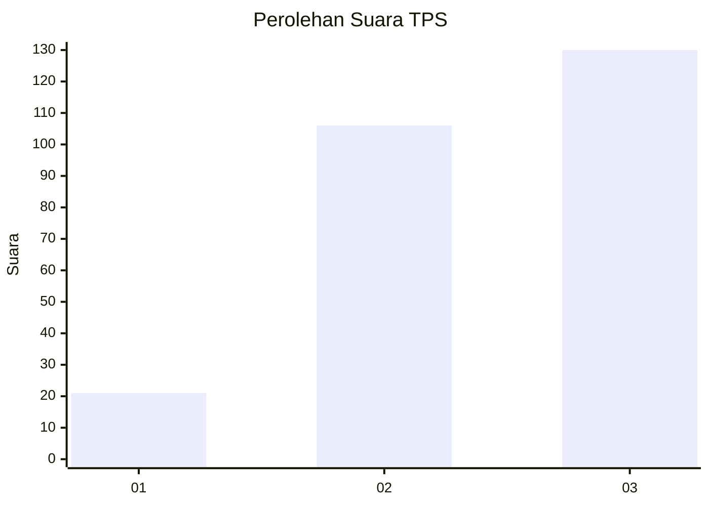
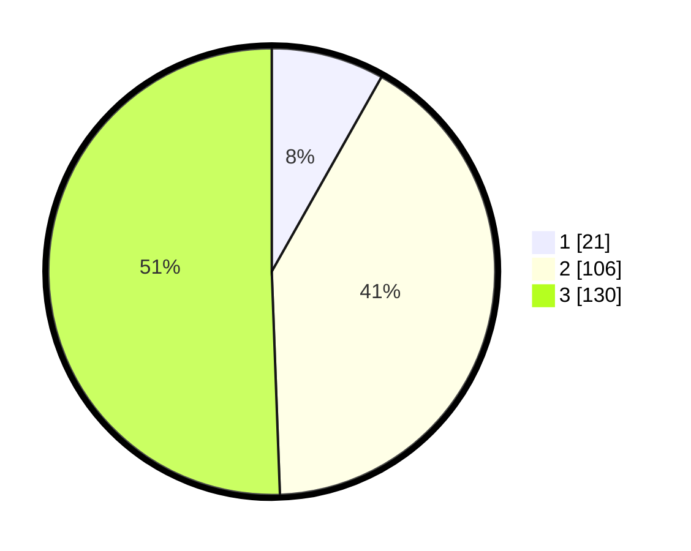

# Hasil

## Grafik

## Tabel

| No. | Nama Paslon    | Suara | Suara (raw) | Persentase |
|:--- |:-------------- | -----:| -----------:| ----------:|
| 1   | ANIES MUHAIMIN | 21    | [21][p-1]   | 8,17       |
| 2   | PRABOWO GIBRAN | 106   | [106][p-2]  | 41,25      |
| 3   | GANJAR MAHFUD  | 130   | [130][p-3]  | 50,58      |

[p-1]: https://github.com/gigit-pemilu/pemilu-2024/blob/main/pilpres/hitung-suara/sub/33-jawa-tengah/sub/11-sukoharjo/sub/11-gatak/sub/2006-jati/sub/003-tps/sub/paslon-1.txt
[p-2]: https://github.com/gigit-pemilu/pemilu-2024/blob/main/pilpres/hitung-suara/sub/33-jawa-tengah/sub/11-sukoharjo/sub/11-gatak/sub/2006-jati/sub/003-tps/sub/paslon-2.txt
[p-3]: https://github.com/gigit-pemilu/pemilu-2024/blob/main/pilpres/hitung-suara/sub/33-jawa-tengah/sub/11-sukoharjo/sub/11-gatak/sub/2006-jati/sub/003-tps/sub/paslon-3.txt

## Foto C Plano

https://sirekap-obj-formc.kpu.go.id/52f8/pemilu/ppwp/33/11/11/20/06/3311112006003-20240214-224429--28d65f4d-62fc-451d-a788-1e75b1561df0.jpg

https://sirekap-obj-formc.kpu.go.id/52f8/pemilu/ppwp/33/11/11/20/06/3311112006003-20240214-224625--bd1b6c1d-48fe-4d26-8a52-f346999be95d.jpg

https://sirekap-obj-formc.kpu.go.id/52f8/pemilu/ppwp/33/11/11/20/06/3311112006003-20240214-224754--ca1c0442-df6d-48f5-96d5-474de5955762.jpg

## Metadata

| Key        | Value               |
| ---------- | ------------------- |
| Time Stamp | 2024-02-15 22:40:13 |

