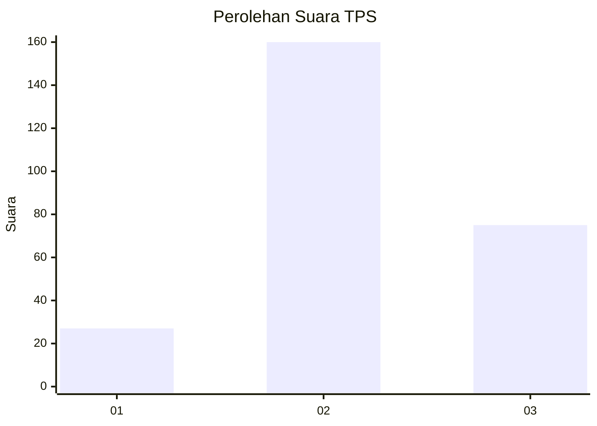
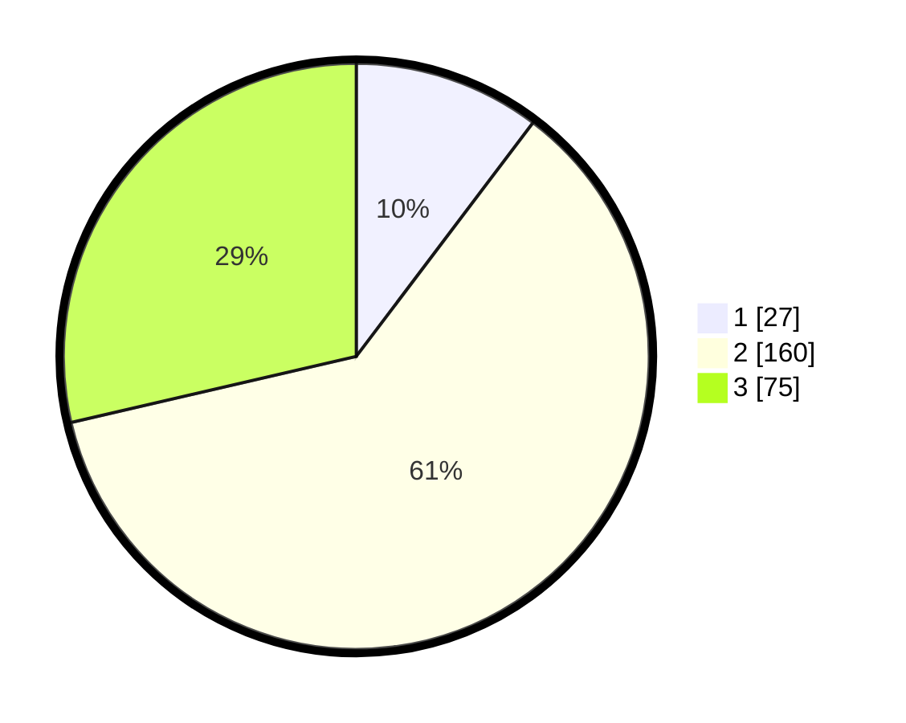

# Hasil

## Grafik

## Tabel

| No. | Nama Paslon    | Suara | Suara (raw) | Persentase |
|:--- |:-------------- | -----:| -----------:| ----------:|
| 1   | ANIES MUHAIMIN | 27    | [27][p-1]   | 10,31      |
| 2   | PRABOWO GIBRAN | 160   | [160][p-2]  | 61,07      |
| 3   | GANJAR MAHFUD  | 75    | [75][p-3]   | 28,63      |

[p-1]: https://github.com/gigit-pemilu/pemilu-2024/blob/main/pilpres/hitung-suara/sub/33-jawa-tengah/sub/11-sukoharjo/sub/11-gatak/sub/2008-luwang/sub/002-tps/sub/paslon-1.txt
[p-2]: https://github.com/gigit-pemilu/pemilu-2024/blob/main/pilpres/hitung-suara/sub/33-jawa-tengah/sub/11-sukoharjo/sub/11-gatak/sub/2008-luwang/sub/002-tps/sub/paslon-2.txt
[p-3]: https://github.com/gigit-pemilu/pemilu-2024/blob/main/pilpres/hitung-suara/sub/33-jawa-tengah/sub/11-sukoharjo/sub/11-gatak/sub/2008-luwang/sub/002-tps/sub/paslon-3.txt

## Foto C Plano

https://sirekap-obj-formc.kpu.go.id/8482/pemilu/ppwp/33/11/11/20/08/3311112008002-20240215-020844--2d1e3411-6acb-4986-992e-abb9d2611029.jpg

https://sirekap-obj-formc.kpu.go.id/8482/pemilu/ppwp/33/11/11/20/08/3311112008002-20240215-023055--8f4ec0b6-5074-499a-8a00-ce5cffd1a4f4.jpg

https://sirekap-obj-formc.kpu.go.id/8482/pemilu/ppwp/33/11/11/20/08/3311112008002-20240215-020915--e3dd4f2e-469f-4990-bfd3-bdf2adc6092a.jpg

## Metadata

| Key        | Value               |
| ---------- | ------------------- |
| Time Stamp | 2024-02-16 21:01:00 |

