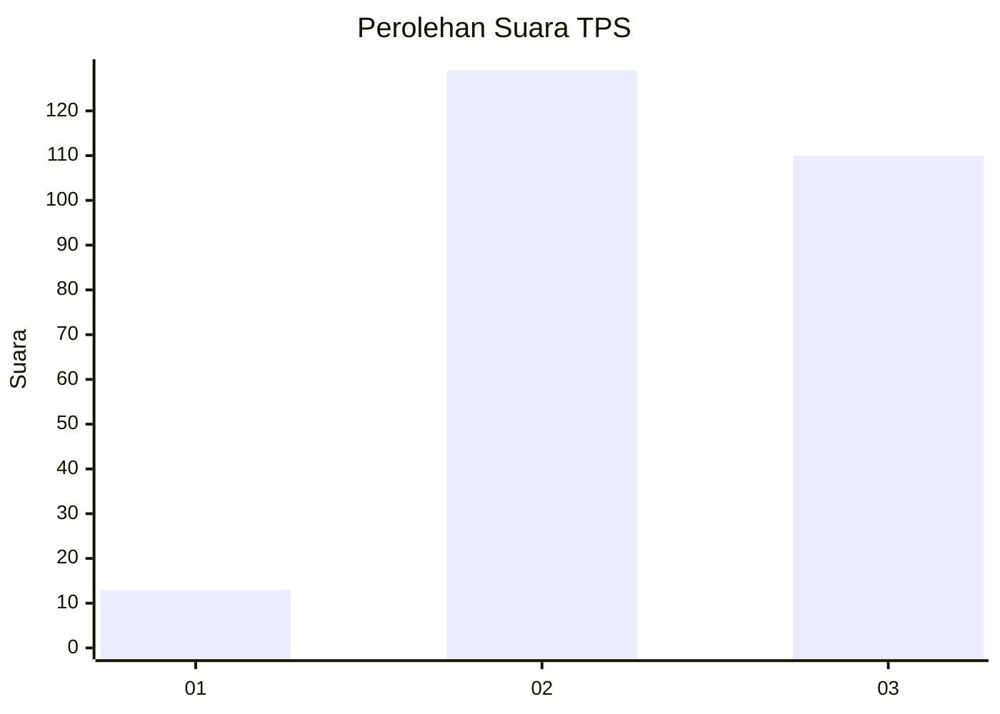
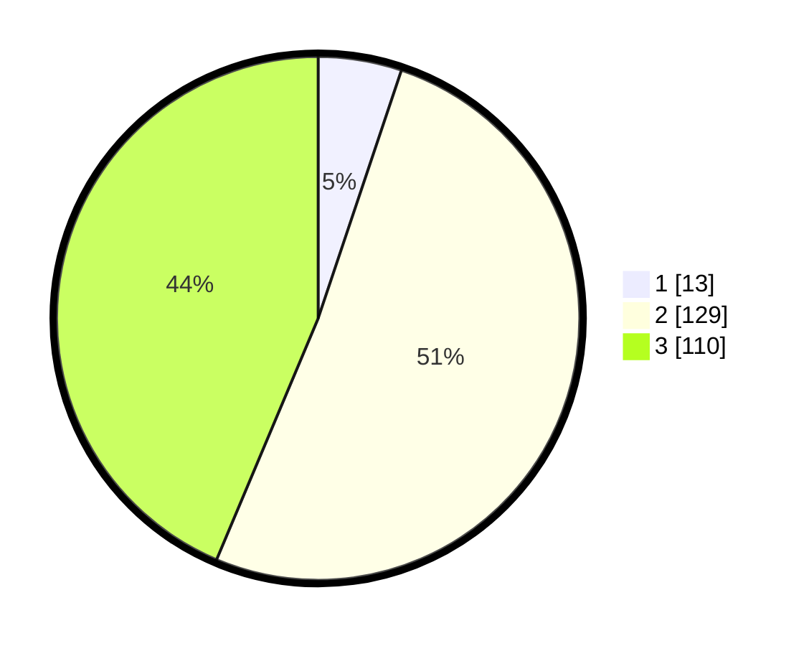

# Hasil

## Grafik

## Tabel

| No. | Nama Paslon    | Suara | Suara (raw) | Persentase |
|:--- |:-------------- | -----:| -----------:| ----------:|
| 1   | ANIES MUHAIMIN | 13    | [13][p-1]   | 5,16       |
| 2   | PRABOWO GIBRAN | 129   | [129][p-2]  | 51,19      |
| 3   | GANJAR MAHFUD  | 110   | [110][p-3]  | 43,65      |

[p-1]: https://github.com/gigit-pemilu/pemilu-2024/blob/main/pilpres/hitung-suara/sub/33-jawa-tengah/sub/11-sukoharjo/sub/11-gatak/sub/2011-sraten/sub/006-tps/sub/paslon-1.txt
[p-2]: https://github.com/gigit-pemilu/pemilu-2024/blob/main/pilpres/hitung-suara/sub/33-jawa-tengah/sub/11-sukoharjo/sub/11-gatak/sub/2011-sraten/sub/006-tps/sub/paslon-2.txt
[p-3]: https://github.com/gigit-pemilu/pemilu-2024/blob/main/pilpres/hitung-suara/sub/33-jawa-tengah/sub/11-sukoharjo/sub/11-gatak/sub/2011-sraten/sub/006-tps/sub/paslon-3.txt

## Foto C Plano

https://sirekap-obj-formc.kpu.go.id/97ce/pemilu/ppwp/33/11/11/20/11/3311112011006-20240215-012120--252ee787-3e5a-44af-8d5d-356c29b67159.jpg

https://sirekap-obj-formc.kpu.go.id/97ce/pemilu/ppwp/33/11/11/20/11/3311112011006-20240215-012249--c383398e-6aaf-4ad1-a60d-1cd3b74e5692.jpg

https://sirekap-obj-formc.kpu.go.id/97ce/pemilu/ppwp/33/11/11/20/11/3311112011006-20240215-012354--7e1ffcf9-efe9-4151-9d7d-c2bbca48667e.jpg

## Metadata

| Key        | Value               |
| ---------- | ------------------- |
| Time Stamp | 2024-02-16 10:00:28 |

