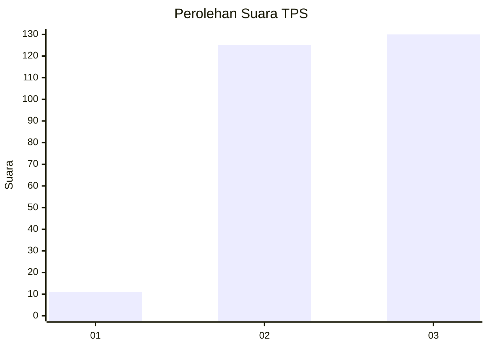
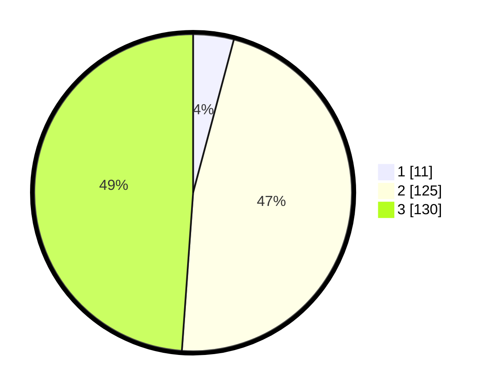

# Hasil

## Grafik

## Tabel

| No. | Nama Paslon    | Suara | Suara (raw) | Persentase |
|:--- |:-------------- | -----:| -----------:| ----------:|
| 1   | ANIES MUHAIMIN | 11    | [11][p-1]   | 4,14       |
| 2   | PRABOWO GIBRAN | 125   | [125][p-2]  | 46,99      |
| 3   | GANJAR MAHFUD  | 130   | [130][p-3]  | 48,87      |

[p-1]: https://github.com/gigit-pemilu/pemilu-2024-33-jawa-tengah/blob/main/pilpres/hitung-suara/sub/33-jawa-tengah/sub/11-sukoharjo/sub/11-gatak/sub/2011-sraten/sub/009-tps/sub/paslon-1.txt
[p-2]: https://github.com/gigit-pemilu/pemilu-2024-33-jawa-tengah/blob/main/pilpres/hitung-suara/sub/33-jawa-tengah/sub/11-sukoharjo/sub/11-gatak/sub/2011-sraten/sub/009-tps/sub/paslon-2.txt
[p-3]: https://github.com/gigit-pemilu/pemilu-2024-33-jawa-tengah/blob/main/pilpres/hitung-suara/sub/33-jawa-tengah/sub/11-sukoharjo/sub/11-gatak/sub/2011-sraten/sub/009-tps/sub/paslon-3.txt

## Foto C Plano

https://sirekap-obj-formc.kpu.go.id/1c0a/pemilu/ppwp/33/11/11/20/11/3311112011009-20240214-215323--4856ad77-d996-4e2d-af3c-143910b21ee0.jpg

https://sirekap-obj-formc.kpu.go.id/1c0a/pemilu/ppwp/33/11/11/20/11/3311112011009-20240214-215323--11f00660-9652-49ab-ab1e-9c6c4e04246a.jpg

https://sirekap-obj-formc.kpu.go.id/1c0a/pemilu/ppwp/33/11/11/20/11/3311112011009-20240214-215601--5e81f2c5-449e-4b52-87fd-e9baffdf76b7.jpg

## Metadata

| Key        | Value               |
| ---------- | ------------------- |
| Time Stamp | 2024-02-16 10:00:28 |

