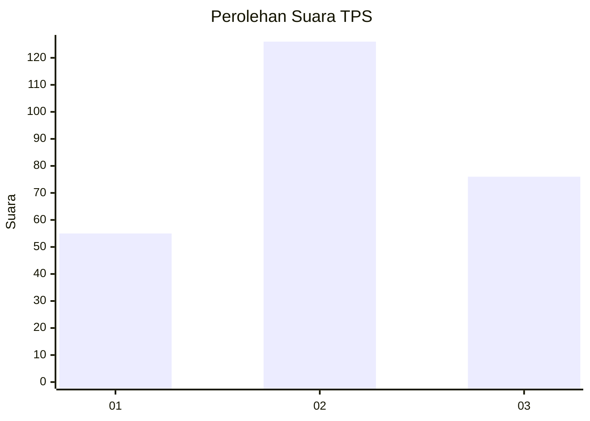
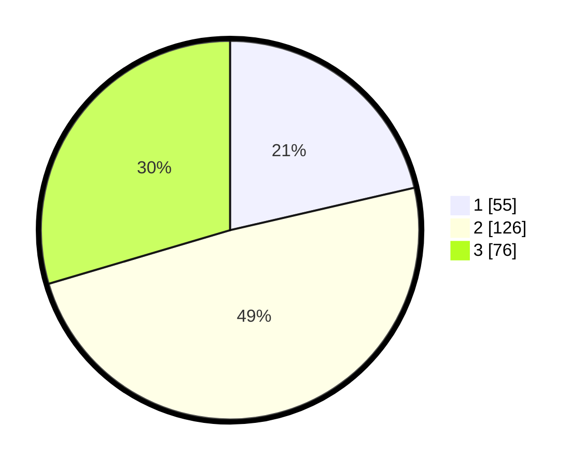

# Hasil

## Grafik

## Tabel

| No. | Nama Paslon    | Suara | Suara (raw) | Persentase |
|:--- |:-------------- | -----:| -----------:| ----------:|
| 1   | ANIES MUHAIMIN | 55    | [55][p-1]   | 21,40      |
| 2   | PRABOWO GIBRAN | 126   | [126][p-2]  | 49,03      |
| 3   | GANJAR MAHFUD  | 76    | [76][p-3]   | 29,57      |

[p-1]: https://github.com/gigit-pemilu/pemilu-2024/blob/main/pilpres/hitung-suara/sub/33-jawa-tengah/sub/11-sukoharjo/sub/12-kartasura/sub/1004-ngadirejo/sub/008-tps/sub/paslon-1.txt
[p-2]: https://github.com/gigit-pemilu/pemilu-2024/blob/main/pilpres/hitung-suara/sub/33-jawa-tengah/sub/11-sukoharjo/sub/12-kartasura/sub/1004-ngadirejo/sub/008-tps/sub/paslon-2.txt
[p-3]: https://github.com/gigit-pemilu/pemilu-2024/blob/main/pilpres/hitung-suara/sub/33-jawa-tengah/sub/11-sukoharjo/sub/12-kartasura/sub/1004-ngadirejo/sub/008-tps/sub/paslon-3.txt

## Foto C Plano

https://sirekap-obj-formc.kpu.go.id/b2d3/pemilu/ppwp/33/11/12/10/04/3311121004008-20240214-192228--e9b89c43-b09d-4361-99aa-bf7172074014.jpg

https://sirekap-obj-formc.kpu.go.id/b2d3/pemilu/ppwp/33/11/12/10/04/3311121004008-20240214-192254--00b39d5c-8fb8-4ace-9af0-143e45960465.jpg

https://sirekap-obj-formc.kpu.go.id/b2d3/pemilu/ppwp/33/11/12/10/04/3311121004008-20240215-000800--26dc208c-30e2-41e7-8e44-f740f44f6aca.jpg

## Metadata

| Key        | Value               |
| ---------- | ------------------- |
| Time Stamp | 2024-02-15 06:00:23 |

