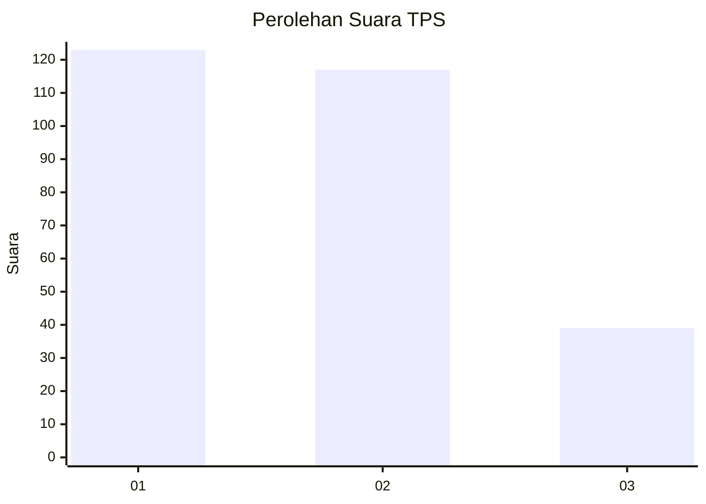
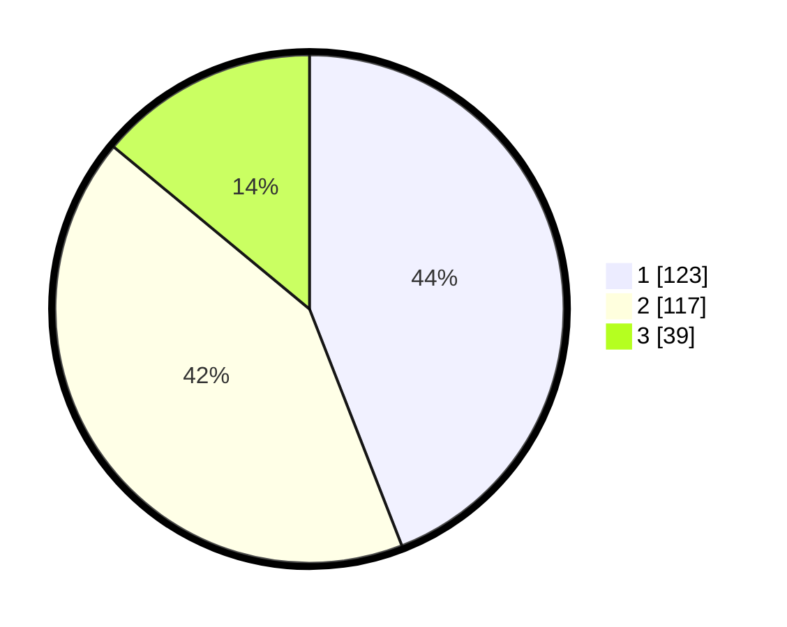

# Hasil

## Grafik

## Tabel

| No. | Nama Paslon    | Suara | Suara (raw) | Persentase |
|:--- |:-------------- | -----:| -----------:| ----------:|
| 1   | ANIES MUHAIMIN | 123   | [123][p-1]  | 44,09      |
| 2   | PRABOWO GIBRAN | 117   | [117][p-2]  | 41,94      |
| 3   | GANJAR MAHFUD  | 39    | [39][p-3]   | 13,98      |

[p-1]: https://github.com/gigit-pemilu/pemilu-2024/blob/main/pilpres/hitung-suara/sub/33-jawa-tengah/sub/11-sukoharjo/sub/12-kartasura/sub/2001-pucangan/sub/004-tps/sub/paslon-1.txt
[p-2]: https://github.com/gigit-pemilu/pemilu-2024/blob/main/pilpres/hitung-suara/sub/33-jawa-tengah/sub/11-sukoharjo/sub/12-kartasura/sub/2001-pucangan/sub/004-tps/sub/paslon-2.txt
[p-3]: https://github.com/gigit-pemilu/pemilu-2024/blob/main/pilpres/hitung-suara/sub/33-jawa-tengah/sub/11-sukoharjo/sub/12-kartasura/sub/2001-pucangan/sub/004-tps/sub/paslon-3.txt

## Foto C Plano

https://sirekap-obj-formc.kpu.go.id/1d0d/pemilu/ppwp/33/11/12/20/01/3311122001004-20240216-150628--5bde6062-4e2b-46f7-b438-f19cabeaa879.jpg

https://sirekap-obj-formc.kpu.go.id/1d0d/pemilu/ppwp/33/11/12/20/01/3311122001004-20240214-193417--a24b68e3-07d6-4077-9460-5cb837919552.jpg

https://sirekap-obj-formc.kpu.go.id/1d0d/pemilu/ppwp/33/11/12/20/01/3311122001004-20240216-151722--97a9d035-01a6-4d7d-8d92-29e05ed84d9d.jpg

## Metadata

| Key        | Value               |
| ---------- | ------------------- |
| Time Stamp | 2024-02-16 16:25:10 |

