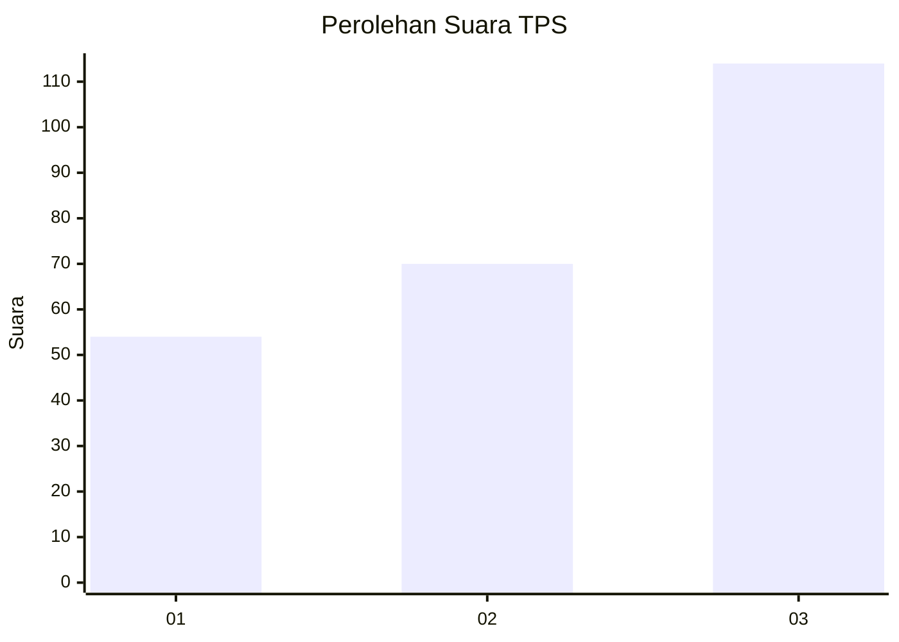
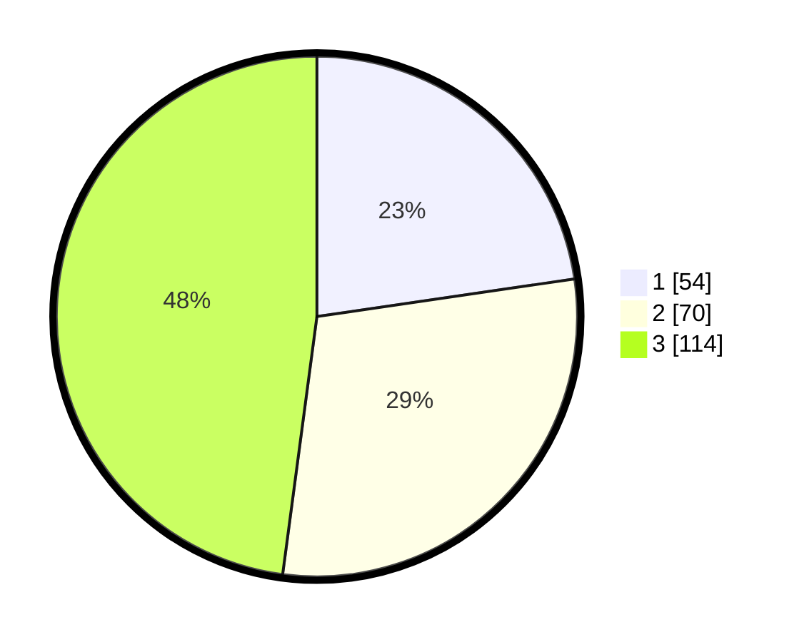

# Hasil

## Grafik

## Tabel

| No. | Nama Paslon    | Suara | Suara (raw) | Persentase |
|:--- |:-------------- | -----:| -----------:| ----------:|
| 1   | ANIES MUHAIMIN | 54    | [54][p-1]   | 22,69      |
| 2   | PRABOWO GIBRAN | 70    | [70][p-2]   | 29,41      |
| 3   | GANJAR MAHFUD  | 114   | [114][p-3]  | 47,90      |

[p-1]: https://github.com/gigit-pemilu/pemilu-2024/blob/main/pilpres/hitung-suara/sub/33-jawa-tengah/sub/11-sukoharjo/sub/12-kartasura/sub/2006-makamhaji/sub/049-tps/sub/paslon-1.txt
[p-2]: https://github.com/gigit-pemilu/pemilu-2024/blob/main/pilpres/hitung-suara/sub/33-jawa-tengah/sub/11-sukoharjo/sub/12-kartasura/sub/2006-makamhaji/sub/049-tps/sub/paslon-2.txt
[p-3]: https://github.com/gigit-pemilu/pemilu-2024/blob/main/pilpres/hitung-suara/sub/33-jawa-tengah/sub/11-sukoharjo/sub/12-kartasura/sub/2006-makamhaji/sub/049-tps/sub/paslon-3.txt

## Foto C Plano

https://sirekap-obj-formc.kpu.go.id/5518/pemilu/ppwp/33/11/12/20/06/3311122006049-20240214-213320--a7066447-a302-4ea9-8af3-b5bb54127ecf.jpg

https://sirekap-obj-formc.kpu.go.id/5518/pemilu/ppwp/33/11/12/20/06/3311122006049-20240214-213453--3a62737f-4b3f-4d6c-836b-2d2db2f240a4.jpg

https://sirekap-obj-formc.kpu.go.id/5518/pemilu/ppwp/33/11/12/20/06/3311122006049-20240215-001754--e9dff679-994b-41b1-8f1c-d6151801e749.jpg

## Metadata

| Key        | Value               |
| ---------- | ------------------- |
| Time Stamp | 2024-02-17 13:37:34 |

