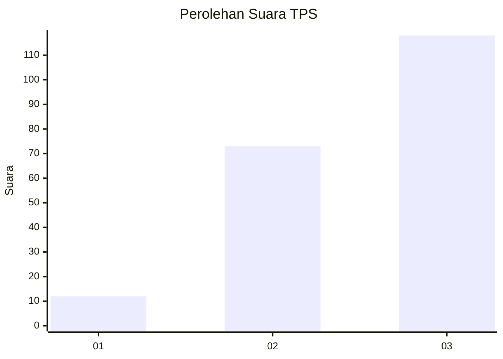
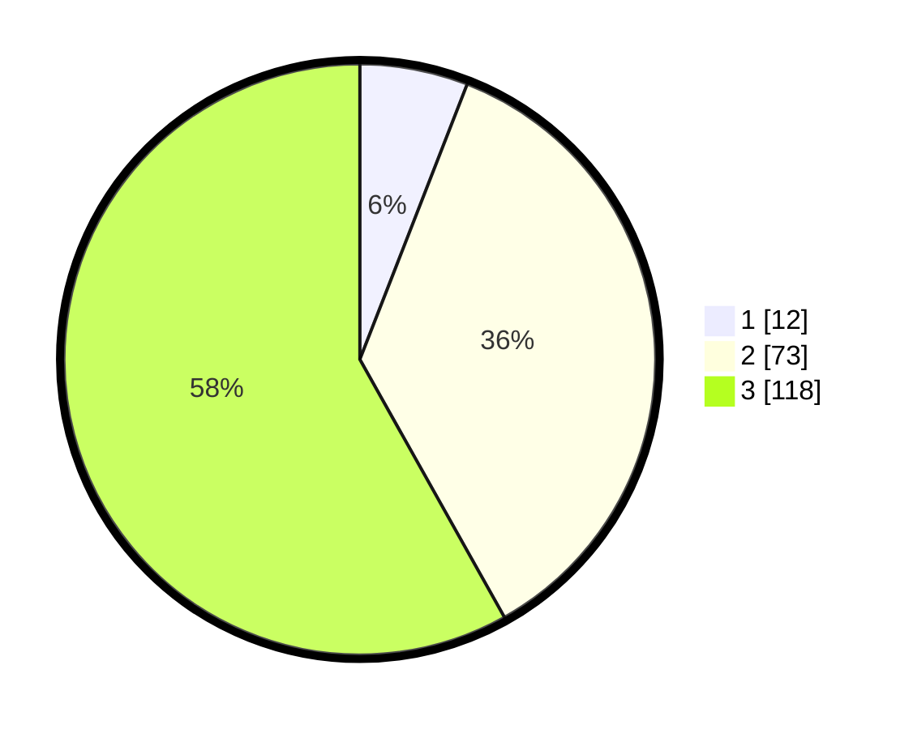

# Hasil

## Grafik

## Tabel

| No. | Nama Paslon    | Suara | Suara (raw) | Persentase |
|:--- |:-------------- | -----:| -----------:| ----------:|
| 1   | ANIES MUHAIMIN | 12    | [12][p-1]   | 5,91       |
| 2   | PRABOWO GIBRAN | 73    | [73][p-2]   | 35,96      |
| 3   | GANJAR MAHFUD  | 118   | [118][p-3]  | 58,13      |

[p-1]: https://github.com/gigit-pemilu/pemilu-2024-33-jawa-tengah/blob/main/pilpres/hitung-suara/sub/33-jawa-tengah/sub/12-wonogiri/sub/01-pracimantoro/sub/1009-gedong/sub/003-tps/sub/paslon-1.txt
[p-2]: https://github.com/gigit-pemilu/pemilu-2024-33-jawa-tengah/blob/main/pilpres/hitung-suara/sub/33-jawa-tengah/sub/12-wonogiri/sub/01-pracimantoro/sub/1009-gedong/sub/003-tps/sub/paslon-2.txt
[p-3]: https://github.com/gigit-pemilu/pemilu-2024-33-jawa-tengah/blob/main/pilpres/hitung-suara/sub/33-jawa-tengah/sub/12-wonogiri/sub/01-pracimantoro/sub/1009-gedong/sub/003-tps/sub/paslon-3.txt

## Foto C Plano

https://sirekap-obj-formc.kpu.go.id/e84d/pemilu/ppwp/33/12/01/10/09/3312011009003-20240218-123200--013934da-b317-47cc-9646-9411f0d90ecc.jpg

https://sirekap-obj-formc.kpu.go.id/e84d/pemilu/ppwp/33/12/01/10/09/3312011009003-20240214-141441--532c126d-89f2-41c8-a698-0b09bad06b53.jpg

https://sirekap-obj-formc.kpu.go.id/e84d/pemilu/ppwp/33/12/01/10/09/3312011009003-20240214-141229--44e6241e-e72c-4ef8-a9be-b2b6917470bf.jpg

## Metadata

| Key        | Value               |
| ---------- | ------------------- |
| Time Stamp | 2024-02-19 06:16:00 |

