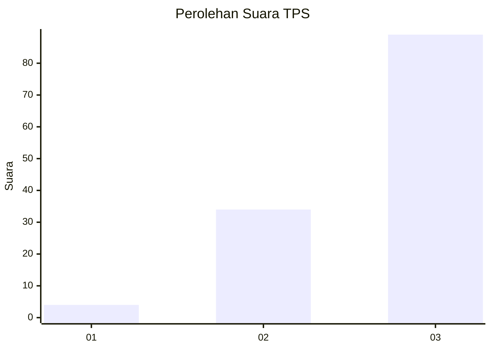
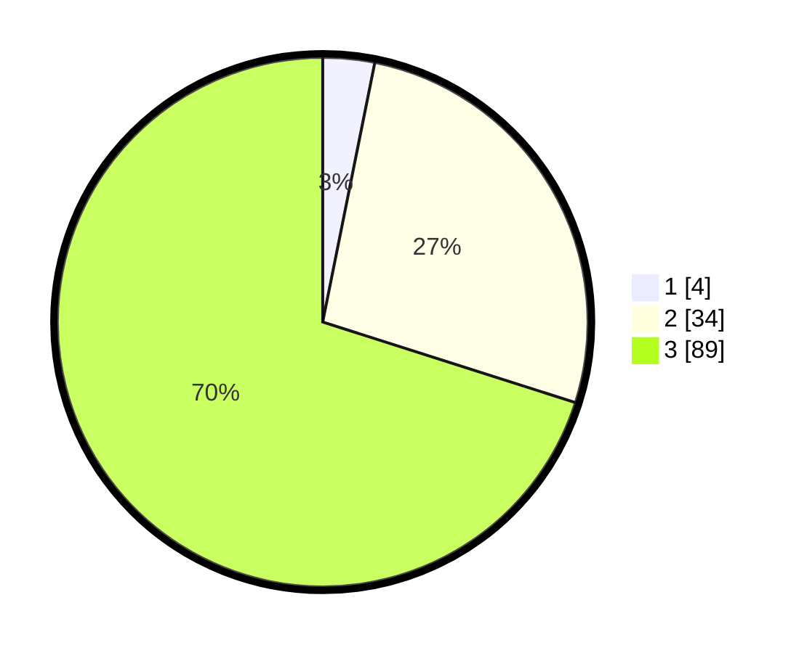

# Hasil

## Grafik

## Tabel

| No. | Nama Paslon    | Suara | Suara (raw) | Persentase |
|:--- |:-------------- | -----:| -----------:| ----------:|
| 1   | ANIES MUHAIMIN | 4     | [4][p-1]    | 3,15       |
| 2   | PRABOWO GIBRAN | 34    | [34][p-2]   | 26,77      |
| 3   | GANJAR MAHFUD  | 89    | [89][p-3]   | 70,08      |

[p-1]: https://github.com/gigit-pemilu/pemilu-2024-33-jawa-tengah/blob/main/pilpres/hitung-suara/sub/33-jawa-tengah/sub/12-wonogiri/sub/01-pracimantoro/sub/2004-gambirmanis/sub/018-tps/sub/paslon-1.txt
[p-2]: https://github.com/gigit-pemilu/pemilu-2024-33-jawa-tengah/blob/main/pilpres/hitung-suara/sub/33-jawa-tengah/sub/12-wonogiri/sub/01-pracimantoro/sub/2004-gambirmanis/sub/018-tps/sub/paslon-2.txt
[p-3]: https://github.com/gigit-pemilu/pemilu-2024-33-jawa-tengah/blob/main/pilpres/hitung-suara/sub/33-jawa-tengah/sub/12-wonogiri/sub/01-pracimantoro/sub/2004-gambirmanis/sub/018-tps/sub/paslon-3.txt

## Foto C Plano

https://sirekap-obj-formc.kpu.go.id/68e1/pemilu/ppwp/33/12/01/20/04/3312012004018-20240214-195409--bc9fc576-121e-47d8-9668-090acc625aea.jpg

https://sirekap-obj-formc.kpu.go.id/68e1/pemilu/ppwp/33/12/01/20/04/3312012004018-20240214-195455--b65f7a35-3db9-46fd-a16c-be3f2919be65.jpg

https://sirekap-obj-formc.kpu.go.id/68e1/pemilu/ppwp/33/12/01/20/04/3312012004018-20240214-195528--b513db9d-f21c-47d6-975b-cbff76f27154.jpg

## Metadata

| Key        | Value               |
| ---------- | ------------------- |
| Time Stamp | 2024-02-15 03:06:03 |

