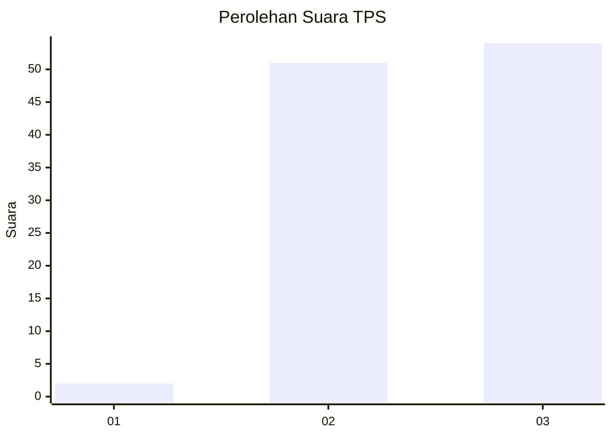
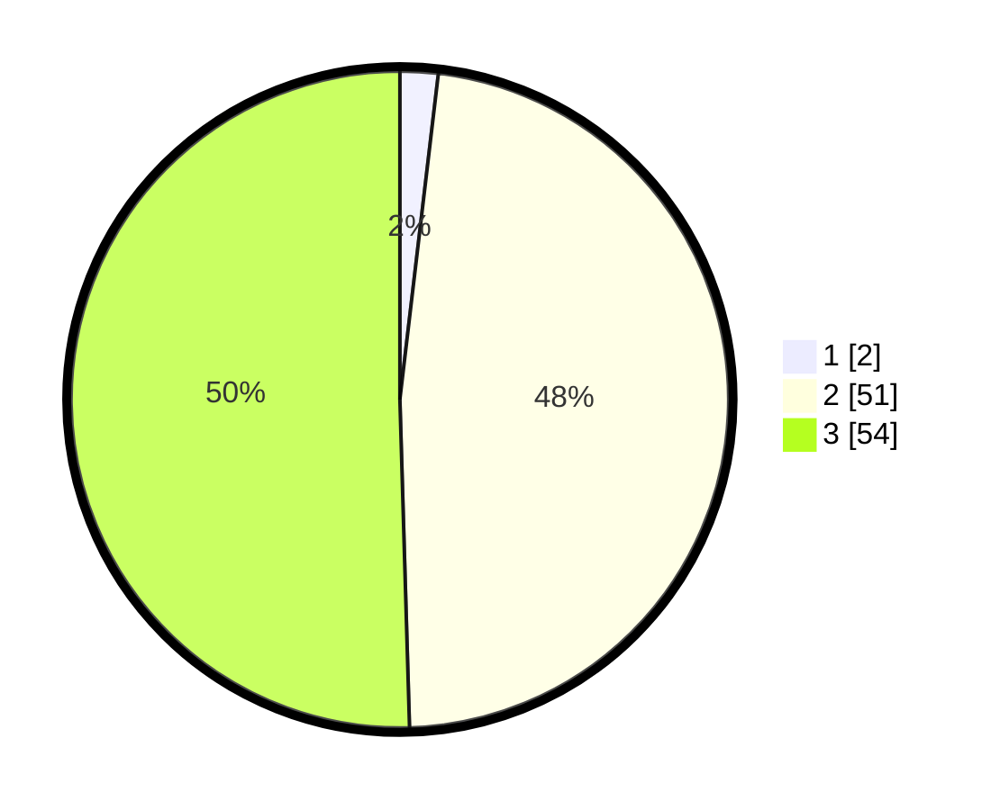

# Hasil

## Grafik

## Tabel

| No. | Nama Paslon    | Suara | Suara (raw) | Persentase |
|:--- |:-------------- | -----:| -----------:| ----------:|
| 1   | ANIES MUHAIMIN | 2     | [2][p-1]    | 1,87       |
| 2   | PRABOWO GIBRAN | 51    | [51][p-2]   | 47,66      |
| 3   | GANJAR MAHFUD  | 54    | [54][p-3]   | 50,47      |

[p-1]: https://github.com/gigit-pemilu/pemilu-2024-33-jawa-tengah/blob/main/pilpres/hitung-suara/sub/33-jawa-tengah/sub/12-wonogiri/sub/01-pracimantoro/sub/2005-suci/sub/012-tps/sub/paslon-1.txt
[p-2]: https://github.com/gigit-pemilu/pemilu-2024-33-jawa-tengah/blob/main/pilpres/hitung-suara/sub/33-jawa-tengah/sub/12-wonogiri/sub/01-pracimantoro/sub/2005-suci/sub/012-tps/sub/paslon-2.txt
[p-3]: https://github.com/gigit-pemilu/pemilu-2024-33-jawa-tengah/blob/main/pilpres/hitung-suara/sub/33-jawa-tengah/sub/12-wonogiri/sub/01-pracimantoro/sub/2005-suci/sub/012-tps/sub/paslon-3.txt

## Foto C Plano

https://sirekap-obj-formc.kpu.go.id/8baa/pemilu/ppwp/33/12/01/20/05/3312012005012-20240214-212401--ca717e93-7b40-4678-96e0-0487fb720c37.jpg

https://sirekap-obj-formc.kpu.go.id/8baa/pemilu/ppwp/33/12/01/20/05/3312012005012-20240214-212432--58889333-f9d0-4907-8add-a30057648367.jpg

https://sirekap-obj-formc.kpu.go.id/8baa/pemilu/ppwp/33/12/01/20/05/3312012005012-20240214-220100--b8205172-d1b2-4576-8039-86a8dc48824e.jpg

## Metadata

| Key        | Value               |
| ---------- | ------------------- |
| Time Stamp | 2024-02-15 23:29:50 |

