# Hasil

## Grafik

```mermaid
%%{init: {"pie": {"textPosition": 0.5}, "themeVariables": {"pieOuterStrokeWidth": "5px"}} }%%
pie showData
    "1" : 23
    "2" : 33
    "3" : 76
```

## Tabel

| No. | Nama Paslon    | Suara | Suara (raw) | Persentase |
|:--- |:-------------- | -----:| -----------:| ----------:|
| 1   | ANIES MUHAIMIN | 23    | [23][p-1]   | 17,42      |
| 2   | PRABOWO GIBRAN | 33    | [33][p-2]   | 25,00      |
| 3   | GANJAR MAHFUD  | 76    | [76][p-3]   | 57,58      |

[p-1]: https://github.com/gigit-pemilu/pemilu-2024-33-jawa-tengah/blob/main/pilpres/hitung-suara/sub/33-jawa-tengah/sub/12-wonogiri/sub/01-pracimantoro/sub/2008-pracimantoro/sub/001-tps/sub/paslon-1.txt
[p-2]: https://github.com/gigit-pemilu/pemilu-2024-33-jawa-tengah/blob/main/pilpres/hitung-suara/sub/33-jawa-tengah/sub/12-wonogiri/sub/01-pracimantoro/sub/2008-pracimantoro/sub/001-tps/sub/paslon-2.txt
[p-3]: https://github.com/gigit-pemilu/pemilu-2024-33-jawa-tengah/blob/main/pilpres/hitung-suara/sub/33-jawa-tengah/sub/12-wonogiri/sub/01-pracimantoro/sub/2008-pracimantoro/sub/001-tps/sub/paslon-3.txt

## Foto C Plano

https://sirekap-obj-formc.kpu.go.id/a459/pemilu/ppwp/33/12/01/20/08/3312012008001-20240218-153016--39c2f64a-44ca-40d1-a199-0ef4a63fb045.jpg

https://sirekap-obj-formc.kpu.go.id/a459/pemilu/ppwp/33/12/01/20/08/3312012008001-20240218-152307--07c78648-096f-43fb-81a7-63dc95ed47ea.jpg

https://sirekap-obj-formc.kpu.go.id/a459/pemilu/ppwp/33/12/01/20/08/3312012008001-20240218-151258--93282520-f752-4346-9b4a-5ffb5a2d5e8b.jpg

## Metadata

| Key        | Value               |
| ---------- | ------------------- |
| Time Stamp | 2024-02-19 06:16:00 |

